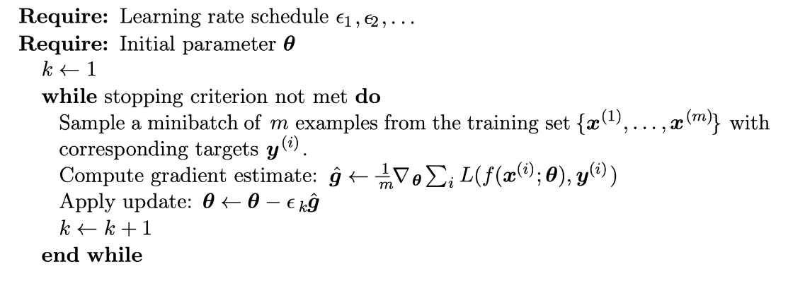

<link rel="stylesheet" type="text/css" href="stili.css">

##### Attivazione delle unità di uscita

> Assumiamo che la stima sia appresa dagli strati nascosti in termini dei parametri, per cui avremo che $\bold h = f(\bold x;  \theta)$, che rappresenta l'**input** alle unità di uscita.

Le **unità di uscita lineari**, supponendo una distribuzione Gaussiana e usando la $MLE$, possono essere usate per stimare la media di $\bold y$, indicata con $\bold {\hat y}$:

$$
\bold {\hat y} = \bold W^T \cdot \bold h + \bold b
$$

$$
p(\bold y | \bold x) = \mathcal N(\bold y; \bold {\hat y}, I)
$$

dove l'uscita della rete $\bold {\hat y}$ è la **media** e siamo nelle ipotesi in cui non stiamo stimando alcuna matrice di covarianza $\Sigma$, perchè altrimenti le unità lineari non basterebbero.

Nei **casi reali**, non sempre possiamo ricorrere ad unità lineari.

> "Non lineare" significa che non puoi prevedere con precisione un'etichetta. In altre parole, la "superficie decisionale" non è una linea. Ecco un esempio di problema di classificazione non lineare:
>
> 
>
> Per modellare un problema non lineare, possiamo introdurre direttamente una non linearità. Possiamo pipelinere ogni nodo del livello nascosto tramite una funzione non lineare.
>
> Nel modello rappresentato dal grafico seguente, il valore di ogni nodo nel livello nascosto 1 viene trasformato da una funzione non lineare prima di essere passato alle somme ponderate del livello successivo. Questa funzione non lineare è chiamata funzione di attivazione.
>
> 
>
> Ora che abbiamo aggiunto una funzione di attivazione, l'aggiunta di livelli ha un impatto maggiore. L'accumulo di non linearità su non linearità ci consente di modellare relazioni molto complicate tra gli input e gli output previsti. In breve, ogni livello apprende in modo efficace una funzione più complessa e di livello superiore sugli input non elaborati.

---

> Non linearità significa che l’output non può essere generato da una combinazione lineare di input.
>
> La non linearità è importante nelle reti neurali perché le funzioni di attivazione lineare non sono sufficienti per formare un approssimatore di funzione universale.
>
> Se usiamo le funzioni di attivazione lineare in una rete neurale profonda, indipendentemente dalla profondità della nostra rete, sarà equivalente ad una semplice rete neurale lineare senza strati nascosti perché quelle funzioni di attivazione lineare possono essere combinate per formare un’altra singola funzione lineare.
>
> Quindi fondamentalmente tutta la nostra rete sarà ridotta ad un singolo neurone con quella funzione lineare combinata come sua funzione di attivazione e quel singolo neurone non sarà in grado di apprendere relazioni complesse nei dati.
>
> Poiché la maggior parte dei problemi del mondo reale sono molto complessi, abbiamo bisogno di funzioni di attivazione non lineari in una rete neurale.
>
> La rete neurale senza funzioni di attivazione non lineare sarà solo un semplice modello di regressione lineare.
>
> Tuttavia, nello strato finale della rete neurale, possiamo scegliere funzioni di attivazione lineare.

---

###### Classificazione binaria

> Il classificatore, ricevuto in **input** un dato, restituirà in **output**:
>
> $$
> \begin{cases} 1 & se \ il \ dato \ \bold {non \ appartiene \ alla \ classe} \\ 0 & se \ il \ dato \ \bold {appartiene \ alla \ classe} \end {cases}
> $$

Verrà utilizzata una sola uscita, che fornisce la $MLE$ di $P(y=1|\bold x) \in [0, 1]$ che è una **distribuzione di Bernoulli**.

Assumeremo che l'ingresso $z$ all'unità NON LINEARE sia sempre **lineare**:

$$
z = \bold W^T \cdot \bold h + \bold b
$$

dove $z$ non è più l'uscita di un'unità lineare, ma è **l'uscita di un'unità lineare che va in ingresso ad una funzione di attivazione non lineare**.

> È come se avessimo uno strato di unità lineari che raccolgono gli ingressi $\bold h$ e producono un'uscita $z$ che andrà in input a delle unità puramente non lineari dello strato successivo.
>
> Il valore $z$ rappresenta quindi la reale uscita dei layer profondi della rete.

Dato che stiamo parlando di effettuare un addestramento della rete imponendo che venga minimizzato un certo errore sulla base di uno specifico task, possiamo assumere che $z$ fornisca, prima dell'ultimo layer, la stima della log-probabilità non normalizzata di $y$, detta **logit**.

$$
logit(x) = \ln \Big ( \cfrac x {1-x} \Big)
$$

In questo caso possiamo vedere come la funzione di attivazione dello strato di uscita debba avere una certa forma.

> Una funzione di attivazione **lineare** con soglia in $0$ e $1$ per ottenere un valore di probabilità valido, non va bene perché il gradiente si annulla non appena $logit(z) \notin [0, 1]$.

Pertanto, dobbiamo utilizzare una funzione di attivazione (**non lineare**) sigmoidale:

$$
\sigma (x) = \cfrac {1} {1 + e^{-x}} \equiv \cfrac {e^x} {e^x + 1}
$$

> L'unità sigmoidale si presta bene a questo problema:
>
> * Varia tra $0$ e $1$, in quanto rappresenta una probabilità.
> * **È sempre differenziabile**, caratteristica fondamentale quando si addestra con un algoritmo di discesa lungo il gradiente.

Assumiamo che la log-likelihood non normalizzata $\tilde P(y)$ sia lineare in $y$ e in $z$, ovvero che:

$$
log \Big( \tilde P(y) \Big) = y \cdot z
$$

Elevando a destra e a sinistra per $e$ otteniamo la probabilità non normalizzata:

$$
\tilde P(y) = e^{yz}
$$

Adesso possiamo ricavare la $pdf$ della probabilità non normalizzata:

$$
P(y) = \cfrac {e^{yz}} {\sum_{y'=0}^1 e^{y'z}} = \cfrac {e^{yz}} {1 + e^{z}} = \sigma \Big ( (2y - 1) \cdot z \Big) = \cfrac {e^{(2y - 1) z}} {e^{(2y - 1) z} + 1}
$$

Pertanto, se vogliamo stimare la probabilità che $y=1$, otteniamo:

$$
P(y=1) = \cfrac {e^{z}} {1 + e^{z}} = \sigma(z) \ \ \overset {z = \bold W^T \cdot \bold h + \bold b} {=} \ \ \sigma \Big(\bold W^T \cdot \bold h + \bold b \Big)
$$

Assumiamo che la $logit$ sia lineare in $y$ e $z$:

$$
z = logit \Big( P(y) \Big) = \ln \Big ( \cfrac {P(y)} {1-P(y)} \Big) = \ln \Big( P(y) \Big) - \ln \Big( 1 - P(y) \Big) \equiv \sigma^{-1} \Big( P(y) \Big)
$$

> Adesso vogliamo ricavare le **funzione di loss** corrispondente all'apprendimento $MLE$.

Tale funzione prende il nome di **softplus**:

$$
\zeta(x) = \ln \Big(\sigma (x) \Big) = \ln \Big(\cfrac {e^x} {e^{x} + 1} \Big) = \ln \Big( e^{x} + 1 \Big)
$$

$$
J(\bold \theta) = - \log \Big( P(y|\bold x) \Big) = - \log \Big( \sigma \big( 2y-1 \big) z \Big) = \zeta \Big( \sigma \big( 1-2y \big) z \Big)
$$

> In questo schema di apprendimento di **classificazione binaria** utilizzeremo:
>
> * La funzione di loss **softplus**, che consente l'apprendimento di $MLE$ (stimeremo la probabilità che $y=1$).
> * La **funzione logistica**, che consente di verificare se quello che otteniamo è corretto, data la probabilità non normalizzata in ingresso.
>
> Definire le stime, e quindi imporre la minimizzazione dell'errore secondo un certo funzionale di stima, è importante per l'addestramento di una rete, in quanto, dato che tutto dipende a ritroso dall'uscita che si vuole imporre, negli strati precedenti si andranno ad accumulare stime funzionali definite esattamente come sono state pensate.
>
> Quindi possiamo assumere che $z$ sia la log-likelihood non normalizzata perché decidiamo di farla apprendere proprio in questo modo alla rete.

###### Classificazione multiclasse

In questo caso, andremo a stimare una **distribuzione Multinoulli**: avremo un vettore di stime, dove ogni singola stima (ogni elemento del vettore) corrisponde alla probabilità che $y$ sia la classe $i$-esima.

$$
\bold {\hat y} = \Big\{ \hat{y_i} = P\big(y = i | \bold x\big) \Big\}
$$

La somma di queste stime, facendo capo alla Multinoulli, deve essere pari a $1$:

$$
\sum_i \hat{y_i} = 1
$$

Sia $z$ l'ingresso:

$$
z = \bold W^T \bold h + b = \Big\{ z_i = \log \Big( P(y = i | \bold x) \Big) \Big\}
$$

Estendiamo l'uso della funzione sigmoidale per singola classe con l'applicazione della funzione **softmax**.

La softmax, usando una loss per apprendimento $MLE$, soddisfa i requisiti per avere somma $1$ su tutti i componenti (anche quelli relativi al calcolo del gradiente).

$$
softmax(z)_i = \cfrac {e^{z_i}} {\sum_j e^{z_j}}
$$

$$
\log \Big(softmax(z)_i \Big) = \log \Big( \cfrac {e^{z_i}} {\sum_j e^{z_j}} \Big) = z_i - \log \sum_j e^{z_j} \approx z_i - \underset j {\max} (z_j)
$$

dove $\sum_j e^{z_j}\approx \underset j {\max} (z_j)$, dato che stimiamo delle probabilità che sono di volta in volta concentrate su una sola classe $i$ e $z_j$ sarebbe molto piccolo se diverso da $\underset j {\max} (z_j)$.

Nel momento in cui $\underset j {\max} (z_j)$ corrisponde all'esempio corretto $z_i$, la log-likelihood negativa per quell'esempio tende a $0$ e quindi non darà contributo alla funzione di costo.

Se definiamo la softmax a meno di una costante $c$ e poniamo $c = \underset i {\max} (z_i)$, avremo una stabilizzazione numerica per evitare problemi nel caso in cui i valori di $\bold z$ sono molto grandi e non appartengono all'intervallo $[-1, 1]$:

$$
softmax(\bold z) = softmax(\bold z + c) \ \ \overset {c \ = \ \underset i {\max} (z_i)} = \ \ softmax \Big(\bold z - \underset i {\max} (z_i) \Big)
$$

##### Attivazione delle unità nascoste

Anche in questo caso la rete applicherà una funzione di attivazione $g(\cdot)$ ad una trasformazione affine sui suoi ingressi:

$$
\bold h = g(z) = g(\bold W^T \bold x + \bold b)
$$

In genere il vettore dei bias $\bold b$ viene inizializzato, in ogni layer, con dei valori piccoli (es. $0.1$).

###### ReLU

La Rectified Linear Unit è definita come:

$$
g(z) = \max \{0, z \} = \begin{cases} 0 & z<0 \\ z & z\ge 0 \end{cases}
$$

La ReLU è ottima per costruire non linearità attraverso il **meccanismo della composizione strato per strato**, ma non è differenziabile per $z=0$.

Questo punto di non differenziabilità può essere risolto usando la derivata destra o sinistra di $g(\cdot)$, che sono entrambe definite.

C'è sempre un errore molto piccolo di computazione $\epsilon$ nel calcolo esatto di un valore di $z$, per cui si può sempre assumere che $g(0)$ corrisponda in realtà ad un valore $g(0+\epsilon)$.

Tale assunzione ci permette di calcolare il gradiente, in quanto nel punto $z=0+\epsilon$ risulta perfettamente definito.

###### Varianti della ReLU

Possiamo estendere la ReLU ad una forma in cui la funzione $g(\cdot)$ è una composizione di due tratti lineari. Pertanto, per ogni unità nascosta $h_i$ avremo:

$$
h_i = g(\bold z, \bold \alpha)_i = \max(0, z_i) + \alpha_i \cdot \min(0, z_i) = \begin{cases} z_i & z_i >0 \\ \alpha_i \cdot z_i & otherwise\end{cases}
$$

In base al valore di $\alpha_i$ avremo:

* $\alpha_i = 1$: unità lineare.

  > $$
  > h_i = \max(0, z_i) + \min(0, z_i) = \begin{cases} \max(0, z_i) & z_i>0 \\ \min(0, z_i) & z_i < 0\end{cases} = \begin{cases}  z_i & z_i>0 \\ z_i & z_i < 0\end{cases}
  > $$
  >
  > Pertanto, avremo sempre $h_i = z_i$, che è una quantità **lineare**.
  >
* $\alpha_i \ll 1$ (es. $0.01$): **Leaky ReLU** (**LReLU**).
* $\alpha_i$ è un parametro da apprendere: **Parametric ReLU** (**PReLU**). La forma funzionale lineare è sempre la stessa e i gradienti sono sempre dello stesso tipo.

###### Maxout

L'unità **Maxout** permette di creare una **funzione lineare a tratti complessa**.

> È una funzione di attivazione che è a sua volta addestrata dal modello.
>
> Una singola unità di Maxout può essere interpretata come un'approssimazione lineare a tratti di una **funzione convessa arbitraria**.
>
> Un'unità di Maxout implementa la seguente funzione:
>
> $$
> h(z) = \max \Big( Z_1, Z_2, \dots, Z_k \Big)
> $$

> L'idea consiste nel suddividere lo spazio degli ingressi in $k$ regioni di $k$ elementi.
>
> Viene poi generata una **permutazione** di indici sui valori delle unità $z_i$ per ogni partizione, con la regione $i$-esima $\mathbb G^{(i)}$ definita come:
>
> $$
> \mathbb G^{(i)} = \Big\{ (i-1)k + 1, (i-1)k + 2, \dots, (i-1)k + k \Big\} = \Big\{ (i-1)k + 1, \dots,ik \Big\}
> $$
>
> dove $i$ è il valore dell'indice sul valore dell'attivazione $z_i$.

L'attivazione è definita come:

$$
g(\bold z)_i = \max
$$

###### Altre funzioni di attivazione per le unità nascoste

Per le unità nascoste vengono usate anche:

* Sigmoide.
* Tangente iperbolica.
* Softplu (ReLU senza la non linearità).
* Radial Basis Function (RBF), in cui ogni attivazione di unità nascosta $h_i$ è una gaussiana con media $1$ e varianza $\sigma_i$ dello scostamento tra l'input rispetto all'$i$-esima colonna del vettore dei pesi:
  $$
  h_i = e^{- \cfrac {1} {\sigma_i^2} \cdot \| W_{:, i} - \bold x \|^2}
  $$

##### Altre considerazioni sulla struttura dei layer

###### Residual Networks

> Il **vanishing gradient** è un fenomeno che si presenta durante il training di reti profonde ed come effetto quello di annullare o rallentare l’aggiornamento dei pesi per alcuni layers della nostra rete.
>
> Durante la fase di backpropagation i pesi degli strati in prossimità dell’input restano costanti o si aggiornano molto lentamente al contrario di quanto accade per gli strati vicini all’output.
>
> Un contributo importante per il training di reti profonde ci fu con l’introduzione delle **skip connections**.
>
> Obiettivo delle **skip connections** è quello di creare un percorso alternativo per il passaggio del gradiente durante la fase di retropropagazione dell’errore.

Siano:

* $\bold x$: identità, ovvero l'input di ingresso.
* $\mathcal F(\bold x)$: trasformazioni non lineari $\mathcal F$ effettuate sull'input $\bold x$ dai layers intermedi (es. convoluzione+attivazione(ReLU)).

Le **residual networks** (**ResNets**)

$$
\bold W = \Big ( \bold V \cdot diag(\bold \lambda) \cdot \bold V^{-1}\Big)
$$

$$
\bold W^t = \Big ( \bold V \cdot diag(\bold \lambda) \cdot \bold V^{-1}\Big)^t = \bold V \cdot diag(\bold \lambda)^t \cdot \bold V^{-1}
$$

$$
\lambda_j \gg 1 \longrightarrow \bold {exploding \ gradients}
$$

$$
\lambda_j \ll 1 \longrightarrow \bold {vanishing \ gradients}
$$

Le **residual networks** (**ResNets**) i

Spesso si usano le cosiddette **skip connections** in quelle che

> **Skip Connections**: un layer è connesso "in avanti" a un layer non successivo.
>
> Aiutano a gestire il problema del **vanishing gradient**

## Addestramento

> Una rete neurale profonda (DNN) è composta da:
>
> * Un'**uscita** appartenente ad un insieme di alternative a seconda di quello che dobbiamo stimare.
> * Strati di **unità nascoste** (tipicamente tutte ReLU o sue varianti) che permettono di ottenere non linearità, eventualmente con skip connections.
> * Unità di **ingresso** che raccolgono gli ingressi e li immettono nella rete.

L'addestramento di una DNN avviene utilizzando un **algoritmo di discesa lungo il gradiente** di una funzione di costo $J(\bold \theta, \bold x)$ rispetto ai parametri del modello: in particolare viene usato l'algoritmo di **discesa stocastica lungo il gradiente** (**Stochastic Gradient Descent**).

> **Gradiente $\nabla$**: vettore delle derivate parziali rispetto ai pesi.
>
> La **SGD** è un **algoritmo di ottimizzazione** il cui obiettivo è minimizzare una funzione di costo $J$, che rappresenta la discrepanza tra le previsioni del modello e i valori desiderati.
>
> La discesa stocastica è chiamata "stocastica" perché **calcola gli aggiornamenti dei pesi del modello su un sottoinsieme casuale dei dati di addestramento a ogni iterazione**, a differenza della discesa del gradiente tradizionale che utilizza l'intero set di dati di addestramento.
>
> Sarà necessario calcolare $\nabla_{\bold \theta} J(\bold \theta, \bold x)$ per minimizzare $J$.
>
> Il calcolo di $\nabla_{\bold \theta} J(\bold \theta, \bold x)$ riguarda tutti i parametri, anche quelli negli strati più nascosti.

Prima di addentrarci nell'algoritmo SGD, è necessario stabilire un approccio per il calcolo dei gradienti.

> Questo calcolo viene fatto in **maniera ricorsiva** partendo dal calcolo dei gradienti dello strato di uscita fino ad arrivare al calcolo dell'ultimo strato, che è il layer di ingresso. Verrà utilizzato un **grafo computazionale**.
>
> Questo algoritmo ricorsivo prende il nome di **Backpropagation**.

### Backpropagation

> Va osservato che l'algoritmo di Backpropagation **NON è un algoritmo di addestramento**, ma è un algoritmo di calcolo del gradiente in maniera ricorsiva in tutti gli strati della rete.

La Backpropagation **si basa sul calcolo del gradiente di una funzione di costo composta**:

$$
z = f \Big( g(\bold x) \Big)
$$

Siano:

$$
\bold y = g(\bold x) \ \ \ \ \& \ \ \ \ z = f(\bold y)
$$

Calcoliamo il gradiente della funzione $z$:

$$
\nabla_{\bold x} z = \Big( \cfrac {\partial {\bold y}} {\partial \bold x} \Big)^T \nabla_\bold y z
$$

> È possibile estendere il concetto al caso di funzioni di tensori $n$-dimensionali $\bold X$ in cui $j$ è una $n$-pla di indici degli elementi corrispondenti.
>
> $$
> \nabla_\bold X z = \sum_j \Big( \nabla_\bold X Y_j \Big) \cfrac {\partial z} {\partial Y_j}
> $$

L'algoritmo prevede una serie di passaggi:

1. Inizializzazione dei pesi: i pesi vengono inizializzati con valori casuali o con valori predefiniti.
2. **Loop**:
   1. Forward Propagation e calcolo della funzione di costo.
   2. Backpropagation ed aggiornamento dei pesi.

#### Forward Propagation

Una volta scelti i pesi iniziali della rete, procediamo al calcolo delle attivazioni per una funzione di loss con termine di regolarizzazione:

> **Input**:
>
> * $l$: profondità della rete.
> * $\bold W^{(i)}, \ i \in \{ 1, 2, \dots, l \}$: matrici dei pesi del modello.
> * $\bold b^{(i)}, \ i\in \{ 1, 2, \dots, l \}$: parametri di bias del modello.
> * $\bold x$\: l'input da processare.
> * $\bold y$\: l'output target.
>
> L'algoritmo si compone dei seguenti passi:
>
> 1. *$h^{(0)} = \bold x$*
> 2. $\bold {for} \ k=1,2, \dots, l \ \bold {do}$
>    1. $a^{(k)} = \bold b^{(k)} + \bold W^{(k)}\bold h^{(k-1)}$
>    2. $h^{(k)} = f(\bold a^{(k)})$
> 3. $\bold {end \ for}$
> 4. $\bold {\hat y} = \bold h^{(l)}$
> 5. $J = L(\bold{\hat y}, \bold y) + \lambda \Omega(\theta)$

#### Backpropagation

Dopo aver calcolato tutte le attivazioni in avanti, bisogna effettuare il calcolo del gradiente all'indietro. Ricordiamo che per calcolare il gradiente, dobbiamo calcolare le derivate parziali e questa operazione può essere computazionalmente onerosa.

Un approccio efficiente utilizza un **grafo computazionale** delle derivate per il calcolo delle derivate composte:

$$
\cfrac {\partial z} {\partial w} = \cfrac {\partial z} {\partial y} \cdot \cfrac {\partial y} {\partial x} \cdot \cfrac {\partial x} {\partial w} = f'(y) \cdot f'(x) \cdot f'(w) = f'\bigg( f\Big(f(w)\Big) \bigg) \cdot f'\Big( f(w) \Big) \cdot f'(w)
$$

A partire dal grafo computazionale di base (a sinistra), vengolo calcolate le attivazioni insieme alle loro derivate.

Quindi, il calcolo delle derivate complessive si riduce a delle moltiplicazioni tra derivate parziali calcolate passo passo (colonna centrale del grafo di destra).

### Stochastic Gradient Descent (SGD)

#### Gradient Descent (GD)

L'algoritmo GD stabilisce che una funzione $f(\bold x)$ può essere minimizzata muovendo $\bold x$ lungo la direzione del gradiente di $f$:

$$
\bold x \longleftarrow \bold x - \epsilon \nabla_\bold x f
$$

dove $\epsilon$ è il Learning Rate che definisce il passo di aggiornamento.

Il movimento lungo la **direzione opposta** alla direzione del gradiente di $f$ (salita lungo il gradiente) punta verso il **minimo globale di $f$**.

Nel nostro caso la $f(\bold x)$ altro non è che la **funzione di costo** $J(\bold \theta)$. Pertanto, $J(\bold \theta)$ può essere minimizzata muovendo $\bold\theta$ lungo la direzione del gradiente di $J$:

$$
\bold \theta \longleftarrow \bold \theta - \epsilon \nabla_\bold \theta J
$$

Il gradiente di $J(\bold \theta)$ sarà pari alla media di tutti i valori di gradiente calcolati per la funzione di loss $L(\bold x, y, \bold \theta)$ per tutti gli $m$ campioni di ingresso:

$$
J(\bold \theta) = \mathbb E_{\bold x, y \sim \hat p_{data} } L(\bold x, y, \bold \theta) = \cfrac 1 m \cdot \sum_{i=1}^m L(\bold x^{(i)}, y^{(i)}, \bold \theta) \\ \nabla_{\bold \theta} J(\bold\theta) = \cfrac 1 m \cdot \sum_{i=1}^m \nabla_{\bold \theta} L(\bold x^{(i)}, y^{(i)}, \bold \theta)
$$

Il costo computazionale, intuitivamente, sarà $O(m)$ e può diventare molto elevato: pertanto, così per com'è, l'algoritmo **GD** non è molto efficiente, considerando il fatto che più campioni abbiamo, migliore sarà la stima e quindi ci si avvicinerà di più al minimo globale (**idealmente**).

Gli viene infatti preferito lo **SGD** che, anzichè utilizzare tutti gli $m$ campioni, ne utilizza un **minibatch** $\mathbb B$ di cardinalità $m'$, contenente alcune decine/centinaia di campioni **prelevati stocasticamente dal data-set** (da qui il nome).

$$
\mathbb B = \Big\{ \bold x^{(1)}, \bold x^{(2)}, \dots, \bold x^{(m')} \Big\}
$$

Su questi $m'$ campioni calcola il gradiente e aggiorna l'algoritmo (come viene fatto nello **GD**).

Chiameremo **epoca** una **presentazione dell’intero data-set** all’algoritmo di addestramento.

Dato che:

$$
\bold g = \cfrac 1 {m'} \cdot \nabla_\bold\theta \sum_{i=1}^{m'} L(\bold x^{(i)}, y^{(i)}, \bold \theta) = \nabla_\bold \theta J
$$

avremo che:

$$
\bold \theta \longleftarrow \bold \theta - \epsilon \bold g
$$

Rendendo **costante il numero di elementi che si vanno a calcolare**, viene eliminata la dipendenza dal numero di campioni e, conseguentemente, l'onere computazionale viene abbattuto.

Il costo dell'algoritmo sarà adesso $O(m'$) e quindi la **dimensione del batch** $m'$ rappresenterà un iperparametro di addestramento.

Questo approccio converge perché oltre un certo numero di campioni, la bontà della stima diventa numericamente poco rilevante.

## Regolarizzazione

> **Regolarizzare**: scegliere una **nuova configurazione dei parametri** in modo tale da finire in un altro punto vicino al minimo della funzione di costo $J$, tale che quando si debba generalizzare, ci si trovi ad **avere un buon comportamento di generalizzazione**.

Le tecniche di regolarizzazione sono mirate a **ridurre l’errore di generalizzazione** a spese di quello di addestramento. Di seguito abbiamo le tecniche di regolarizzazione più diffuse.

### Uso della norma $L^2$

Il termine di regolarizzazione non interessa i bias, ma solo i pesi, in quanto **la regolarizzazione sui bias porta a underfitting**.

Nel caso della norma $L^2$, la regolarizzazione è un termine quadratico (per esempio il weight decay):

$$
\tilde J(\bold w; \bold X, \bold y) = \cfrac \alpha 2 \bold w^T\bold w + J(\bold w; \bold X, \bold y)
$$

$$
\bold w \longleftarrow \bold w - \epsilon \cdot \big( \alpha \bold w + \nabla_\bold w J(\bold w; \bold X, \bold y) \big)
$$

Oltre al learning rate $\epsilon$ interviene anche un coefficiente $\alpha$ a pesare i pesi. Pertanto, il coefficiente complessivo è $\epsilon \alpha$.

Questa tecnica usa l'opposto della direzione del gradiente, aggiungendo una costante di pruning sul valore dei pesi.

Assumendo $J$ sempre quadratica in un piccolo intorno del suo minimo $\bold {w^*}$:

$$
\hat J (\bold \theta) = J (\bold {w^*}) + \cfrac 1 2 \cdot (\bold w - \bold {w^*})^T \cdot \bold H \cdot (\bold w - \bold {w^*})
$$

dove $\bold H$ è la matrice Hessiana di $J$.

> **Matrice Hessiana**: la matrice Hessiana di una funzione reale $J$ di più variabili reali è una matrice quadrata i cui elementi sono le **derivate parziali seconde** della funzione $J$.

Si dimostra che il termine di regolarizzazione individua un punto di minimo $\hat {\bold w}$ che è una versione scalata di $\bold{w^*}$ lungo gli autovalori di $\bold H$ secondo dei coefficienti dati da:

$$
\cfrac {\lambda_i} {\lambda_i + \alpha}
$$

Pertanto, possiamo dire che:

$$
\hat {\bold w} = \cfrac {\lambda_i} {\lambda_i + \alpha} \cdot \bold {w^*} = \begin{cases} \bold {w^*} & \lambda_i \gg \alpha \\ 0 & \lambda_i \ll \alpha \end{cases}
$$

> La norma $L^2$ tende a sostituire, garantendo una maggiore capacità di generalizzazione, il valore di minimo assoluto con uno nuovo, tenendo conto che la funzione di costo $J$ ha una certa variabilità lungo le dimensioni.
>
> Pertanto, tende a **mantenere prevalenti** le dimensioni in cui la funzione originale $J$ ha una **maggiore variabilità** e **penalizza** le dimensioni in cui $J$ ha una **minore variabilità**.

### Data Augmentation

> Le tecniche di **data augmentation** consistono nell'**aumentare artificiosamente** il numero dei **campioni** per consentire una migliore generalizzazione della rete.
>
> Una rete **generalizza** quando, dato un punto ignoto (da predire), essa ha visto un numero sufficiente di campioni nell'intorno di quel punto (casi simili) che è tale da farle stimare la predizione sul punto ignoto.

Si possono usare **trasformazioni dei dati** che possono essere indotte dal dominio di applicazione (ad es. trasformazioni affini su immagini).

Si può **iniettare rumore nei dati** di ingresso (ha l’effetto di una regolarizzazione $L^2$) o anche **nei pesi degli strati nascosti**.

### Multi-task Learning

> Anche conosciuto come **Transfer Learning**, esso consiste nella costruzione di una rete che condivida la struttura dei pesi dei layer nascosti e che venga addestrata in base ai diversi task.

In particolare i layer più vicini alle uscite sono specifici per ogni task, mentre nei layer di ingresso i parametri sono condivisi.

Avremo una miglior generalizzazione del modello, perché questa tecnica si basa sul riutilizzo dei pesi di un modello precedentemente addestrato per un certo task: questo permette di addestrare su una rete in cui la cui configurazione dei pesi è più vicina alla soluzione del task di interesse rispetto ad una configurazione casuale della rete inizializzata per l'addestramento.

### Early Stopping

> Un addestramento che si protrae per un numero eccessivo di epoche porta a **overfitting** e riduce la capacità di generalizzare il modello.
>
> L'**early stopping** è un algoritmo per fermare l’addestramento quando si osserva che la loss, valutata su un apposito validation set, comincia a risalire.

L'early stopping dà luogo ad un iperparametro di **pazienza** $p$ che indica il numero di epoche che l'algoritmo attende per osservare un definitivo incremento dell’errore commesso sul set di validazione: a quel punto l'algoritmo arresta l'addestramento.

Abbiamo due possibili strategie di addestramento:

#### Strategia 1

Dopo aver ottenuto il miglior numero di passi di addestramento $i^*$ dall'algoritmo di early stopping, si riparte da $0$ e si riaddestra su tutto il training-set (per ottenere $i^*$ è stato infatti necessario dividere il training-set in sub-training-set e validation-set). Non è garantito il raggiungimento della loss ottenuta dall’early stopping.

#### Strategia 2

Si riaddestra via via su tutto il training-set a partire dai parametri $\bold \theta^*$ ottenuti dall'early stopping, controllando che la loss calcolata sui parametri via via aggiornati scenda al di sotto di quella ottenuta con l’early stopping.

I parametri verranno aggiornati fino a quando sul validation-set non si scenderà al di sotto dell'errore ottimale ottenuto quando è stato eseguito l'algoritmo di early stopping.

Questa strategia ha maggiori possibilità di convergere.

#### Considerazioni finali

Anche con l'uso dell'early stopping si ottiene un effetto di regolarizzazione analogo all’uso di una norma $L^2$.

Si può dimostrare che il troncamento dell'addestramento a $\tau$ epoche (che non sono quelle che permettono di raggiungere il minimo $\bold {w^*}$\), mentre la soluzione procede verso il minimo $\bold {w^*}$ di $J$, ha un effetto inversamente proporzionale al coefficiente di regolarizzazione:

$$
\alpha \approx \cfrac 1 {\tau \epsilon}
$$

> Queste considerazioni sono corrette poiché viene assunto di essere nell'intorno del minimo $\bold {w^*}$, in cui si assume che $J$ sia quadratica.
>
> Gli **algoritmi di minimizzazione del gradiente** sono esatti se **il funzionale $J$ è localmente quadratico**.

### Dropout

> È noto che i metodi di **ensemble di modelli**, come il bagging, hanno una performance più accurata perchè ogni modello ha una performance lievemente diversa dagli altri sullo stesso test-set, per cui la media/maggioranza delle predizioni risulta essere più accurata della singola predizione.

Il **dropout** è una tecnica statistica per fare pruning delle connessioni tra le unità (di input e hidden layers) generando di fatto un ensemble di modelli che vengono addestrati contemporaneamente.

Rimuovendo via via le diverse connessioni, si ottengono le sotto-reti della rete di partenza:

Ad ogni run l'insieme delle connessioni effettivamente attive cambia dinamicamente (alcune vengono spente ed altre riattivate) e questo porta ad addestrare ad ogni run una rete diversa da quella di partenza.

Assumiamo di avere la possibilità di mascherare ogni unità $h_i$ con un coefficiente $\mu_i$ che vale $1$ (se l'unità è attiva) o $0$ (altrimenti) con una certa probabilità.

> Avremo quindi ad ogni strato un vettore delle unità nascoste $\bold h$ e un vettore binario $\bold \mu$ che maschera le attivazioni delle unità.
>
> Ogni unità si attiverà come $\mu_ih_i$.

Abbiamo un nuovo iperparametro, detto **iperparametro di dropout**, che corrisponde alla **probabilità che ogni unità sarà inclusa nella rete**.

> In genere si sceglie un dropout di $0.8$ per le unità di ingresso e di **almeno** $0.5$ per le unità nascoste.

Ad ogni minibatch viene campionata casualmente una maschera $\bold \mu$ diversa nel rispetto del valore di dropout con una distribuzione $p(\bold \mu)$

> L'addestramento avviene in ogni minibatch su una sottorete **differente**.

Siamo in presenza di un ensemble di modelli (al variare di $\bold \mu$), per cui dovremo minimizzare **globalmente** una funzione di costo che corrisponde al **valore atteso** di $J$ rispetto a $\bold \mu$: 

$$
\mathbb E_\bold \mu \Big[ J(\bold x; \bold \theta, \bold \mu) \Big]
$$

> Solitamente non si crea un numero elevato di sottoreti, ma si fa una **stima** con poche decine di campioni per **$\bold \mu$** ed **ogni modello** viene addestrato con **campionamento con rimpiazzo** dal data-set.

La predizione di ogni singolo modello $p(y|\bold x, \bold \mu)$ viene inserita nel modello di ensemble con la **media pesata**:

$$
\sum_\mu p(\bold \mu) \cdot p(y|\bold x, \bold \mu)
$$

## Ottimizzazione

> L’**ottimizzazione** per le DNN riguarda tutto l’insieme di algoritmi e di tecniche per accelerare la convergenza della procedura di minimizzazione del funzionale di costo.

In linea teorica si vuole minimizzare il **rischio empirico**, ovvero il **valore atteso della loss** posto che traiamo i nostri campioni di addestramento da una **distribuzione empirica** di dati $\hat p_{data} (\bold x, y)$ e non da quella vera (che non ci è nota).

$$
\mathbb E_{\bold x, y \sim \hat p_{data}} \bigg[ L\Big(f\big(\bold x; \bold \theta\big), y \Big) \bigg] = \cfrac 1 m \cdot \sum_{i=1}^m L\Big(f\big(\bold x^{(i)}; \bold \theta\big), y^{(i)} \Big)
$$

Gli approcci alla minimizzazione più diffusi ed efficienti assumono che la funzione obiettivo sia **localmente approssimabile con una funzione quadratica**. I due approcci più diffusi sono:

### Gradient Descent (GD)

È ottimo esattamente sotto l'assunzione quadratica e fa una serie di passi iterativi verso la convergenza nella direzione negativa del gradiente. La lunghezza di ogni passo è determinata dal parametro di **learning rate** $\epsilon$.

### Metodo di Newton

Calcola esplicitamente la matrice hessiana $H$ della funzione obiettivo per effettuare la minimizzazione **ad un passo** e ha la medesima assunzione di funzione quadratica:

$$
f(x) \approx h(x) := f(\bar x) + \nabla f(\bar x)^T \cdot (x- \bar x) - \cfrac 1 2(x- \bar x)^T \cdot H(\bar x) \cdot (x-\bar x)
$$

$$
0 = \nabla h(x) = \nabla f(\bar x) + H(\bar x) \cdot (x-\bar x)
$$

$$
x= \bar x - H(\bar x)^-1 \cdot \nabla f(\bar x)
$$

> Il metodo di Newton rappresenza l'errore commesso sulla funzione come espansione in serie di Taylor fino al secondo ordine più il termine di errore.
>
> Quindi stima l'errore e lo corregge in termini della jacobiana $\nabla$ (matrice delle derivate parziali prime) e dell'hessiana $H$ (matrice delle derivate parziali seconde) della funzione e lo risolve direttamente.

### Considerazioni finali

Queste metodologie esulano dal campo del Deep Learning in quanto esistono già per problemi di ottimizzazione in generale.

Soffrono di problemi di mal condizionamento numerico della matrice hessiana $H$ e di presenza di plateau, minimi locali o punti sella nella funzione di costo.

La **scelta dell'ottimizzatore** è un **iperparametro** che dipende dal **campo di applicazione**.

La minimizzazione diretta del rischio empirico porta in genere ad overfitting, in quanto il calcolo di **tutti** i gradienti è molto oneroso e la rete si addestrerà per valori di elevata capacità e tenderà a minimizzare solo il training error.

Si minimizzerà una funzione diversa selezionando un minibatch di campioni per volta e utilizzando l'algoritmo di **Stochastic Gradient Descent** (SGD) e le sue varianti.

### SGD

Il learning rate non è costante. Tipicamente si rende costante solo il learning rate iniziale e viene via via ridotto in modo che la velocità della soluzione rallenti, permettendole di fermarsi nei pressi del **minimo globale**.

Caratteristiche di questo algoritmo sono:

1. $\bold {\hat g}$ calcolato sul minibatch consente all'algoritmo di convergere bene risparmiando molto onere computazionale.
2. In genere il learning rate $\epsilon$ viene fatto **decrescere linearmente**.
3. Il minibatch serve da regolarizzazione.
4. Si presta ad essere eseguito in parallelo su architetture multi-core, poichè permettono di utilizzare i minibatch separatamente.
5. Spesso si usano valori potenza di $2$ da $2^5 = 32$ a $2^8 = 256$ come dimensione del minibatch per una migliore organizzazione dell'hardware.

### SGD con momentum

Una variante dell'algoritmo **SGD** è l'algoritmo **SDG con momentum**.

In questa variante si usa un termine di momento che accumula una media mobile delle stime dei passati gradienti in un termine di memoria:

$$
\bold v \longleftarrow \alpha \bold v - \epsilon \nabla_\bold \theta \bigg( \cfrac 1 m \sum_{i=1}^m L \Big( \bold f (\bold x^{(i)}; \bold \theta), \bold y^{(i)} \Big) \bigg)
$$

$$
\bold \theta \longleftarrow \bold \theta + \bold v
$$

dove $\alpha$ è il parametro di velocità dell'aggiornamento che pesa gli aggiornamenti precedenti $\bold v$. 

$\bold \theta$ viene aggiornato in termini di $\bold v$ e non di $\epsilon$ per il gradiente: questo imposta una **velocità** di variazione dei parametri **variabile e controllata** dalla storia precedente, consentendo di controllare l'evoluzione della soluzione.

Il **momento di Nesterov** interessa anche l’aggiornamento di $\bold \theta$:

$$
\bold v \longleftarrow \alpha \bold v - \epsilon \nabla_\bold \theta \bigg[ \cfrac 1 m \sum_{i=1}^m L \Big( \bold f (\bold x^{(i)}; \bold \theta + \alpha \bold v), \bold y^{(i)} \Big) \bigg]
$$

$$
\bold \theta \longleftarrow \bold \theta + \bold v
$$

In questa variante il parametro di velocità dell'aggiornamento $\alpha$ viene utilizzato anche nel calcolo del gradiente, che non sarà solo in funzione di $\bold \theta$, ma anche in funzione del termine di momento $\bold v$ opportunamente pesato ($\alpha \bold v$).

Il momentum fa tendere la soluzione verso **direzioni a minore curvatura** per evitare che la soluzione **diverga**:

La velocità della soluzione è:

$$
\cfrac {\epsilon \cdot \| \bold g \|} {1-\alpha}
$$

dove, in genere, $\alpha$ vale $0.5, \ 0.9, \ 0.99$.

### Algoritmi con learning rate variabile

Gli **algoritmi con learning rate variabile** adattano il LR scalandolo con un termine legato all'accumulazione dei quadrati dei gradienti lungo l'addestramento (momento statistico del secondo ordine di $\bold g$). Differiscono in base a come guardano la storia dei gradienti.

#### AdaGrad

**Adaptive Gradient**: usa l'intera storia dei gradienti.

#### RMSProp

**Root Mean Square Propagation**: usa una media mobile su una finestra di osservazione con termine di **decay** (considera i termini più recenti) ed usa il momento di Nesterov.

#### Adam

**Adaptive momentum**: usa una regolarizzazione con i momenti del primo e del secondo ordine di $\bold g$ e li mette insieme in una formula di aggiornamento.

## Reti Convoluzionali

Le **reti neurali convoluzionali** (**CNN**) sono reti mirate ad analizzare dati che abbiano una **topologia a griglia**.

Le CNN possono essere applicate per:

* Immagini.
* Sequenze monodimensionali con finestra di analisi fissa
  * Campionamento di serie temporali.
  * Serie discrete (frasi).
  * Molecole.
  * $\dots$

> La **connessione tra due layer** usa l'operatore di **convoluzione**:
>
> $$
> S(i,j) = (K*I)(i,j) = \sum_m \sum_n I(i-m, j-n) \cdot K(m,n)
> $$

In realtà, l'operatore è applicato **sempre** a un **tensore** $n$-dimensionale anche nel caso in cui l'input sia monodimensionale.

> **Tensore**: è una generalizzazione dei vettori e delle matrici a dimensioni superiori. In modo più specifico, un tensore è un oggetto matematico che rappresenta una collezione multidimensionale di elementi organizzati in un array di dimensioni definite (è una matrice a più dimensioni contenente valori arbitrari).
>
> 

In genere, le dimensioni del tensore di ingresso $\bold X_{b,w,h,d}$ sono **batch** $b$ (ovvero il numero $m'$ di ingressi campionati, ognuno dei quali è un tensore 3D), **larghezza** $w$, **ampiezza** $h$ e **profondità** $d$ (canali).

Un vettore $\bold x \in \mathbb R^n$ corrisponde ad un tensore $\bold X_{b,d,1,1}$:

$$
\bold x \in \mathbb R^d \longrightarrow \bold X_{b,d,1,1}
$$

La struttura del tensore deriva esplicitamente dal fatto che per le immagini la dimensione della profondità è quella dei tre **canali** R, G e B.

La dimensione del batch non rientra direttamente nell’operazione di convoluzione, ma il nucleo di convoluzione viene applicato alle altre tre dimensioni:

$$
Y_{i,j,k} = \sum_l \sum_m \sum_n X_{i-l, j-m, k-n} \cdot K_{l,m,n}
$$

  
  

Il supporto (la dimensione) $s$ del nucleo (filtro) di convoluzione lungo le dimensioni della griglia è un **iperparametro**.

Lungo la direzione della **profondità**, la **convoluzione** è sempre completa (**fully-connected**) e pari alla profondità $d$ del tensore in input.

Ogni layer convoluzionale può avere comunque una propria **profondità diversa da quella dell'input e degli altri layer**, la quale è un altro **iperparametro**:

$$
Y_{i,j,k} = \sum_l^s \sum_m^s \sum_n^d X_{i-l, j-m, k-n} \cdot K_{l,m,n}
$$

Proprio perché le CNN mirano ad estrarre tante feature via via sempre più aggregate dai primi layer a quelli successivi, **si tende a creare i tensori dei primi layer convoluzionali molto profondi ed a ridurre questa profondità via via che si va verso il layer di uscita**.

> Un **layer convoluzionale complesso** è in genere una sequenza di tre sub-layer:
>
> 1. **Layer convoluzionale**: raccoglie gli input su una regione limitata e serve ad estrarre caratteristiche locali applicando il kernel per regioni. Nella dimensione di profondità vengono generate differenti **feature map**.
> 2. **ReLU**: classico layer DNN per il calcolo della non linearità. Spesso il layer complesso è dato solo da $Conv + ReLu$.
> 3. **Pool** (opzionale): effettua  un sotto-campionamento degli ingressi per ottenere delle feature map ridotte nella dimensione spaziale (a scala più piccola). Lo strato di pooling è orientato ad ottenere feature aggregate invarianti alla posizione.

Il **layer di pooling** filtra le feature map in un piccolo intorno ($2\times2$) applicando diversi filtri: i più utilizzati sono il **max pooling** e l'**average pooling**.

Il sotto-campionamento si può ottenere anche applicando uno **stride**.

> **Stride**: step di salto nell'applicazione dei kernel convoluzionali o del Pooling.

Spesso è necessario introdurre uno **zero-padding** (cornice di valori nulli) attorno alla feature map al fine di adeguare il passo del kernel e la sua dimensione con quelle delle feature map. Esempio:

**A sinistra**: il neurone attraversa l'ingresso con un passo di $S = 1$.

**A destra**: il neurone attraversa l'ingresso con un passo di $S=2$.

I pesi del neurone sono, in questo esempio, $[1,0,-1]$ (mostrato sulla destra) e il suo bias è $0$. Questi pesi sono condivisi da tutti i neuroni gialli.

  
  

### Layer convoluzionale

### Layer ReLU

### Layer di max pooling $2 \times 2$ con stride per down-sampling

Ecco come appare la **struttura** della rete neurale convoluzionale:

Con una serie di layer convoluzionali e di pooling, si ottiene un layer detto di **flattening**, cioè di scansione dell'ultimo tensore in modo tale che diventi un vettore monodimensionale.

**L'uscita di questo layer di flattening è l'ingresso della zona fully connected, usata per classificazione** (Random Forests, SVM o, in generale, **qualunque algoritmo di classificazione che parta da un vettore monodimensionale**).

### Flattening + Dense Layer

### Struttura generale di una CNN

Ecco come la CNN riconosce esattamente un uccello:

1. I pixel dell'immagine vengono inviati allo strato convoluzionale che esegue l'operazione di convoluzione.
2. Il risultato è una mappa di convoluzione.
3. La mappa di convoluzione viene applicata ad una funzione ReLU per generare una feature map.
4. L'immagine viene elaborata con più livelli di convoluzione e ReLU per individuare le feature.
5. Per identificare parti specifiche dell'immagine vengono utilizzati diversi livelli di pooling con vari filtri.
6. La mappa di caratteristiche raggruppate (pooled feature map) viene appiattita e inviata ad un layer fully-connected per ottenere l'output finale.

La presenza di più layer complessi, in genere con molte feature map e con diversi livelli di sotto-campionamento consente di estrarre caratteristiche gerarchicamente sempre più aggregate e invarianti a scala e posizione.

Le CNN sono di derivazione biologica e si basano sugli studi percettivi della visione umana, ma dal 2012 in poi le CNN moderne si sono sviluppate le CNN moderne, quali LeNet, AlexNet, VGGNet, GoogleNet, ResNet, $\dots$

**Le reti sono sempre più profonde**: spesso questi modelli generalisti addestrati a riconoscere decine di classi di oggetti sono usate come **backbone** di architetture più complesse che si addestrano tramite **transfer learning**.

> **Transfer learning**: metodo di Machine Learning in cui un modello sviluppato per un task viene riutilizzato come punto di partenza per un modello in un secondo task (l'insieme dei parametri viene riutilizzato). È un approccio diffuso nel Deep Learning, in cui i modelli pre-addestrati vengono utilizzati come punto di partenza per la visione artificiale e le attività di elaborazione del linguaggio naturale, date le elevate risorse di calcolo e di tempo necessarie per sviluppare modelli di rete neurale su questi problemi.

Le CNN sono caratterizzate da un numero di parametri che esplode e quindi vi è la necessità di reinterpretare l'operatore di convoluzione.

### Depthwise separable convolution

Una convoluzione da una layer $w_i \times h_i \times d_i$ ad uno $w_o \times h_o \times d_o$ con un kernel $s \times s \times d_i$ comporta un numero di moltiplicazioni pari a:

$$
d_o \times (s\times s\times d_i) \times w_o \times h_o
$$

che nell'esempio corrisponde a $128\times (3 \times 3 \times 3) \times 5 \times 5$.

La **convoluzione separabile in profondità** (**depthwise separable convolution**) disaccoppia il problema ed effettua l'operazione di convoluzione in due fasi:

* Prima vengono eseguite le $d_i$ **convoluzioni spaziali a profondità** $\bold 1$, $s \times s \times 1$ (nell'esempio $3 \times 3 \times 1$):

* Successivamente, per ogni convoluzione calcolata nella fase precedente, viene calcolata la **convoluzione in profondità** $1 \times 1 \times d_i$ (nell'esempio $ 1 \times 1 \times 3$):

Al termine della seconda fase avremo $d_o$ kernel $1 \times 1 \times d_i$ che forniscono la vera uscita (il volume finale):

Costo della DSC in rapporto alla convoluzione normale in un caso bidimensionale:

$$
\cfrac {d_i (s\times s\times 1) w_0 h_0 + d_0 (1\times 1\times d_i) w_0 h_0} {d_0 (s\times s\times d_i) w_0 h_0} = \cfrac {d_is^2} {d_i d_0 s^2} + \cfrac {d_0 d_i} {d_0 s^2 d_i} = \cfrac 1 {d_0} + \cfrac 1 {s^2} \approx \cfrac 1 {s^2}, \ \ \ \ \ \ d_0 \gg s
$$

### Inception module e DSC (GoogleNet)

GoogleNet è una realizzazione di DNN per il riconoscimento di oggetti e si basa sull'uso della **fattorizzazione DSC** e del **modulo Inception**.

Il modulo Inception è un processo per accelerare l'apprendimento di pattern tridimensionali, invarianti rispetto a posizione, rotazione e scaling (comportamento che si ottiene grazie alla data augmentation).

I layer realizzati con Inception partono dall'idea di **analizzare contemporaneamente l'input a più scale**: il modulo Inception crea una serie di campi ricettivi su regioni di varia dimensione e premette di osservare la scena contemporaneamente a scale diverse.

Vengono introdotti blocchi convoluzionali $1 \times 1$ per ridurre la dimensionalità dell'input.

  
  

Il layer finale di concatenazione viene utilizzato per concatenare più informazioni provenienti dai layer precedenti.

Il blocco $5 \times 5$ viene fattorizzato in due $3 \times 3$. I blocchi $3 \times 3$ vengono fattorizzati in $1\times 3$ e $3 \times 1$ (DSC in due dimensioni).

La rete ResNet (Residual Network) usa le skip connection dopo due blocchi Inception per evitare il problema dei **vanishing gradients**.

Un blocco Inception ha la seguente struttura:

### VGG Net

La **VGG** è una classica architettura di rete neurale convoluzionale. 

Nasce per diminuire i parametri di AlexNet (la prima CNN a vincere ImageNet).

Si basa su un'analisi di come aumentare la profondità di tali reti. La rete utilizza piccoli filtri $3 \times 3$. Per il resto, la rete si caratterizza per la sua semplicità: gli unici altri componenti sono gli strati di pooling e uno strato completamente connesso.

Impianto classico, senza DSC.

## Autoencoder

Un **autoencoder** è una coppia di reti CNN in cui sono presenti due parti (encoder e decoder) che hanno **struttura simmetrica** e che sono addestrate su coppie input/output **uguali**.

Lo strato più interno (encoder) apprende una rappresentazione degli ingressi in uno **spazio latente a ridotta dimensionalità**.

Si addestrano a codificare ed a decodificare il dato, cercando di riottenere in uscita la stessa quantità dell'ingresso.

* Attivazioni **lineari** $\longrightarrow \ PCA$.
* Otherwise $\longrightarrow \ ReLU$.

Apprendimento (**self-supervised learning**):

$$
\phi: \mathcal X \rightarrow \mathcal F, \ encoder \\ \psi: \mathcal F \rightarrow \mathcal X, \ decoder
$$

$$
\phi, \psi = \underset {\phi, \psi} {arg \min} \| X - (\psi \ o \ \phi) X \|^2
$$

$$
\bold z = \sigma(\bold W \bold x + \bold b) \\ \bold{x'} = \sigma'(\bold W' \bold z + \bold b') \\ \mathcal L(\bold x, \bold x') = \| \bold x - \bold x' \|^2 = \bigg \| \bold x - \sigma' \Big(\bold W'\big(\sigma (\bold W \bold x + \bold b)\big) + \bold b' \Big) \bigg\|
$$

Si cerca la coppia che renda minimo il $MSE$ tra il dato vero e la sua ricostruzione.

Ci sono numerose varianti degli autoencoder sulla base del task che si intende realizzare:

1. **Denoising autoencoder**: Apprendono su input rumorosi, ma usano una loss riferita al dato con rumore. Questo dà un effetto di **regolarizzazione** che diminuisce l'overfit ed aumenta la capacità di generalizzazione. L'inserimento di rumore nei dati in ingresso comporta una distribuzione più ampia dei campioni nello spazio di ingresso, in modo da coprire quanto più spazio possibile.
2. **Sparse autoencoder**: Apprendono un vettore di codifica sparso con molte unità, ma che non si attivano tutte. Anche questa applicazione dà un effetto di regolarizzazione.
3. **Contractive autoencoder**: Apprendimento con una regolarizzazione esplicita della loss.

Limiti degli autoencoder:

1. Spazio di ingresso discreto.
2. Gap nello spazio latente: mancanza di rappresentazione.
3. Necessità di una distribuzione continua di probabilità (l'apprendimento avviene in maniera campionaria senza la stima di alcuna distribuzione di probabilità).

### Variational autoencoder (VAE)

Un **autoencoder variazionale** (**VAE**) campiona la codifica da una **distribuzione di probabilità**, quindi non fa un semplice mapping uno a uno come avviene nei tradizionali autoencoder.

I VAE fanno una stima di una distribuzione di probabilità $q(\bold z | \bold x)$ dalla quale generare le uscite $\bold x'$ non osservate a partire dalle variabili latenti $\bold z$.

Addestreremo il VAE ad eseguire una stima MAP (maximum a posteriori) di $q(\bold z | \bold x)$ con un prior $p(\bold z)$ gaussiano.

Possiamo considerare indipendenti i dati e quindi la loss sarà la somma dei singoli contributi di ogni dato.

La funzione di loss ha due componenti:

* La cross-entropia della distribuzione $p_\phi(x_i|z)$ con $z$ tratto da $q_\phi (z|x_i)$.
* La divergenza di Kullback-Leibler $\mathbb {KL}$ che misura la dissimilarità di $q_\phi (z|x_i)$ dal prior $p(z)$.

$$
\mathcal L(\theta, \phi) = \sum_i^N l_i(\theta, \phi)
$$

$$
l_i(\theta, \phi) = -\mathbb E_{z \sim q_\theta(z|x_i)} \bigg[ \log \Big(p_\phi(x_i|z) \Big) \bigg] + \mathbb{KL} \Big( q_\theta(z|x_i) \| p(z) \Big)
$$

Ricordando l’inferenza Bayesiana, il VAE apprende una distribuzione di probabilità congiunta $p(x, z) = p(x|z)p(z)$, di conseguenza il teorema di Bayes ci dice che:

$$
p(z|x) = \cfrac {p(x,z)} {p(x)} = \cfrac {p(x|z)p(z)} {p(x)}
$$

$q_\lambda(z|x)$ è un insieme di distribuzioni componenti indipendenti che approssima $p(z|x)$.

Nel caso gaussiano: $\lambda_{x_i} = (\mu_{x_i}, \sigma_{x_i}^2)$.

La distribuzione ottima $q^*_\lambda(z|x)$ minimizza la $\mathbb {KL}$ da $p(z|x)$.

$$
\mathbb {KL} \Big( q_\lambda (z|x) \big\| p(z|x) \Big) = \mathbb E_q \Big[ \log \big ( q_\lambda(z|x) \big) \Big] - \mathbb E_q \Big[ \log \big ( p(x,z) \big) \Big] + \log\big(p(x)\big) = ELBO(\lambda) + \log\big(p(x)\big)
$$

> $ELBO (\lambda)$: Evidence Lower BOund, ovvero il limite inferiore della probabilità di osservare i dati dal modello.

$$
q^*_\lambda(z|x) = \underset {\lambda} {arg \min} \ \mathbb {KL} \Big( q_\lambda (z|x) \big\| p(z|x) \Big)
$$

Per le singole componenti $ELBO_i(\lambda)$ è pari a:

$$
ELBO_i(\lambda) = \mathbb E_{q_\lambda(z|x_i)} \Big[ \log \big ( p(x_i|z) \big) \Big] - \mathbb {KL} \Big( q_\lambda (z|x_i) \big\| p(z) \Big)
$$

L'architettura del VAE si addestra sui parametri $( \theta, \phi)$ del layer e $ELBO_i ( \theta, \phi)$ diviene:

$$
ELBO_i ( \theta, \phi) = \mathbb E_{q_\theta(z|x_i)} \Big[ \log \big ( p_\phi(x_i|z) \big) \Big] - \mathbb {KL} \Big( q_\theta (z|x_i) \big\| p(z) \Big) = -l_i ( \theta, \phi)
$$

Si riparametrizza il campionamento di $z$ a partire da due vettori di medie $\bold \mu$ e varianze $\bold \sigma$ e un errore $\epsilon$ sulla varianza estratto dalla distribuzione normale $\mathcal N(0,1)$ al fine di calcolare più efficientemente i gradienti:

$$
z = \mu + \sigma \cdot \epsilon \\ \epsilon \sim \mathcal N(0,1)
$$

  
  

## Generative Adversarial Networks (GAN)

> I VAE sono stati usati spesso per tentare di generare campioni sintetici e realistici tratti dallo spazio di ingresso. Un'applicazione tipica è stata la generazione di **celebrity faces**, ovvero immagini sintetiche non esistenti realistiche ed indistinguibili da foto reali di volti di celebrità.

Le **Generative Adversarial Networks** (**GAN**) sono delle architetture che usano due reti, un **generatore** ed un **discriminatore**, addestrate per competere l'una contro l'altra al fine di generare campioni realistici (secondo il gioco del minmax).

Il **generatore** cerca di ingannare il **discriminatore**, il quale a sua volta cerca di classificare un insieme di input sia reali che generati dal generatore (sintetici), in modo tale da etichettarli come reali o sintetici.

Questo processo porta ad apprendere la distribuzione sui dati.

Il generatore è una rete **non supervisionata**, mentre il discriminatore è una rete **supervisionata**.

Il **generatore** $G(\bold z, \bold \theta_g)$ è non supervisionato e apprende la probabilità congiunta $p(\bold x, y)$ di ingressi e uscite. Viene addestrato a partire da campioni di rumore gaussiano a produrre esempi realistici.

Il **discriminatore** $D(\bold x, \theta_d)$ è supervisionato e apprende $p(y|\bold x)$. Viene addestrato a discriminare gli esempi reali e quelli sintetici prodotti dal generatore.

Entrambi apprendono con un approccio **minmax**.

$$
\underset G \min \ \underset D \max \ V(D,G) = \mathbb E_{\bold x\sim p_{data}(\bold x)} \Big[ \log \big(D(\bold x)\big) \Big] + \mathbb E_{\bold z\sim p_{\bold z}(\bold z)} \Big[ \log \big( 1 - D(G(\bold z)) \big) \Big]
$$

Il **generatore** corrisponde ad un **decoder**, in quanto parte da una rappresentazione interna e genera un campione realistico dello spazio di ingresso, mentre il **discriminatore** corrisponde a un **encoder**.

Questa strategia **minmax** viene implementata da un algoritmo di questo tipo:

Ecco come funziona una GAN:

1. Campioniamo $m$ campioni di rumore $\bold z$ e dati reali $\bold x$.
2. Addestriamo $D$ su $\bold x$ e $G(\bold z)$ che non si addestra.

4. Campioniamo di nuovo $m$ campioni di rumore $\bold z$.
5. Addestriamo $G$ sulla base della loss di $D(G(\bold z))$.

Queste architetture sono molto versatili e sono una buona alternativa in tutti quei casi in cui il problema di classificazione è abbastanza arduo e c'è bisogno di generare dei campioni sintetici per aumentare i campioni dei dati in ingresso.

## Reti ricorrenti

Le **reti neurali ricorrenti** (**RNN**) analizzano sequenze di ingressi riproponendo in ingresso le uscite calcolate al passo precedente.

Possono essere viste come catene di reti identiche che analizzano, di volta in volta, $x_t$ e $h_{t-1}$ per produrre $h_t$.

Le RNN in questo modello non riescono a gestire le **long term dependency** perchè non riescono ad apprendere dipendenze da ingressi molto lontani. Questo porta a problemi di **vanishing gradients**.

> Per risolvere questo problema, le RNN non vengono utilizzate nella loro forma standard, ma vengono utilizzate con **apposite celle di attivazione**, chiamate **Long-Short Term Memory**.

### Long-Short Term Memory (LSTM)

Nelle **LSTM** le unità apprendono dipendenze a lungo termine attraverso l'uso di uno **stato** $C_t$ della cella che viene propagato verso le celle successive e tiene conto del fatto che la cella vuole **ricordare** o **dimenticare** le dipendenze pregresse.

Le celle propagano tra loro non solo quello che viene chiamato **hidden state $h$** della cella, ma anche uno stato che viene utilizzato per applicare delle operazioni di **forget** della storia pregressa della sequenza.

> Questo consente di **conservare** le attivazioni degli stati precedenti **a lungo termine**.

Le uscite dipendono dall'attivazione accumulata a lungo termine, che potrebbe essere ad un certo punto tagliata da alcune celle che attivano delle funzioni di forget e che portano alla riduzione della finestra di memoria rispetto alla quale si considera la sequenza di ingresso.

#### Forget Gate

$f_t$ è il **forget gate** che tiene memoria dello stato $C_{t-1}$. Sarà questo termine a **ricordare** o **dimenticare** alcune parti della sequenza (ad es. selezionare l’attenzione sul verbo della frase).

#### Input Gate

$\tilde C_t$ è lo stato candidato della cella.

> La tangente iperbolica $\tanh$ garantisce valori nell'intervallo $\big [ -1, 1 \big ]$ evitando che questa attivazione accumulata esploda lungo la catena di celle.

$i_t$ è l'**input gate** che va a modulare lo stato candidato $\tilde {C_t}$ con l'ingresso alla cella.

$C_t$ è lo stato della cella ottenuto pesando lo stato corrente $C_{t-1}$ con il termine candidato $\tilde {C_t}$ generato dalla cella stessa.

#### Output Gate

$o_t$ è l'**output gate** che va a filtrare lo stato aggiornato $C_t$ per fornire l'uscita $h_t$ (anche qui viene usata la $\tanh$).

### Gate Recurrent Unit (GRU)

Non vi è più lo stato separato $C_t$ ma è presente una **gate di update $z_t$**:

> Unisce l’input e il forget gate in un **unico update gate**.

$r_t$ va a pesare $h_{t-1}$ nella generazione dell'uscita candidata $\tilde h_t$.

$z_t$ modula l'uscita precedente $h_{t-1}$ con quella candidata.

La GRU è molto più efficiente delle LSTM, dato che riesce a ricordare le dipendenze molto più a lungo termine.

### Conclusioni

L'architettura tipica è:

* Sequenza di ingresso.
* Layer(s) LSTM o GRU.
* Classificatore sugli **hidden state**.

Le uscite vanno sempre passate ad uno stadio di classificazione denso.

Spesso si utilizzano **varianti bidirezionali** delle LSTM o GRU, cioè varianti in cui le sequenze sono fatte apprendere in tutte e due le direzioni, da $x_0$ a $x_t$ e da $x_t$ a $x_0$. 

Nel **Natural Language Processing** consentono di catturare il **contesto sinistro e destro** di una parola che è una informazione più ricca al fine di classificarla in termini di task linguistici.

## Traduzione automatica

Nel campo della **traduzione automatica** si sono sviluppate reti dedicate a trasformare sequenze di simboli (frase nella lingua sorgente) in nuove sequenze di simboli (frase nella lingua target).

> Queste reti prendono il nome di **transformer**.

Queste architetture si basano su **coppie encoder-decoder** che hanno struttura ricorrente.

Ecco, di seguito una implemetazione tradizionale di encoder-decoder di RNN:

Poiché è necessario, in questi casi, focalizzarsi su parti rilevanti della frase che siano punti chiave per la traduzione e comunque comprendere le **dipendenze** tra le parti del discorso è nato il meccanismo dell’**attenzione**.

Per comprendere il meccanismo dell'attenzione consideriamo l'esempio: "la cagnetta si rifiutava di attraversare la strada perché era impaurita".

«era impaurita» **dipende** da «la cagnetta» cioè è necessario ricordare la sotto-sequenza «la cagnetta» quando si processa «era impaurita».

### Attenzione - Prima Implementazione

In una prima implementazione, gli encoder RNN passano **tutti i loro stati nascosti** ai decoder RNN e non solamente quello generato dall'ultimo encoder.

### Attenzione – Context Vector Dinamico

> Anziché limitarsi a codificare la sequenza di input in un singolo vettore di contesto fisso da trasmettere ulteriormente, il modello di attenzione tenta un approccio diverso. Questo modello cerca di sviluppare un **vettore di contesto** che viene **filtrato selettivamente** in modo specifico per ogni fase temporale di uscita, in modo da potersi concentrare e generare punteggi specifici per quelle parole filtrate rilevanti e, di conseguenza, addestrare il nostro modello di decodifica con le sequenze complete e in particolare con quelle parole filtrate per ottenere previsioni.

Un **attention score** attribuito token per token consente di generare un context vector pesato.

## Self-attention

La **self-attention** confronta tutti i membri della sequenza di ingresso tra loro e modifica le posizioni corrispondenti della sequenza di uscita. 

In altre parole, il livello di self-attention ricerca in modo differenziato i valori-chiave nella sequenza di ingresso per ogni ingresso e aggiunge i risultati alla sequenza di uscita.

La multi-head attention è addestrata su diverse combinazioni in parallelo di $Q$, $K$ e $V$.

* $Q$: vettore delle query (rappresentazione delle singole parole).
* $K$: vettore delle chiavi (rappresentazione di tutte le parole della frase).
* $V$: vettore dei valori (di nuovo tutte le parole della frase).

$$
Attention(Q,K,V) = softmax \Bigg( \cfrac {QK^T} {\sqrt{d_k})} \Bigg) V
$$

> La $softmax$ è un termine di **attenzione** che modula una query con tutte le chiavi.

Lo strato multi-head attention crea una pesatura dei termini della frase con l'attivazione $softmax$.

## Transformer

