<link rel="stylesheet" type="text/css" href="stili.css">

# 4 - Distanze e Similarità

## Distanza e similarità

Servono per valutare (QUANTIFICARE) la somiglianza tra oggetti o istanzeall’interno di un dataset. Questo è un compito cruciale in molteapplicazioni di data mining, come il CLUSTERING, la CLASSIFICAZIONE ela RICERCA DI PATTERN.

* **SIMILARITÀ**: dati due oggetti $O_i$ e $O_j$ la similarità $Sim(O_i, \ O_j)$ è una funzione che ritorna unvalore tanto più GRANDE quanto $O_i$ e $O_j$ sono simili.
* **DISTANZA**: dati due oggetti $O_i$ e $O_j$ la distanza $Dist(O_i, \ O_j)$ è una funzione che ritorna un valore tanto più PICCOLO quanto  e  sono simili.

Siparla di distanza o di similarità a seconda del dominio in analisi, ma va ricordato che I PRINCIPI DI PROGETTAZIONE SONO IDENTICI, A PRESCINDERE DAL DOMINIO.

Tali funzioni sono, in genere, espresse:

1. in FORMA CHIUSA: la funzione viene espressa secondo una FORMULA MATEMATICA (ad esempio la distanza euclidea)
2. in FORMULAZIONE ALGORITMICA: la funzione viene espressa mediante un ALGORITMO.

In base al tipo di dato, abbiamo distanze e/o similarità differenti.

## Misure di similarità per dati quantitativi

La funzione di distanza più comune è la **norma $L_p$**:

$$
Dist(\bar X,\ \bar Y) = \big( \ \sum_{i=1}^d |x_i - y_i|^p \ \big)^{\frac{1}{p}}
$$

dove $\bar X = x_1, x_2, ..., x_d$ e $\bar Y = y_1, y_2, ..., y_d$ sono dati multidimensionali (ovvero **vettori**).

In particolare:

* $p=1 \Rightarrow DISTANZA \ DI \ MANHATTAN$, ovvero la somma delle differenze (in valore assoluto) tra le corrispondenti coordinate di $\bar X$ e $\bar Y$. È quindi la distanza percorsa tra due punti, se si dovesse camminare
  su una griglia ortogonale seguendo solo percorsi orizzontali e verticali.
* $p=2 \Rightarrow DISTANZA \ EUCLIDEA$, ovvero la distanza lineare (in linea retta) tra due vettori (dati
  multidimensionali). Essa è **invariante alla rotazione dello spazio dei dati**, dato che la distanza lineare tra due punti (dati) non cambia con l’orientamento del sistema di assi. Allora trasformazioni come  **PCA** ,**SVD** o **DWT** per serie temporali, possono essere usate sui dati senza incidere sulla distanza, dato che le distanze vengono modificate dopo che le dimensioni vengono eliminate.
* $p=\infty \Rightarrow NORMA \ DEL \ MASSIMO \ O \ NORMA \ DI \ CHEBYSHEV$, ovvero la misura di distanza tra due vettori (dati multidimensionali) definita come la **MASSIMA DIFFERENZA** tra le corrispondenti componenti dei due vettori.

Considerato che la **norma $L_p$** prende in considerazione tutti gli attributi in **MANIERA UNIFORME**, essa potrebbe non operare molto bene in alcuni casi, risentendo dell'influenza di diversi fattori:

* Importanza delle feature (specifica del dominio)
* Alta dimensionalità
* Feature localmente irrilevanti

### Impatto dell'importanza delle feature

Un analista può sapere quali feature sono più significative di altre per una data applicazione e può, di conseguenza, scegliere di **pesare** tali feature in modo diverso.

In tal caso viene usata la **distanza $L_p$ generalizzata**, nota anche come **distanza di Minkowski**:

$$
Dist(\bar X, \ \bar Y) = \big( \sum_{i=1}^d a_i \cdot |x_i - y_i|^p \big)^{\frac 1 p}
$$

dove $a_i$ è il peso della feature i-esima.

### Impatto dell'alta dimensionalità

Molte applicazioni di data mining basate sulla distanza, al crescere della dimensionalità dei dati, sono soggette ad un fenomeno noto come **curse of dimensionality**: le norme, al crescere della dimensionalità dei dati, perdono di capacità discriminativa.

Per meglio comprendere il fenomeno, si consideri un ipercubo unitario d-dimensionale, interamente situato nel quadrante non negativo dello spazio e con uno spigolo coincidente col vettore di origine $\bar O$.

Se volessimo calcolare la distanza di Manhattan tra $ \bar O$ e un punto (vettore) n-dimensionale $ \bar {X} = \big( Y_1, Y_2, ..., Y_n \big)$ appartenente all'ipercubo, otterremmo:

$$
Dist(\bar X, \ \bar O) = \sum_{i=1}^{d} \big( Y_i - 0 \big) = \sum_{i=1}^d Y_i
$$

Il risultato è una variabile aleatoria con media $\mu = \frac d 2$ e deviazione standard $ \sigma = \sqrt{\frac d {12}}$.

Si dimostra che, per la legge dei grandi numeri, al crescere della dimensionalità *d* dei dati, la distanza tra due punti qualunque dell'ipercubo cadrà nell'intervallo $\big[ D_{min}, \ D_{max} \big] = \big [ \mu - 3\sigma, \ \mu + 3\sigma \big]$ e ciascun punto disterà dall'origine $\bar O$ esattamente $D_{max} - D_{min} = 6\sigma = \sqrt{3d}$.

Il **contrasto** della distanza di Manhattan, ovvero il rapporto tra la differenza tra il valor massimo di distanza e il minimo rispetto al valor medio $\mu$ delle grandezze in gioco è dunque:

$$
Contrast(d)=\frac{D_{max} - D_{min}}{\mu} = \frac {\sqrt{3d}} {\frac d 2} = \sqrt{\frac {12} d}
$$

All’aumentare di **p**, il contrasto decresce ancora più velocemente con **d**.

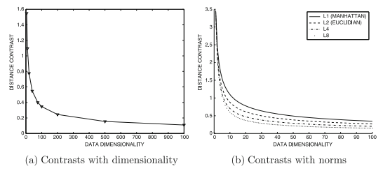

È qui che si verifica il fenomeno della **curse of dimensionality**: all’aumentare della dimensionalità, un uso diretto della norma $L_p$ potrebbe non essere efficace.

È quindi utile esaminare l'impatto delle **feature rilevanti** sui dati considerato che, al crescere delle dimensioni, oltre all'aumento del rumore dei dati si verifica l'aumento del numero di **feature irrilevanti**.

Questi due fattori, combinati con l'uso di norme basate su somme di quadrati (come norme $L_1$ ed $L_2$) causano degli errori nel calcolo delle distanze. È quindi importante, al fine di non avere distanze falsate e di evitare la **course of dimensionality**:

1. eliminare le feature irrilevanti (**Proximity Thresholding**)
2. ridurre il rumore sui dati

### Eliminazione delle feature irrilevanti

Dato che, come abbiamo visto, è desiderabile **selezionare feature rilevanti** a livello locale per il calcolo della distanza, come facciamo a mettere in pratica questo approccio per le applicazioni di data mining?

Un approccio generale, che sembra funzionare bene con dati ad alta dimensionalità è il  **PROXIMITY THRESHOLDING** . Esso si basa sul fatto che l’impatto della variazione dei dati dovuta al rumore lungo i singoli attributi deve essere de-enfatizzato mentre la corrispondenza cumulativa su molte dimensioni deve essere conteggiata.

Viene usata una **PROXIMITY THRESHOLD** (soglia di prossimità) che dipende dalla dimensionalità. Prima di applicare questa sogliatura, è necessario preparare opportunamente (discretizzare) i dati:

Si suddividono le dimensioni dei dati in $k_d$ intervalli equiprofondi, in modo da rendere costante la probabilità che due dati condividano lo stesso intervallo in una data dimensione.

Siano $ \bar X = (x_1, x_2, ..., x_d)$ e $\bar Y = (y_1, y_2, ..., y_d)$ due record d-dimensionali.

Se $x_i, y_i \in k_i \ \ \Rightarrow \ \ Dist(x_i, y_i) < PROXIMITY \ \ THRESHOLD \ \ \Rightarrow \ \ \bar X, \bar Y$ **sono in prossimità della dimensione *i-esima***.

Pertanto, dato l'**insieme delle prossimità** $S \big( \bar X, \bar Y, k_d \big)$, ovvero il sottoinsieme delle dimensioni in cui $\bar X$ e $\bar Y$ sono in prossimità, la dimensione $i \in S \big( \bar X, \bar Y, k_d \big)$.

Ciascun intervallo $k_i$, come tale, è caratterizzato dalla presenza di:

* un estremo superiore $sup(k_i) = m_i$
* un estremo inferiore $inf(k_i) = n_i$

Si parla quindi di **similarità PSelect** tra i record $ \bar X$ e $\bar Y$:

$$
PSelect(\bar X, \bar Y, k_d) = \Bigg[ \sum_{i \ \in \ S(\bar X, \ \bar Y, \ k_d)} {\bigg ( 1 - \frac {|x_i - y_i|} {m_i - n_i} \bigg)^p} \Bigg] ^ {\frac 1 p}
$$

Poiché ogni singola espressione della sommatoria è compresa tra 0 e 1, il valore della PSelect sarà a sua volta compreso nell'intervallo $\Bigg[ 0, \Big| S \big ( \bar X, \bar Y, k_d \big) \Big| \Bigg]$: più questo valore è grande, più $ \bar X$ e $\bar Y$ sono simili.

La scelta di $k_d$ anzichè $d$ fa sì che questo approccio si adatti in maniera automatica al crescere della dimensionalità:

* Per **valori piccoli** di $d$ si avrà un comportamento simile alla norma $L_p$
* Per **valori grandi** di *d* si avrà un comportamento simile alle funzioni di similarità dei **domini testuali**, dove si usa la similarità sulla corrispondenza degli attributi.

### Impatto della distribuzione dei dati

La norma $L_p$ dipende solo dai due dati $\bar X$ e $\bar Y$ ed è invariante alle statistiche globali dei dati rimanenti. Le distanze, dovrebbero anche dipendere **dalla distribuzione dei dati rimanenti** nel dataset.

A tal fine, entra in gioco la **distanza di Mahalanobis**, che tiene esplicitamente conto della covarianza tra i dati che possono avere una particolare distribuzione nello spazio.

$$
Maha \big(\bar X, \bar Y \big) = \sqrt{\big(\bar X - \bar Y \big) \cdot \Sigma^{-1} \cdot \big(\bar X - \bar Y \big)^T}
$$

dove $\Sigma$ è la matrice di covarianza $d \times d$ del dataset ed è una matrice **simmetrica** che **rappresenta la variazione di ogni variabile rispetto alle altre (inclusa sè stessa)**. Ogni elemento è definito come

$$
\sigma_{ij}^2 = \frac 1 n \sum_{h=1}^d(x_{hi} - \mu_i) \cdot (x_{hj}-\mu_j)
$$

$\rightarrow$ La distanza di Mahalanobis è una distanza euclidea che normalizza i dati sulla base delle correlazioni tra attributi.

$\rightarrow$ Diviene banalmente la **distanza euclidea** dopo aver ruotato i dati lungo le loro componenti principali (Σ diviene diagonale).

## Misure di similarità per dati binari, categorici e testuali

### Dati categorici

Le funzioni di distanza nei dati numerici, che sono ordinati, sono calcolate come differenze di valori lungo le dimensioni. Nei dati categorici, invece, non esiste alcun ordinamento tra i valori discreti: come si fa a calcolare le distanze?

Si convertono i dati categorici in numerici attraverso il processo di **BINARIZZAZIONE**.

In questo modo, si otterrebbe un vettore binario sparso che è poco adatto all’uso di distanze. Pertanto, anziché parlare di funzioni di distanza, **nei dati categorici si parla di funzioni di similarità** in quanto, per valori discreti, ha più senso trovare una corrispondenza (una similarità) tra i singoli attributi, ognuno dei quali varia all’interno di una proprio insieme di valori discreti.

Dati due record $\bar X = \big( x_1, x_2, ..., x_d \big)$ e $\bar Y = \big( y_1, y_2, ..., y_d \big)$, la **similarità complessiva** tra $\bar X$ e $\bar Y$ è indicata come:

$$
Sim(\bar X, \ \bar Y) = \sum_{i=i}^d S(x_i, \ y_i)
$$

La scelta di $S(x_i, y_i)$ determina i vari tipi di similarità.

#### Inverse occurrence frequency

Secondo questa misura, **due attributi** corrispondenti di due record **sono simili** sulla base di una funzione inversa della frequenza del valore corrispondente.

$$
S(x_i, y_i) =
\begin{cases}
\frac{1}{p_k(x_i)^2}& \text{$x_i=y_i$}\\
0& \text{altrimenti}.
\end{cases}
$$

dove $p_k(x)$ è la frazione di record per cui il k-esimo attributo vale *x*: va vista come una **frequenza di occorrenze**, ovvero un conteggio del numero delle volte che il k-esimo attributo vale *x* nel dataset.

#### Goodall similarity

$$
S(x_i, y_i) =
\begin{cases}
1 - {p_k(x_i)^2}& \text{$x_i=y_i$}\\
0& \text{altrimenti}.
\end{cases}
$$

### Dati testuali

Come abbiamo visto, un dato testuale può essere considerato un dato quantitativo multidimensionale quando viene trattato come bag-of-words:

* la **frequenza di parole** può essere trattata come un attributo quantitativo
* il **lessico** di base (insieme delle parole) può essere trattato come l’insieme degli attributi

Così facendo, si otterrebbe una matrice sparsa e, come abbiamo visto precedentemente, misure come le norme $L_p$ non gestirebbero bene documenti di lunghezza differente appartenenti ad un corpus documentale e avrebbero la tendenza a riportare valori sempre più alti. Ad esempio, la norma $L_2$ tra due documenti lunghi sarà sempre maggiore rispetto a quella tra due documenti brevi, anche se i primi avrebbero molte parole in comune e i secondi sarebbero completamente disgiunti.

Il problema è quindi relativo alla **lunghezza**: basterebbe trovare qualcosa che sia invariante rispetto ad essa per risolvere questa irregolarità.

Un modo per farlo è usare la **distanza coseno**, dato che il coseno dell’angolo tra due vettori è invariante rispetto alla loro lunghezza:

$$
\cos(\bar X, \bar Y) = \frac {\sum_{i=1}^d x_i \cdot y_i} {\sqrt{\sum_{i=1}^d x_i^2} \cdot \sqrt{\sum_{i=1}^d y_i^2}}
$$

La distanza coseno calcola quindi l'**angolo tra due documenti** $\bar X = (x_1, x_2, ..., x_d)$ e $\bar Y = (y_1, y_2, ..., y_d)$ **su un lessico di dimensione *d***.

### Dati binari

## Similarità per serie temporali e sequenze discrete

## Similarità tra grafi

## Domande Frequenti

1. Analisi delle serie temporali, come viene fatta? Perché si usa la scala della profondità?
2. Differenza fra distanza e similarità, caratteristiche fra le misure di distanza e quelle di similarità.
3. Distanza/similarità fra distribuzioni di probabilità. Quando i dati sono espressi tramite distribuzioni di probabilità, come si fa a vedere se le distribuzioni sono simili o dissimili?

# 5 - Stimatori, Stima e Campionamento

## Definizione di stimatore

In statistica, si definisce **stimatore** una ***funzione che associa ad ogni possibile campione (scelto casualmente all'interno di una popolazione) un valore del parametro da stimare***.
Il valore che viene assunto dallo stimatore in presenza di un campione è detto **stima**. In generale, vale che la stima di una variabile $y$ è una funzione del tipo $y=f(x)+\epsilon$, da cui si evince che:

* la relazione tra $x$ e $y$ non è espressa totalmente da $f$
* si desidera una funzione che approssimi $f$
* $y$ è una stima puntuale nello spazio delle funzioni

## Stimatori polarizzati e non polarizzati

In statistica sono state proposte delle caratteristiche che un buono stimatore dovrebbe soddisfare, tra cui che **l'errore commesso tra la stima e il valore del parametro dev'essere minimo**. Di solito, si sfrutta proprio questa caratteristica per valutare la bontà di uno stimatore, soltanto che, non potendo valutare l'errore puntualmente, si sfrutta lo **scostamento medio**.
Più nello specifico, detto $\theta$ il parametro da stimare e $\hat{\theta}_m$ lo stimatore, funzione del campione m, possiamo calcolare il valore atteso dello scostamento tra stimatore e parametro, detto **distorsione** o **bias**

$$
\mathrm{bias}\left( \hat{\theta}_m \right) = \mathbb{E}\left[ \hat{\theta}_m \right] - \theta
$$

Diciamo che lo stimatore è non polarizzato se $\mathrm{bias}\left( \hat{\theta}_m \right)=0$.

Lo stimatore $\hat{\theta}_m$ si dice asintoticamente non polarizzato se vale

$$
\lim _{m\rightarrow \infty} \mathbb{E}\left[ \hat{\theta}_m \right] = \theta
$$

### Stimatori Campionari di Media

Noto che la **media** è data da $\hat{\mu}_m = \frac{1}m \sum_{i=1}^m x^{(i)}$ e, supposto che i campioni siano tratti da distribuzione gaussiana $\forall i,\ x^{(i)} \sim \mathcal{N}\left( x; \mu, \sigma \right) $, risulta che $\mathrm{bias}\left( \hat{\mu}_m \right) = 0$, dunque che **uno stimatore campionario di media è uno stimatore non polarizzato**.

### Stimatori Campionari di Varianza

Noto che la varianza è data da $\hat{\sigma}_m^2 = \frac{1}m \sum_{i=1}^m \left( x^{(i)}-\hat{mu}_m \right) ^2 $ e, supposto che i campioni siano tratti da distribuzione gaussiana $\forall i,\ x^{(i)} \sim \mathcal{N}\left( x; \mu, \sigma \right) $, risulta che **uno stimatore campionario di varianza è uno stimatore polarizzato**, e che il fattore polarizzante è $\frac{m-1}m$.
Basterà scegliere, infatti, una varianza $\bar{\sigma}_m = \frac{1}{m-1} \sum_{i=1}^m \left( x^{(i)}-\hat{mu}_m \right) ^2 $ per ottenere uno stimatore non polarizzato.

### Varianza di uno stimatore

È la misura ***utilizzata per valutare quanto sia stabile la stima rispetto alla variazione dei campioni utilizzati***. Da questa misura, indicata come $\mathrm{Var}\left( \hat{\theta} _m \right)$, si può ricavare lo **standard error** come

$$
\mathrm{SE}\left( \hat{\theta}_m \right) = \sqrt{\mathrm{Var}\left( \hat{\theta} _m \right)}
$$

Lo standard error è definito come la ***stima della deviazione standard dello stimatore***.

### Errore Quadratico Medio (MSE)

Si usa per giudicare la bontà di uno stimatore a minimo bias e a minima varianza, ossia ideale. Indica la ***discrepanza quadratica media tra i valori dei dati osservati e i valori dei dati stimati***, secondo la relazione

$$
\mathrm{MSE} = \mathcal{E}\left[ \left( \hat{\theta}_m - \theta \right) ^2 \right] = \mathrm{bias}\left( \hat{\theta}_m \right) + \mathrm{Var}\left( \hat{\theta} _m \right)
$$

## Campionamento e stimatori

Gli stimatori visti finora rientrano tra quelli ottenuti coi metodi di ***Monte Carlo***, metodi basati sul campionamento casuale.

Quando si usano i metodi di Monte Carlo, si ottiene una **stima della quantità ricercata con un certo errore**, per cui bisogna fare molta attenzione al processo di **campionamento**, ossia la scelta dei campioni necessari alla stima.
In genere, si campionano dati da una distribuzione per approssimare un integrale non trattabile numericamente o attraverso una serie finita di somme.
Se osserviamo tale integrale come il calcolo di un valore atteso, stimato attraverso la corrispondente media

$$
s = \int p(x)f(x) dx = \mathbb{E}_p \left[ f(x) \right]
$$

Osserviamo, adesso, alcuni metodi di campionamento.

### Campionamento con Distribuzione Uniforme

È un tipo di campionamento che fornisce gli stimatori visti in precedenza

### Campionamento Stratificato

È un tipo di campionamento che funziona in questo modo:

1. Si suddivide la popolazione in **strati omogenei** rispetto alla variabile da stimare **usando**, però, **un'altra variabile correlata**.
2. Si estrae con una procedura di campionamento con rimpiazzo il campione relativo a ciascuno strato.
3. Si mettono insieme i campioni estratti ottenendo un campione globale.

**La stima della varianza**, con questo metodo, **dipende dal numero di strati** $S$ **e dal numero di campioni per strato** $n_k$

$$
\hat{\sigma}^2 = \sum_{k=1}^L \left( \frac{S_k}S \right) ^2 \frac{\sigma_k^2}{n_k}
$$

Da notare che, se gli strati hanno tutti la stessa dimensione, la funzione diventa

$$
\hat{\sigma}^2 = \frac{1}L \sum_{k=1}^L \sigma_k^2
$$

### Campionamento per Importanza

L'idea alla base è quella di **approssimare la distribuzione di probabilità di cui calcolare il valore atteso**. Poiché tale distribuzione di probabilità non è nota, si possono estrarre campioni da una distribuzione nota, detta **funzione importanza**, che, si spera, approssimi la distribuzione originaria. Ne risulta

$$
s = \int p(x)f(x) dx = \int q(x)\frac{p(x)f(x)}{q(x)} dx
$$

che, per una distribuzione $x\sim q$, diventa

$$
s =  \mathbb{E}_{x\sim q} \left[ \frac{p(x)f(x)}{q(x)} \right]
$$

Osserviamo, adesso, il comportamento degli stimatori:

* **Stimatore di media**

  $$
  \hat{s}_q = \frac{1}n \sum_{i=1, x^{(i)}\sim q} ^n \frac{p(x^{(i)})f(x^{(i)})}{q(x^{(i)})}
  $$

  $$
  \mathbb{E}_q \left[ \hat{s}_q \right] = \frac{1}n \sum_{i=1, x^{(i)}\sim q} ^n q(x^{(i)})\cdot \frac{p(x^{(i)})f(x^{(i)})}{q(x^{(i)})} = \mathbb{E}_p \left[ \hat{s}_p \right] = s
  $$

  Da cui si evince che si può ricondurre la stima secondo $q(x)$ alla stima secondo $p(x)$, ossia quella esatta. Ciò ci permette di dire che **lo stimatore di media non è polarizzato**.
* **Stimatore di varianza**
  Per la legge dei grandi numeri, vale che

  $$
  \mathrm{Var}\left[ \hat{s}_q \right] = \frac{\mathrm{Var}\left[ \frac{p(x)f(x)}{q(x)} \right]}n
  $$

  Scegliendo una funzione importanza $ q*(x) = \frac{p(x) |f(x)|}{Z} $, si riconduce la varianza di $f$ ad una forma normalizzata rispetto al suo valore assoluto, con una varianza della stima

  $$
  \mathrm{Var}\left[ \hat{s}_q \right] = 0
  $$

  Da cui, paradossalmente, possiamo dedurre che basta un solo campione per avere una stima esatta, anche se stiamo lavorando con l'ipotesi di conoscere $p(x)$ e $f(x)$, che non è sempre vera. In ogni caso, **lo stimatore di varianza è non polarizzato**.

## Stima MLE e MAP

### Maximum Likelihood Estimation

È un **procedimento matematico per determinare uno stimatore**, e consiste nel **massimizzare una funzione di verosimiglianza**, definita in base alla probabilità di osservare una determinata realizzazione campionaria condizionatamente ai valori assunti dai parametri statistici da stimare.

La MLE è uno dei principi che possono essere utilizzati per definire se una funzione rappresenta un buono stimatore per una certa classe di modelli di apprendimento. Dato un **insieme** $\mathbb{X} = \{ x^{(1)}, \cdots, x^{(m)} \}$ **di dati osservati** e una **distribuzione di probabilità** $p_{\mathrm{data}}(x)$ **non nota**, **la stima dei parametri** della MLE è data da

$$
\theta _{ML} = \mathrm{argmax}_{\theta} p_{\mathrm{model}} \left( \mathbb{X}; \theta \right) = \mathrm{argmax}_{\theta} \prod _{i=1}^m p_{\mathrm{model}} \left( x^{(i)}; \theta \right)
$$

Passando ai logaritmi

$$
\theta _{ML} = \mathrm{argmax}_{\theta} \sum _{i=1}^m \log p_{\mathrm{model}} \left( x^{(i)}; \theta \right) = \mathrm{argmax}_{\theta} \mathbb{E}_{x\sim p_{\mathrm{data}}} \log p_{\mathrm{model}} \left( x^{(i)}; \theta \right)
$$

Dove abbiamo, però, che $\mathbb{E}_{x\sim p_{\mathrm{data}}}$ è n**ota dall'osservazione empirica** dei dati.

Supponiamo di voler minimizzare la distanza tra la distribuzione empirica e quella del modello in termini della loro $D_{KL}$

$$
D_{KL} \left( \hat{p}_{\mathrm{data}} | p_{\mathrm{model}} \right) = - \mathbb{E}_{x\sim \hat{p}_{\mathrm{data}}}\left[ \log p_{\mathrm{model}}(x) \right]
$$

Ovvero la cross-entropia della distribuzione del modello rispetto a quella dei dati.

**È possibile estendere la MLE anche alle stime dei classificatori**. Sfruttando l'ipotesi che i dati siano indipendenti e identicamente distribuiti (i.i.d. assumption), possiamo scrivere che

$$
\theta _{ML} = \mathrm{argmax}_{\theta} \mathrm{Pr}\left( Y|\bold{x}; \theta \right) = \mathrm{argmax}_{\theta} \sum _{i=1}^m \log \mathrm{P}\left( y^{(i)}| x^{(i)};\theta \right)
$$

**Sotto l'ipotesi di una distribuzione gaussiana,** si dimostra che **l'errore quadratico medio (MSE) corrisponde alla MLE**.

### Stima Maximum a Posteriori

Mentre la **MLE** opera secondo **statistica frequentista**, la stima **MAP** opera secondo **statistica bayesiana**. La differenza principale tra i due tipi
di statistica risiede nel fatto che mentre, per la statistica frequentista, i parametri del modello sono considerati fissi e che i risultati degli esperimenti ripetibili,
per la statistica di Bayes i parametri del modello sono considerati come **variabili casuali** e la cui osservazione è condizionata da una **conoscenza precedente imperfetta**,
rappresentata da una distribuzione di probabilità **detta prior**.

La stima MAP è una moda della distribuzione a posteriori della formulazione di Bayes, e può essere usata per ottenere una stima puntuale di una quantità inosservata sulla
base dei dati empirici.

Il processo di stima avviene a partire dalla regola di Bayes, che stima una **distribuzione di probabilità a posteriori** su una variabile casuale $\theta$

$$
p\left( \theta | x^{(1)}, \cdots ,x^{(m)} \right) = \frac{p\left( x^{(1)}, \cdots ,x^{(m)} | \theta \right) p(\theta)}{p\left( x^{(1)}, \cdots ,x^{(m)}\right)}
$$

dove:

* $p\left( \theta | x^{(1)}, \cdots ,x^{(m)} \right)$ è detta **posterior** (o probabilità a posteriori)
* $p\left( x^{(1)}, \cdots ,x^{(m)} | \theta \right)$ è la **likelihood** (o verosimiglianza)
* $p(\theta)$ è il **prior** (o probabilità a priori)
* $p\left( x^{(1)}, \cdots ,x^{(m)}\right)$ è la **evidence** (o dati noti/evidenza)

In questo contesto, **è importante la scelta del prior**, che:

* deve riflettere l'incertezza aprioristica sul valore di $\theta$
* deve avere una **distribuzione uniforme/gaussiana** sul dominio di variazione
* deve avere **alta entropia**

La stima MAP non è altro che la scelta di un valore puntuale per $\theta$ al posto dell'intera distribuzione

$$
\theta_{\mathrm{MAP}} = \mathrm{argmax}_{\theta} p\left( \theta | x \right) = \mathrm{argmax}_{\theta} \left[ \log p\left( x | \theta \right) + \log p\left( \theta \right) \right]
$$

Caratteristica importante della stima MAP è che **riduce la varianza dello stimatore rispetto alla MLE**.

## Domande Frequenti

1. Cos'è uno stimatore statistico? Cosa si intende per stima? Stima bayesiana (maximum a posteriori)
2. MLE
3. MAP
4. Campionamento. Cos'è una stima? Cosa vuol dire rendere la stima più precisa?

# 6 - Mining di Pattern Frequenti

## Generalità e definizioni

## Proprietà di Itemset e Regole

## Algoritmo Apriori e sue varianti

## Mining di pattern interessant

## Gestione di grandi database

## Domande Frequenti

1. Algoritmo Apriori (cos'è una transazione, cos'è un database di transazioni, cos'è un itemset, proprietà di chiusura)
2. Descrivere una versione dell'algoritmo Apriori, come funziona l'algoritmo? Come fa a calcolare gli itemset per un dato supporto?

# 7 - Data Warehousing e Data Lake

## Introduzione

Un **database** è una collezione di dati **persistente** e **condivisa**, gestita in modo **efficace**, **efficiente** e **affidabile** attraverso un **DBMS**, che
altro non è che un software progettato per consentire la **creazione**, la **manipolazione** e l'**interrogazione** della base di dati.

Al giorno d'oggi, sarebbe desiderabile che ogni organizzazione abbia un DB, che ciascuna applicazione abbia accesso solo alla porzione
di dati di sua competenza, in tempo reale e senza duplicazione, senza dimenticarsi di alte prestazioni nell'esecuzione di tutte le
operazioni. Le caratteristiche appena elencate caratterizzano quella che viene definita base di dati **ideale**.

In realtà, vista la realtà mutevole nel tempo, è più facile imbattersi in basi di dati distribuite, eterogenee e autonome.

### Risorse e Processi

Si definisce **risorsa** di un'organizzazione **tutto ciò su cui essa opera** (materiale/immateriale) **per perseguire gli obiettivi aziendali**, mentre si definisce
**processo** aziendale **l'insieme di attività** (inteso come sequenza di azioni) che l'organizzazione svolge nel suo complesso **per raggiungere un'obiettivo** aziendale.

Esistono tre categorie di processi:

1. **Processi Decisionali**, che operano su **dati integrati e fortemente aggregati**, facendo uso di **operazioni non strutturate** (senza criteri precisi)
2. **Processi Gestionali**, che operano su **dati settoriali e parzialmente aggregati**, facendo uso di **operazioni semi-strutturate** (regole note, ma dipendenti dall'essere umano)
3. **Processi Operativi**, che operano su **dati dipartimentali e dettagliati**, facendo uso di **operazioni strutturate** (basate su regole ben definite)

Sulla base dei processi aziendali, possiamo distinguere tre tipologie di sistemi informatici:

1. Processi Decisionali $\longrightarrow$ **Sistemi di Supporto alle Decisioni**
2. Processi Gestionali $\longrightarrow$ **Sistemi di Gestione delle Informazioni**
3. Processi Operativi $\longrightarrow$ **Sistemi di Elaborazione delle Transazioni**

### OLTP e OLAP

Definiamo **sistema di supporto alle decisioni** un qualsiasi sistema informatico che aiuta quanti devono prendere **decisioni strategiche per risolvere problemi non risolvibili con strategie
di ricerca operativa**.

Il supporto alle decisioni avviene attraverso l'aggregazione dei dati dei processi gerarchicamente sottostanti. Dal punto di vista dell'elaborazione
dei dati, abbiamo due categorie di processing:

1. **On-Line Transaction Processing (OLTP)** - su basi di dati nei sistemi di **livello operativo**
2. **On-Line Analytical Processing (OLAP)** - su sistemi di **livello più alto**

#### OLTP

Detti anche **sistemi transazionali**, permettono di registare, modificare e mostrare record in tempo reale. **I dati sono distribuiti su più tabelle**, mentre le
informazioni vengono inserite solo una volta, cosa che evita ridondanze. I sistemi OLTP sono caratterizzati da **operazioni elementari estremamente veloci** e,
dati il livello di competenza dell'utenza e la sua natura esecutiva, **possibilità di generare errori minima**.

Proprio per l'ultima caratteristica citata, i sitemi OLTP fanno enorme uso di **transazioni**, ossia **insiemi di operazioni atomiche sequenziali**, che quindi ha
successo/fallimento in blocco. Per le caratteristiche delle sue transazioni, si dice che i sistemi OLTP possiedono le proprietà di **Atomicità**, **Coerenza**,
**Isolamento** e **Durabilitintegratoreà** (**ACID**), rendendo tutte le operazioni rapide e fluide.

Tra le altre caratteristiche ricordiamo:

* **esigenze di archiviazione ridotte** (i dati storici vengono salvati altrove)
* **progettazione multi-tabellare e normalizzata**, quindi priva di ridondanze o incoerenze tra le tabelle
* **gestione sicura e affidabile dei dati correnti**, in modo da garantire la continuità di servizio

#### OLAP

Si tratta di sistemi che **non lavorano su dati recenti**, ma su archi temporali piuttosto ampi, motivo per cui il loro **aggiornamento** avviene s**u dati operativi periodici** e la loro dimensione tende a crescere nel tempo.

I sistemi OLAP sono molto utili anche perché consentono di osservare i dati da diverse prospettive o, in termini tecnici, **dimensioni**.
Ogni **dimensione** dei dati **raccoglie i criteri in base ai quali si potranno utilizzare i dati** e viene rappresentata con una struttura a cubo di $N$ lati, ognuno dei quali indica le misure corrispondenti.

Rispetto ai sistemi OLTP, i sistemi OLAP sono caratterizzati da:

* *grosse esigenze di archiviazione* (per memorizzare i dati storici)
* **progettazione de-normalizzata con poche tabelle**
* **gestione della sicurezza poco rilevante**, in quanto non pregiudica la continuità di servizio.

Nella seguente figura, sono schematizzate le caratteristiche dei sistemi OLTP e OLAP, ed è possibile evidenziarne le differenze.

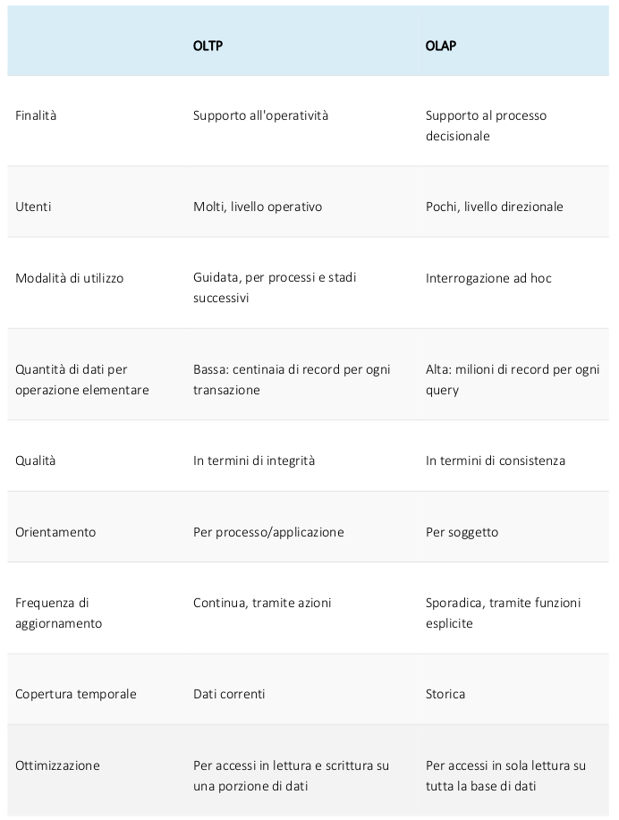

Per come sono pensati i due sistemi, **è impossibile implementare tutte le funzionalità in una singola workstation**, dato che, a partire dalla stessa progettazione, entrambi rischiano di danneggiarsi a vicenda.

## Data warehouse e data warehousing

### Multi-Database e Data Warehouse

Nell'ottica di basi di dati distribuite, eterogenee e autonome, sono le due correnti di pensiero predominanti.

Un sistema **multi-database** (o database federato) è una struttura che consente agli utenti di **accedere a dati distribuiti su più database** attraverso diversi DBMS.

In un sistema del genere, le **transazioni globali** vengono gestite da un **controllore proprio del multi-database**, ma le **transazioni interne** alla singola base di dati vengono gestite dallo **specifico DBMS**.
I DBMS locali, inoltre, non sono consapevoli degli altri, dunque **non possono prevedere le meccaniche di coordinamento** tradizionali atte a garantire atomicità e coerenza.

In corrispondenza di ogni singolo DBMS troviamo un **mediatore**, utile a **convertire query generiche** provenienti dallo strato **integratore** superiore in **query dedicate** per le varie basi di dati sottostanti

Di converso, un **data warehouse** è una **collezione** (aggregazione) **di dati strutturati provenienti da fonti eterogenee** (interne e esterne al sistema informativo aziendale) **utili per analisi e rapporti informativi**, in uso principalmente nei processi decisionali di impresa.

In generale, può essere visto come una grande banca dati in sola lettura, in quanto **non necessita delle operazione CRUD** (create, read, update e delete). Nell'ambito dell'analisi OLAP, il sottoinsieme del data warehouse viene detto **data mart**.

In un sistema di data warehousing, la creazione di un database non avviene tramite DBMS, ma tramite un **gestore** del data warehouse, che implementerà i processi di tipo OLAP, in modo che i livelli integratore e mediatore possono popolare il data warehouse in modo asincrono rispetto alle interrogazioni fatte al gestore.

### Data Warehouse

Un data warehouse dev'essere:

* uno **strumento di supporto alle decisioni**
* **integrato**, in quanto i dati vengono da fonti eterogenee
* **orientato ai dati** (non alle applicazioni), in quanto **deve servire solo per decisioni strategiche** e non per processi operativi
* **con dati storici**, raccolti su orizzonti temporali molto ampi, utili a osservare le variazioni sul periodo
* **con dati aggregati**, utili per stime e valutazioni, in quanto non serve sapere il fenomeno in dettaglio, ma avere indicatori generali su di esso
* **fuori linea**, nel senso che **il suo aggiornamento non deve avvenire in tempo reale** (spesso si aggiornano i dati in batch quando l'azienda non è operativa)
* **separata dalle basi di dati operazionali**, in quanto:
  * non esiste un DB operazionale con tutti i dati di interesse
  * il data warehouse dev'essere integrato
  * non è possibile fare l'integrazione in linea (per questioni di reattività del sistema).

#### Architettura

Il **processo di gestione e valutazione dei dati** da parte di un data warehouse si chiama **data warehousing**. Prevede:

1. **l'acquisizione** e **l'integrazione** dei dati
2. **l'archiviazione** dei dati
3. **la valutazione** e **l'analisi** dei dati

Questa suddivisione non è casuale, in quanto la **struttura modulare** dei data warehouse si compone di **tre livelli** omologhi (acquisizione, archiviazione e presentazione).

Come detto in precedenza, il data warehouse presenta anche un componente di controllo centralizzato, ossia il **data warehouse manager**.

#### Data Mart

Sono **sottoinsiemi di un data warehouse** più generale **mirati a specifiche porzioni di dati e processi**. Contengono immagini dei dati al loro interno, utili per formulare strategie in base all'evoluzione storica del fenomeno di interesse.

La differenza fondamentale consiste nel fatto che la creazione di un data warehouse avviene a partire da database operazionali, mentre i data mart vengono generati per venire incontro a un'esigenza specifica predeterminata.

La scelta di utilizzare un data mart come sistema separato è legata a:

* **necessità di utilizzare un diverso schema di rappresentazione**
* **migliorare le performance** separando l'hardware dedicato
* **garantire una maggiore sicurezza** con accessi autorizzati su porzioni minori di dati

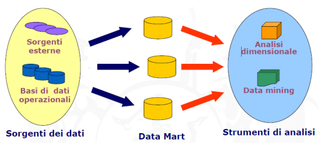

In generale, sono due gli approcci di gestione dell'architettura con data mart:

* **top-down**, con cui i data mart vengono creati a partire da un data warehouse
* **bottom-up**, con cui i data mart concorrono a creare un data warehouse

Da un punto di vista logico, sembrerebbe più sensato il secondo approccio, in quanto basta progettare i data mart, per poi allinearli e integrarli per formare un data warehouse. In realtà, per quanto controintuitivo, **la progettazione di buoni data mart non porta sempre alla realizzazione di buoni data warehouse**, in quanto, se ci si dimentica di progettare un data mart per un processo, il data warehouse risultante non lo conterrà mai; al contrario, l'approccio top-down permette di superare questo limite, ma risulta **particolarmente inefficiente**, in quanto lo sforzo computazionale effettuato per progettare e realizzare il data warehouse rende inutile ogni forma di data splitting per la realizzazione dei data mart.

Esiste una soluzione ibrida, che prevede la creazione di data mart che concorrono alla creazione di un **data warehouse tramite un bus**.
Un'architettura bus è composto da un insieme di **data mart strettamente integrati** caratterizzati da:

* **dimensioni conformi**, che devono essere definite e implementate solo una volta
* **tabelle dei fatti**, che sono costituite da misurazioni, metriche o fatti su un dato processo aziendale

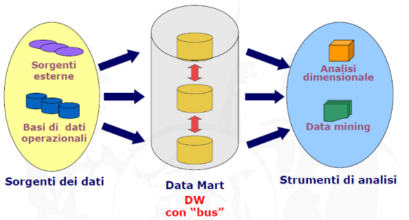

La struttura con bus permette di aggregare i data mart semplicemente pensandoli come un insieme, dato che sono strettamente integrati, e consente di interrogare la struttura globale sapendo già che il data split è stato effettuato e che, quindi, l'interrogazione sarà più efficiente.

#### Elementi di un Data Warehouse

Abbiamo:

1. sorgenti dei dati eterogenee, da cui vengono estratti i dati
2. area di preparazione dei dati (data staging), in cui abbiamo:

* aree di memorizzazione
* processi di preparazione dei dati (pulizia, trasformazione, combinazione, ecc.)
  solitamente viene distribuita su più calcolatori e gestisce dati con formati di varia natura

Definiamo ETL (extract, transform, load) il complesso di processi che porta i dati dai sistemi operazionali al data warehouse attraverso l'area di staging.

3. server di presentazione del data warehouse, in cui i dati sono organizzati e memorizzati per essere interrogati.
   Fanno uso di dati in forma multidimensionale e possono essere adottate tecnologie caratterizzanti le operazioni OLAP:

* con RDBMS si parla di operazioni ROLAP
* con operazioni OLAP in cui i concetti di fatto e dimensione sono espliciti si parla di MOLAP

4. sistemi di visualizzazione dei dati

#### Modello Logico per Data Warehouse

La rappresentazione dei dati in un'analisi OLAP avviene in forma **multidimensionale**. La rappresentazione multidimensionale di concetti di interesse per l'azienda permette di esplodere o aggregare elementi di interesse, così come modificare tale rappresentazione per adattarla ad operazioni aggregate o di rappresentazione.

Elementi fondamentali per la rappresentazione multidimensionale (e per l'analisi) sono:

* **fatto**, ossia un concetto su cui centrare l'analisi
* **misura**, ossia una proprietà atomica di un fatto da analizzare
* **dimensione**, ossia la prospettiva lungo cui effettuare l'analisi

| Fatti      | Misure                     | Dimensioni      |
| ---------- | -------------------------- | --------------- |
| vendita    | quantità venduta, incasso | prodotto, tempo |
| telefonata | costo                      | durata          |

## Dati multidimensionali

Le rappresentazioni tridimensionali aiutano i decisori di un'azienda, in quanto permettono di derivare concetti e/o fenomeni in modo intuitivo, semplicemente splittando o aggregando porzioni di questa figura.

Su dati multi-dimensionali, le operazioni possibili sono:

* **roll-up (drill-up)**, per **aggregare** i dati e mostrarli ad una grana più grossa
* **drill down**, per **disaggregare** i dati ed esploderli in una grana più fine
* **slice & dice**, per **selezionare** e **proiettare** porzioni dei dati
* **pivot**, per **riorientare** i dati nello spazio

Ogni dimensione del dato è organizzata in una gerarchia, che rappresenta i diversi livelli di aggregazione (ad esempio città $\leftrightarrow$ provincia $\leftrightarrow$ regione).

### Implementazioni per Dati Multidimensionali

#### MOLAP

L'**OLAP multidimensionale** è un OLAP in senso classico che utilizza un **cubo multidimensionale**. I dati vengono precalcolati, riepilogati e archiviati in un MOLAP e un utente può utilizzare i dati multidimensionali visualizzandoli sotto diverse sfaccettature. Piuttosto che utilizzare un database relazionale, la cui interrogazione richiederebbe più tabelle, un'implementazione MOLAP **contiene tutte le possibili combinazioni dei dati già archiviate in un array multidimensionale**, permettendo a MOLAP di essere più veloce di ROLAP.
In un'implementazione MOLAP i dati sono accessibili in modo diretto grazie all'**indicizzazione delle matrici**.

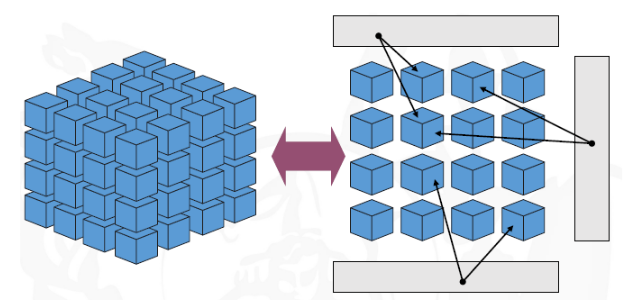

#### ROLAP

L'OLAP Relazionale è un OLAP che esegue l'analisi multidimensionale dinamica dei dati archiviati un un RDB. L'elaborazione dei dati può avvenire sul client, nel sistema di database o su un server. In un'architettura a due livelli, il client interroga il database e riceve i dati richiesti, in una a tre livelli l'utente invia, invece, una richiesta di analisi multidimensionale e il motore ROLAP la converte in SQL per l'invio al database, con il processo eseguito al contrario per l'invio dei dati.
Usando database relazionali, ROLAP richiede più tempo di elaborazione e spazio su disco per operazioni tipiche dei database multidimensionali, ma supporta più utenti e maggiori quantità di dati. Lo schema usato da ROLAP è detto a stella e si compone di:

* tabella dei fatti, che memorizza le misure di un processo in forma molto disaggregata
* due o più tabelle di dimensione, che rappresentano prospettive di analisi dei dati (ossia fenomeni per cui è utile analizzare i fatti)

### Tabelle di Dimensione

Si tratta di tabelle che **memorizzano gli elementi di una dimensione rispetto a cui è interessante analizzare un processo**. Ciascun loro record descrive esattamente un elemento della rispettiva dimensione.
In una tabella di dimensione, i record memorizzano gli attributi dei membri, dove per attributi si intendono le proprietà (testuali, discrete, descrittive) dei membri.

Negli schemi dimensionali, le **chiavi** sono **legate all'indicizzazione della dimensione alla grana più fine di interesse**, solitamente sono da preferire chiavi semplici (numeriche) e locali (progressive) per rendere le query più semplici.

Di solito le dimensioni **non sono normalizzate**, per cui potrebbe sembrare lecito eliminare le ridondanze procedendo alla normalizzazione: in realtà, negli schemi dimensionali, **si preferisce avere dimensioni non normalizzate** per non dover eseguire operazioni di aggregazione o esplosione che appesantirebbero l'esecuzione di una query.

È possibile, però, modellare le dimensioni in modo che siano memorizzate in più tabelle di dimensioni correlate, secondo un processo detto **snowflaking**. Lo snowflaking è solitamente svantaggioso, in quanto:

* causa grande **spreco di memoria**
* **può peggiorare le prestazioni e complicare la scrittura delle query**
* **non porta benefici in termini di riduzione delle anomalie**, in quanto le tabelle di dimensione sono, di fatto, delle LUT

### Tabelle dei Fatti

Permettono di memorizzare le **misure numeriche di un processo**. In ogni loro record abbiamo una $n-$pla di fatti relativi a una combinazione degli elementi delle dimensioni con riferimento a una certa granularità (grana).

I campi della tabella dei fatti sono partizionati in due insiemi:

* **chiave** (composta), in cui vi sono riferimenti alle chiavi primarie delle tabelle di dimensione che **stabiliscono la grana dei fatti**
* **misure**, ossia valori numerici comparabili e additivi

Un fatto si dice **additivo** se ha senso sommarlo rispetto a **ogni possibile combinazione delle dimensioni** da cui dipende (es. l'incasso monetario è un fatto additivo, in quanto ha senso sommarlo per le dimensioni temporali, locali e per prodotti). La proprietà di additività è importante, in quanto le applicazioni del data warehouse devono spesso combinare fatti descritti da molti record di una tabella dei fatti. I fatti possono essere **semi-additivi** se ha senso aggregarli solo in **alcune dimensioni**, mentre, negli altri casi, i dati si dicono **non additivi**.

## Data Lake

Un **data lake** è un **archivio centralizzato che contiene una vasta quantità di dati grezzi e non strutturati provenienti da diverse fonti**. È progettato per immagazzinare dati senza la necessità di una struttura o uno schema predefinito. L'obiettivo principale di un data lake è quello di **consentire l'archiviazione, l'analisi e l'elaborazione di grandi volumi di dati** in modo flessibile e scalabile.

Per quanto riguarda le **tecnologie** per i big data utilizzate nei data lake, ci sono diverse opzioni disponibili. Alcune delle tecnologie comuni includono:

1. **Hadoop**, grazie ad HDFS e MapReduce.

2. **Apache Spark**, che consente l'elaborazione in tempo reale, l'elaborazione di flussi di dati e il supporto per il machine learning.

3. **Database NoSQL**, come Apache Cassandra, MongoDB o HBase, grazie alla loro capacità di gestire grandi volumi di dati non strutturati.

4. **Cloud storage**, come Amazon S3, Google Cloud Storage o Azure Blob Storage, grazie alla loro scalabilità, durabilità e facilità di accesso ai dati.

La struttura logica del data lake suddivide i dati in **diverse aree** in base al loro scopo e livello di elaborazione. Le zone comuni di un data lake includono:

1. **Raw Zone**: È l'area in cui vengono caricati i dati grezzi provenienti da diverse fonti. In questa zona, i dati non subiscono alcuna trasformazione o pulizia.

2. **Staging Zone**: È l'area in cui i dati grezzi vengono trasformati e preparati per l'elaborazione successiva. Qui è possibile applicare regole di pulizia, normalizzazione e strutturazione dei dati.

3. **Curated Zone**: È l'area in cui i dati vengono archiviati per l'analisi e l'elaborazione. In questa zona, i dati sono organizzati in modelli logici e possono essere facilmente accessibili per l'elaborazione analitica.

4. **Sandbox Zone**: È un'area separata in cui gli utenti possono esplorare e sperimentare con nuovi dati o algoritmi senza influire sui dati curati o sulla produzione.

L'integrazione tra un data lake e un data warehouse è un aspetto importante dell'architettura dei dati aziendali. Essa avviene in diversi modi:

1. **Ingestione dei dati**: I dati grezzi provenienti dal data lake possono essere estratti, trasformati e caricati nel data warehouse per essere utilizzati in analisi e reportistica aziendale.

2. **Elaborazione congiunta**: Alcune analisi richiedono sia dati strutturati che dati non strutturati. In questo caso, il data lake e il data warehouse possono essere utilizzati insieme per l'elaborazione dei dati e per generare risultati più approfonditi e significativi.

3. **Archiviazione di backup**: Il data warehouse può utilizzare il data lake come archivio di backup per i dati grezzi o non strutturati, consentendo di recuperare e ripristinare i dati in caso di necessità.

### Architettura lambda

È un approccio per l'integrazione tra un data lake e un data warehouse che consente di **combinare dati in tempo reale e batch per analisi e reportistica aziendale**.
Questa architettura si basa sulla creazione di due percorsi paralleli per l'elaborazione dei dati:

1. **Batch Layer** (Strato batch): In questo strato, i dati vengono elaborati in modalità batch. 
   1. I dati grezzi vengono estratti dal data lake e trasformati utilizzando *algoritmi di elaborazione batch*. 
   2. I risultati di questa elaborazione vengono **memorizzati nel data warehouse**, creando una versione aggiornata e strutturata dei dati.

2. **Speed Layer** (Strato di velocità): Questo strato gestisce l'elaborazione dei dati in tempo reale o quasi. 
   1. I dati grezzi vengono trasmessi allo speed layer e vengono elaborati utilizzando *algoritmi di elaborazione in tempo reale*. 
   2. I risultati di questa elaborazione vengono **combinati con i dati presenti nel data warehouse** per fornire analisi in tempo reale o quasi in tempo reale.

La combinazione dei risultati dei due strati avviene attraverso un **servizio di query** o un **layer di unificazione**, che consente di ottenere una visione completa e aggiornata dei dati dal data lake e dal data warehouse. Questo permette di eseguire analisi che combinano dati storici e dati in tempo reale.

L'architettura Lambda offre diversi vantaggi, tuttavia, può essere **complessa da implementare** e richiede una gestione accurata delle trasformazioni e delle sincronizzazioni tra i due strati per mantenere l'integrità e la coerenza dei dati.

## Domande Frequenti

1. Schema a stella data warehouse

# 8 - Introduzione a HDFS

HDFS (Hadoop Distributed File System) è un **sistema di file distribuito**, parte integrante di Apache Hadoop, progettato per archiviare e gestire grandi quantità di dati in modo efficiente e affidabile su cluster di computer commodity (computer economici e di basso costo).

## Caratteristiche di HDFS

HDFS è **progettato per gestire file di grandi dimensioni**, tipicamente di dimensioni comprese tra i gigabyte e i petabyte, suddividendoli in **blocchi di dimensioni fisse**, tipicamente di 128 MB o 256 MB. I blocchi vengono **distribuiti su diversi nodi** del cluster e **replicati** per garantire l'affidabilità dei dati e la tolleranza ai guasti. HDFS è in grado di gestire la replicazione dei blocchi, la gestione del failover, l'accesso parallelo ai dati e la scalabilità orizzontale del cluster.

## Architettura

Le componenti principali di HDFS sono:

* **NameNode**: il NameNode è il componente centrale di HDFS e gestisce il namespace del file system, ovvero i nomi dei file e delle directory, nonché le informazioni di posizione e di replicazione dei blocchi di dati. Il NameNode funziona come un singolo punto di fallimento, quindi è importante avere un meccanismo di backup o di ripristino in caso di problemi.
  Il NameNode è caratterizzato da metadati scritti in due file, uno statico e uno dinamico, aventi la stessa struttura: il primo è FsImage, che contiene la lista dei nomi del file system, il secondo è EditLogs, che registra tutte le operazioni fatte nello spazio dei nomi.
* **DataNode**: il DataNode è il componente di storage di HDFS e gestisce i blocchi di dati, ovvero il contenuto dei file. Il DataNode si occupa dell'accesso ai dati, della lettura e scrittura dei blocchi e della replicazione dei blocchi su altri nodi del cluster. I datanode sono fisicamente organizzati in rack, ossia vengono considerati come facenti parte di un unico insieme.
* **Secondary NameNode**: il Secondary NameNode è un nodo di supporto che aiuta il NameNode a gestire le informazioni sul file system. Il Secondary NameNode crea regolarmente snapshot del namespace del file system e delle informazioni di posizione dei blocchi di dati, che vengono utilizzati in caso di ripristino del sistema.

Vi sono anche altri nodi che permettono di mantenere la sincronizzazione dell'architettura, come il **CheckpointNode** e il **BackupNode**, le cui funzionalità sono intuitive.

Una proprietà importante per HDFS è la **rack awareness**, per cui si progetta un algoritmo che permetta al NameNode di **scegliere il DataNode ad esso più vicino**, in modo da limitare l'uso di banda di rete e ridurre i costi delle operazioni read/write.

Un'altra caratteristica saliente di HDFS è la cosiddetta **high availability**, ossia quella caratteristica per cui, quando un client richiede una risorsa e non ottiene una risposta per il percorso associato alla risorsa, **il NameNode riesce a restituire la nuova locazione** per leggere dei blocchi dagli altri DataNode e ottenere l'informazione richiesta.

## Operazioni di read/write

(*Le immagini nelle slide sono esplicative*)

## Caratteristiche avanzate

* **High availability del NameNode** - Uso di almeno due NameNode ridondanti sempre in
  funzione, uno **attivo** e uno **passivo**. Il NameNode passivo entra in gioco nel momento in cui quello attivo va in fault, venendo messo prima in stand-by e poi divenendo il nuovo nodo passivo.
  Per implementare tale strategia, viene fatto uso del **QuorumJournalNode**, ossia un **pool di nodi** di journaling, in cui ogni nodo **genera e condivide i propri EditLog**, che poi il nodo candidato a diventare attivo deve leggere e garantire di aver aggiornato il proprio namespace in modo corretto. Si dimostra che, per $N$ nodi di journaling, sono gestibili $\frac{N-1}2$ fallimenti.
* **Federazione di HDFS** - Per come è pensata, HDFS è letteralmente il collo di bottiglia delle
  applicazioni distribuite, pertanto soffre di problemi come:

  * **forte accoppiamento tra storage dei blocchi e spazio dei nomi;**
  * **poca scalabilità dello spazio dei nomi;**
  * **performance limitate dal throughput del NameNode;**
  * **assenza di isolamento tra le applicazioni e tra chi gestisce il cluster e la gestione dello spazio dei nomi**.

  Pertanto, si può pensare di **federare più HDFS**, facendo in modo che ogni NameNode abbia un pool di blocchi, che vi sia gestione separata dei DataNode, che vi sia isolamento tra le applicazioni, scalabilità dello spazio dei nomi e, in generale, un aumento delle performance.
* **Disk Balancing** - Ossia il **bilanciamento del carico** a livello dei singoli DataNode. Quando uno dei DataNode risulta in sovraccarico, **HDFS sposta internamente dei blocchi** per cercare di mantenere omogenea l'occupazione di spazio su tutti i dischi del DataNode.
* **Erasure Coding** - Ossia un metodo di **protezione dei dati** per cui questi ultimi vengono suddivisi in frammenti, espansi e codificati con parti di dati ridondanti, per poi venire archiviati in posizioni diverse. In questo modo, se un'unità è guasta o i dati vengono danneggiati, essi possono essere ricostruiti a partire da tali frammenti, superando, di fatto, alcune limitazioni legate alla struttura a tre repliche di un blocco.

## Domande Frequenti

* HDFS

# 9 - Database NoSQL

## RDBMS per la gestione di grandi moli di dati

Con l'avvento dei big data, si è sentita la necessità di definire architetture RDBMS scalabili per grandi moli di dati, dato che quelle tradizionali sono incapaci di gestire grandi moli di dati.

I modi per scalare un RDBMS sono due:

1. **Scaling verticale**, con cui si concentrano **tutti i dati su una singola macchina**, che deve essere potente abbastanza da gestirli. È fortemente **limitato dalla scalabilità della macchina/cluster**.

2. **Scaling orizzontale**, con cui si distribuiscono i dati su più macchine non necessariamente vicine grazie a **database sharding e/o replication**, con lo svantaggio di un overhead sull'elaborazione dovuto alla comunicazione.
Il database sharding, nello specifico, presenta un problema di **elaborazione parallela**, poiché i vari blocchi di dati possono essere raggiunti solo accedendo alla macchina che li contiene.
La data replication, in questo senso, è una soluzione migliore, dato che:
   * non ci sono colli di bottiglia delle architetture parallele
   * è scalabile
   * non sono previsti più SPoF (Single Points of Failure)

### Legge di Amdhal

È una legge usata per **trovare il miglioramento atteso massimo in un sistema informatico quando viene migliorato parzialmente**. Essa afferma che il tempo $T_p$ di esecuzione di un task su $p$ processori in parallelo è legato al tempo $T_1$ su singolo processore dalla relazione

$$
\frac{T_1}{T_p} =\frac{T_1}{\left( T_1 \cdot s + T_1 \cdot \frac{1-s}p \right)} = \frac{1}{s+\frac{1-s}p}
$$

dove $s$ è la porzione di programma necessariamente sequenziale. In situazioni in cui il carico di lavoro è sbilanciato (o vi sono overhead dovuti a comunicazione), il miglioramento atteso diminuisce, motivo per cui è sconsigliabile usare, per esempio, database sharding per gestire moli di dati con RDBMS

### Protocollo 2PC

Il protocollo **2 Phase Commit** è un algoritmo distribuito atto a garantire la coerenza dei dati.

Esso è costituito da due fasi:

1. **Richiesta di validazione**, in cui il coordinatore del cluster prepara tutti i gruppi e richiede una validazione.

2. **Fase di validazione**, in cui il coordinatore completa la transazione a tutti i gruppi.

Questa procedura a due fasi è necessaria quando gli aggiornamenti sui dati devono avvenire simultaneamente su più database distribuiti, in modo da garantire l'integrità e l'accuratezza dell'informazione.

Entrando più in dettaglio, dati $N$ database che partecipano a una transazione e un **nodo coordinatore**:

1. Nella prima fase, detta di "**voting**", **il coordinatore invia delle richieste di voto al cluster**, ossia di provare la transazione sulle loro copie locali dei dati.

2. Sulla base dei log, **ogni database invia una propria risposta** al coordinatore per accettare o meno la transazione (per esempio, i database potrebbero essere disallineati).

3. Nella seconda fase, detta di "**commit**", se tutti i database hanno accettato di eseguire la transazione, viene loro **inviata dal coordinatore una richiesta di commit globale**.
Il problema in questa fase è che, a causa della lontananza, alcuni database possano non essere allineati alla transazione $k-$esima, cosa che genererebbe un fault.

## CAP (Consistency, Availability, Partition Tolerance) Theorem

È un teorema che afferma che **è impossibile, per un sistema informatico distribuito, fornire tutte e tre le caratteristiche**, dove:

* per **Coerenza** si intende che tutti i nodi devono vedere gli stessi dati ed essere allineati alle stesse transazioni.
* per **Disponibilità** si intende che il sistema resta operativo in ogni suo punto anche se un nodo va giù.
* per **Tolleranza alle Partizioni** si intende che il sistema continua a funzionare anche con errori di comunicazione.

Un database che rispetta i requisiti CAP è detto **ideale**, ma nel mondo reale un sistema distribuito può garantire al più due di queste proprietà. Abbiamo quindi:

* **Sistemi AP che non consentono Coerenza**, dato che devono garantire la CoS anche al fault di un nodo (cosa che porta disallineamento)
* **Sistemi CP che non consentono Disponibilità**, dato che, se un nodo va giù, bisogna mandare offline tutto il cluster per garantire la Coerenza.
* **Sistemi CA che non consentono Tolleranza alle Partizioni**, dato che i nodi del cluster devono essere raggiungibili in ogni momento e fornire coerenza, il sistema risultante non può essere resistente a errori di comunicazione.

## Proprietà BASE

Sono proprietà che ogni database distribuito **può e deve possedere**, e fanno riferimento a un modello di **coerenza lasca**. Di base, dato che i DB aziendali devono garantire le proprietà AP, si accetta che in determinate situazioni possano non essere coerenti in ogni loro sotto-porzione, ma che in generale lo siano. Le proprietà BASE sono:

* **Basically Available**, per cui il sistema dev'essere sempre disponibile.

* **Soft-state**, per cui lo **stato del sistema** (l'elenco delle transazioni fino a un dato momento) è **mutevole** nel tempo.

* **Eventually Consistent**, per cui **l'allineamento del cluster avviene nel tempo**, ossia che, senza modifiche, tutte le repliche del DB si allineano gradualmente.

Quest'ultima proprietà può essere garantita attraverso un modello di coerenza ***read-your-own-writes***, che permette a ogni nodo di poter leggere sempre e solo la propria copia delle transazioni e di rendere disponibili localmente i risultati delle proprie transazioni in modo immediato.

Quando un nodo deve eseguire una transazione viene eletto a nodo master, e genera un **commit token** che invia alle repliche. Sulla base del token, ogni replica può stabilire se è allineata o meno, dunque il client può sempre scegliere di interrogare la replica più aggiornata, sapendo che le altre tenderanno ad allinearsi nel tempo.

## Caratteristiche NoSQL

Un **database NoSQL** (Not only SQL) è un database che **non fa uso di relazioni tabellari** e, in base a come vengono implementati gli schemi dei dati, rendono la consistenza ancora più lasca.

Si basano sul paradigma **schema-on-read**, che consiste nel **caricare i dati** man mano che arrivano **senza modifiche**, mantenendo pattern e struttura dei dati originali. Questo paradigma ben si presta ai big data, dati non strutturati e modifiche frequenti allo schema. Il problema di questo paradigma è che, non facendo controlli e modifiche ai dati in ingresso, **potrebbero esserci molte mancanze, ridondanze e altri problemi** che potrebbero inficiare i risultati delle query.
Detto questo, una minima attività di progettazione dello schema è comunque prevista, solo che la sua struttura non è rigida come negli schemi relazionali

Tra le loro caratteristiche ricordiamo:

* **Assenza di schema relazionale**.

* Assenza **di tabelle** con attributi fissati.

* Assenza **di ORM o di normalizzazione dei dati**.

* **Accesso dei dati in forma programmatica** (non esistono query in senso stretto).

* **Assenza di vincoli di integrità e di transazioni ACID**

* **Presenza di interfaccia HTTP REST e protocolli di testo per la comunicazione**.

* Presenza di **interfaccia web**.

* **Ambiente distribuito** che soddisfa Eventual Consistency.

* Progettazione con **architettura *shared nothing***.

Con riferimento a quest'ultima proprietà, distinguiamo tre tipologie di condivisione tra $P$ processi che si appoggiano a $M$ memorie e ad un'infrastruttura di storage:

1. Un'architettura **shared-memory** prevede la **condivisione della memoria principale**, per cui i dati vengono caricati su un'infrastruttura di memoria condivisa e l'accesso ad essi dev'essere sincronizzato per i singoli processi che devono elaborare il dato.

2. Un'architettura **shared-disk** prevede che ogni processo operi separatamente nella propria area di memoria utilizzando una **struttura di storage condivisa**. Questa forma di condivisione rende il sistema adattabile a variazioni dei carichi di lavoro.

3. Un'architettura **shared-nothing** (come quella dei DB NoSQL) prevede che i processi si coordinino attraverso messaggi, mantenendo però il proprio spazio di lavoro e il proprio storage separati. 

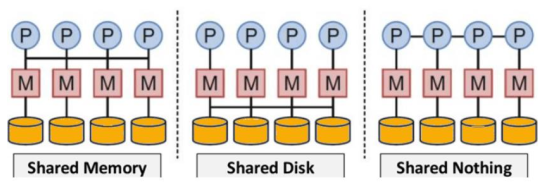

## Tipologie principali dei database NoSQL

Vi sono diverse filosofie di realizzazione dei database NoSQL. Distinguiamo tra:

* **Coppie Chiave-Valore**
È il livello minimo di schema, e fa uso di una **struttura dati a coppie chiave-valore**. Le chiavi sono univoche e costituiscono lo schema (implicitamente); i valori possono essere eterogenei (stringhe, numeri, JSON, BLOB).

* **Database a Colonne**
Si tratta di DB NoSQL che **indicizzano i dati per colonna**. Ogni colonna contiene i valori, ciascuno con la propria chiave. In questi DB il concetto di riga è associato a ***gruppi di colonne***, che **non sempre coincidono con i record in senso relazionale**. Sono molto **efficienti per query cumulative sulle colonne**.
Questi database definiscono implicitamente uno schema, ma solitamente è l'utente a indicare gli insiemi di colonne (equivalenti delle tabelle).
I database colonnari sono **basati principalmente su Google BigTable**, una struttura dati definita da Google che definisce un meccanismo di read/write sulla BigTable distribuita.
**Cassandra** e **HBase** fanno uso di database colonnari.

* **Database Documentali**
Si tratta di database in cui **ogni record è un documento in formato testo strutturato** (come XML e JSON). Tali database sono molto utili nei Sistemi di Gestione dei Contenuti Digitali, negli e-commerce, ecc.
**MongoDB** è un esempio di database documentale.

* **Database a Grafo**
Si tratta di database in cui **i dati sono rappresentati da nodi e archi etichettati di un grafo**. Qui le entità, ossia i nodi, sono uniti tramite relazioni, ossia gli archi, caratterizzate da un significato e da proprietà proprie. In questo tipo di database le operazioni tra entità diventano operazioni su grafi.
**Neo4j** è un esempio di database a grafo.

## Vantaggi e svantaggi dei database NoSQL

Tra i vantaggi ricordiamo:

* Possibilità d'uso per analytics o come data lake.

* Big Data-oriented.

* Assenza di single point of failure.

* Buone performance e scalabilità orizzontale.

* Gestione di dati strutturati, semi-strutturati e non.

* Non necessitano di server performanti dedicati.

* Pensati per database distribuiti.

Tra gli svantaggi abbiamo, invece:

* Assenza di standardizzazione.

* Capacità di query limitate.

* Immaturità della tecnologia.

* Mancata garanzia di coerenza in senso stretto.

* Poco utilizzati nelle organizzazioni.

# 10 - MongoDB

## Modello dei dati

## Interazione base con MongoDB

## Caratteristiche generali

### Indicizzazione

### Aggregazione e Map-Reduce

## Caratteristiche architetturali

### Gestione della replicazione e sharding

### GridFS

## Modellazione del database

## Domande Frequenti

1. MongoDB, come funziona dal punto di vista architetturale? Com'è strutturato dal punto di vista dell'organizzazione dei dati?
2. Implementazione del framework MapReduce in MongoDB e MongoDB in generale.
   I nodi del cluster come sono organizzati?

# 11 - Cassandra

## Caratteristiche Principali

## Cassandra vs MongoDB

## Architettura

## Modello dei dati

## Domande Frequenti

1. Come funziona un cluster Cassandra?
2. Cassandra

# 12 - Hadoop

## Caratteristiche generali

Hadoop è un framework open source per il processing distribuito di grandi volumi di dati su cluster di computer.
Il suo obiettivo principale è quello di fornire un modo efficiente per elaborare, archiviare e analizzare grandi quantità di dati, suddividendoli in blocchi e distribuendoli su un cluster di macchine.
Il cuore di Hadoop è composto dalle seguenti componenti:

* il file system distribuito HDFS (Hadoop Distributed File System)
* il framework per il calcolo parallelo MapReduce
* il framework di gestione delle risorse YARN (Yet Another Resource Negotiator)
* un framework di elaborazione dati distribuito come Spark

Hadoop è stato progettato per funzionare su cluster di computer commodity, cioè su hardware standard e a basso costo. Grazie a questo approccio, è possibile costruire cluster di elaborazione ad alte prestazioni senza dover investire in costose macchine proprietarie.

## Architettura generale

### HDFS

(*Vedi cap. 8*)

### YARN

Il funzionamento di YARN si basa su un'architettura client-server composta da tre componenti principali:

* **ResourceManager**
* **NodeManager**
* **ApplicationMaster**

Il **ResourceManager** è il componente centrale di YARN. Esso **è responsabile dell'allocazione delle risorse** del cluster alle applicazioni in esecuzione. Il ResourceManager tiene traccia delle risorse disponibili nel cluster e le assegna alle applicazioni in base alle loro richieste. Il ResourceManager è in grado di gestire più code di lavoro e di impostare limiti di utilizzo delle risorse per ciascuna di esse.

Il **NodeManager** è il componente che viene eseguito su ciascun nodo del cluster. Esso è responsabile della **gestione delle risorse locali del nodo**, tra cui la CPU, la memoria e lo spazio su disco. Il NodeManager comunica con il ResourceManager per informarlo sulle risorse disponibili nel nodo e per ottenere l'autorizzazione per l'esecuzione delle applicazioni.

L'**ApplicationMaster** è un **componente specifico dell'applicazione** che viene eseguito su un nodo del cluster. Esso è responsabile della **gestione delle risorse richieste dall'applicazione** e della **coordinazione** con il ResourceManager per ottenere le risorse necessarie.
L'ApplicationMaster comunica con il NodeManager per monitorare l'utilizzo delle risorse del nodo e per assicurarsi che l'applicazione abbia abbastanza risorse a disposizione.

Il processo di esecuzione di un'applicazione su YARN prevede i seguenti passi:

1. L'utente sottomette la richiesta di esecuzione dell'applicazione al ResourceManager.
2. Il ResourceManager cerca i nodi del cluster con risorse sufficienti per soddisfare la richiesta dell'applicazione.
3. Il ResourceManager assegna al NodeManager di ciascun nodo del cluster le risorse richieste dall'applicazione.
4. L'ApplicationMaster viene eseguito su un nodo del cluster e richiede le risorse necessarie all'esecuzione dell'applicazione al ResourceManager.
5. L'ApplicationMaster comunica con il NodeManager per monitorare l'utilizzo delle risorse del nodo e per assicurarsi che l'applicazione abbia abbastanza risorse a disposizione.
6. L'applicazione viene eseguita sui nodi del cluster assegnati dal ResourceManager e gestiti dai NodeManager.

Un altro componente fondamentale di YARN è il **JobSubmitter**, che consente agli utenti di far eseguire jobs al sistema YARN. Esso viene **eseguito sul client**, ovvero sulla macchina dell'utente che vuole eseguire un lavoro sul cluster Hadoop.

Il JobSubmitter di YARN fornisce un'interfaccia per la sottomissione dei lavori al sistema, che può essere effettuata tramite la **riga di comando** o tramite un'**API**. Quando un lavoro viene sottomesso, il JobSubmitter si occupa di **incapsularlo in un container**, che rappresenta l'unità di esecuzione di un lavoro su YARN. Il container viene quindi **assegnato a un NodeManager sul cluster**, che si occuperà dell'esecuzione del lavoro.

Il JobSubmitter di YARN **gestisce** anche **la fase di configurazione del lavoro**, ovvero la definizione delle risorse richieste dal lavoro, dei parametri di configurazione e delle dipendenze.

Inoltre, esso **fornisce meccanismi per il monitoraggio e il controllo dell'esecuzione dei lavori sottomessi**, ad esempio per l'invio di comandi di stop o di segnalazioni di stato.

### MapReduce

Consente di elaborare grandi quantità di dati in parallelo su un cluster di computer, suddividendo il lavoro in **due fasi**: la fase di **map** e la fase di **reduce**.

Nella fase di **map**, i dati vengono elaborati in **modo parallelo** da un insieme di **mapper**. Ogni mapper legge un blocco di dati di input e **applica una funzione di mapping** ad ogni elemento del blocco. La funzione di mapping prende in input un elemento e **produce un insieme di coppie chiave-valore** (key-value pair), dove la chiave rappresenta una categoria di raggruppamento e il valore rappresenta l'informazione associata a quella categoria.

Successivamente alla fase di mapping, in cui viene generate una lista di coppie chiave-valore, abbiamo un'operazione detta di shuffle e sort, con cui i dati vengono mescolati e riordinati da due componenti dell'architettura MapReduce: **Combiner** (responsabile dello shuffle) e **Partitioner** (responsabile del partizionamento della lista). L'uso di questo meccanismo permette di alleggerire il traffico di rete (viaggiano dati meno pesanti) e di migliorare il throughput.

Per quanto riguarda l'operazione di sorting, esso avviene per chiave e, comunque, prima di finire al reducer (che quindi non deve fare queste operazioni).

Nella fase di **reduce**, i dati vengono elaborati in **modo parallelo** da un insieme di **reducer**. Ogni reducer riceve tutte le coppie chiave-valore prodotte dai mapper che hanno la stessa chiave, e **applica una funzione di riduzione** a ciascun gruppo di coppie. La funzione di riduzione prende in input la chiave e un insieme di valori associati alla chiave, e **produce un insieme di coppie chiave-valore** di output.

Il framework MapReduce di Hadoop gestisce la distribuzione dei dati tra i mapper e i reducer, la gestione degli errori, la tolleranza ai guasti e la sincronizzazione dell'esecuzione delle fasi di map e reduce.

MapReduce è molto potente perché consente di elaborare grandi quantità di dati in modo scalabile, utilizzando un approccio dichiarativo che separa la logica dell'elaborazione dei dati dall'implementazione specifica del codice. Inoltre, MapReduce può essere utilizzato in combinazione con altri framework di Hadoop, come HDFS per la gestione del file system distribuito e YARN per la gestione delle risorse, per costruire soluzioni di elaborazione di dati distribuite e scalabili.

## Ecosistema Hadoop

### Hive

Hive è un framework di elaborazione di dati distribuito in Hadoop che permette di interrogare i dati memorizzati in Hadoop utilizzando una **sintassi simile al linguaggio SQL**. Hive **converte le query SQL in una serie di attività di MapReduce** che vengono eseguite sul cluster Hadoop. In
questo modo, gli utenti possono interrogare i dati in modo semplice e naturale, come se stessero lavorando con un database relazionale tradizionale, senza dover scrivere codice MapReduce.

L'accesso a Hive è consentito a client eterogenei, grazie a connettori specifici per la connessione.
Ogni drive di Hive non si appoggia direttamente su MapReduce, ma usa uno **store di metadati** per schemi e tabelle.

Hive utilizza una serie di componenti per l'elaborazione dei dati, tra cui:

1. **HiveQL**: HiveQL è un dialetto SQL-like che permette di scrivere query per l'elaborazione dei dati. HiveQL supporta una vasta gamma di funzioni SQL standard, come SELECT, WHERE, GROUP BY, JOIN e altre. Hive converte automaticamente le query HiveQL in attività MapReduce da eseguire sul cluster.
2. **Hive Metastore**: Hive Metastore è un database che memorizza i metadati dei dati archiviati in Hadoop, come lo schema dei dati e le informazioni sulle partizioni. Hive utilizza i metadati del metastore per generare le attività MapReduce necessarie per eseguire le query.
3. **Driver Hive**: Il Driver Hive è il componente principale del framework Hive. Esso riceve le query dall'utente e le traduce in attività MapReduce che possono essere eseguite sui nodi del cluster Hadoop.
4. **Hive Server**: Il server Hive fornisce un'interfaccia per l'accesso ai dati Hive tramite protocollo JDBC/ODBC. Questo consente alle applicazioni di accedere ai dati Hive in modo simile a come accedono a un database relazionale tradizionale.
5. **Hadoop Distributed File System (HDFS)**: HDFS è un sistema di file distribuito che viene utilizzato da Hive per memorizzare i dati elaborati.

Ma come avviene il processo di esecuzione in Hive?

Inizialmente **viene invocato il driver**, che legge le istruzione SQL e avvia una fase di **compilazione** il cui risultato è un DAG detto **piano**. A partire dal piano, **il driver cerca** nel Metastore **le informazioni sugli schemi logici** nel sistema **ed innesca l'esecuzione** vera e propria.

Una caratteristica importante di Hive è il **sistema di cache**, grazie al quale vengono evitate interazioni continue con HDFS.

Per quanto concerne i tipi di dato, abbiamo i **tipi semplici** (tipici di SQL) e i **tipi complessi**, come **Array**, **Map**, **Struct** e **UnionType**.

Le operazioni sulle tabelle sono le stesse di SQL, mentre un discorso a parte va effettuato per i dati creati in una tabella. I dati possono essere divisi in partizioni, suddivise a loro volta in **bucket**, ossia gruppi di righe raggruppati per chiave e utilizzati per rendere l'indicizzazione più efficiente.

Un'altra caratteristica interessante di Hive è che permette di **caricare i dati sia dal file system locale**, attraverso la parola chiave LOCAL, **oppure da HDFS**, attraverso la parola INPATH seguita da un percorso specifico. La parola chiave PARTITION, invece, consente di specificare la struttura di partizioni della tabella (se ammesse).

### Pig

È uno strumento che fa uso di **programmazione procedurale** attraverso degli **script** (detti *pig latin*) ma, a parte questa differenza, opera esattamente come Hive, dato che l'esecuzione di uno script genera un piano per l'execution engine, il quale genera i processi MapReduce.

Pig, inoltre, permette una maggiore versatilità di linguaggio, consentendo le **funzioni definite dall'utente**.

**I tipi di dato sono sia semplici**, come int, long, float, double e chararray, **che complessi**, come **tupla** (ossia la riga di un database), **mappa** (coppie chiave-valore), **bag** (insieme non ordinato di tuple).

Abbiamo, infine, **operatori di base**, come quelli aritmetici, booleani e di casting, **funzioni di load/store**, per il caricamento e la scrittura di dati in un file system locale/su HDFS, **funzioni di descrizione dei dati**, come **dump** (per descrivere il contenuto di un alias), **explain** (per mostrare la struttura del piano e la sua decomposizione in azioni semplici), **describe** (per mostrare lo schema dell'aggregato) e **illustrate** (che funziona come describe, ma inserisce esplicitamente alcuni campioni per la visualizzazione), e **operatori relazionali**, come order by, rank, ecc.

## Domande Frequenti

1. Map-reduce in Hadoop. Dal punto di vista della creazione dei processi (thread) di mapper e di reducer, i dati si muovono in questo paradigma?
2. Architettura a cluster Hadoop (in generale). Input e output degli step map e reduce.
3. È possibile eseguire su Hadoop processi non map/reduce?
4. Funzionamento di YARN.

# 13 - Spark

**Apache Spark** è un framework di analisi open-source usato per **l'elaborazione dei dati su larga scala**.

Spesso si fa riferimento a un **ecosistema Spark**, sebbene esso sia uno dei componenti del più ampio Hadoop, in quanto Spark può essere usato in **modalità *standalone*** su una singola macchina.

Le API di Spark consentono di adoperarlo in Python, Java, Scala e altri linguaggi di
programmazione, sebbene Scala sia il linguaggio nativo del framework. Il supporto a Java è garantito attraverso la JVM, mentre quello a Python attraverso l'uso di driver.

## Ecosistema Spark

Il framework si compone delle seguenti API:

* **Spark Core** - Consente di lavorare indistintamente sui vari linguaggi di programmazione
* **Spark SQL** - Permette l'astrazione dei dati SQL
* **Spark Streaming** - Permette la manipolazione dei dati
* **MLlib** - API usata per il machine learning
* **GraphX** - API che consente la manipolazione dei dati su grafo
* **PySpark** - API che consente di lavorare in Python

Vediamo, ora ciascuna API in dettaglio.

### Spark Core

È l'API principale con cui opera Spark, di cui ne rappresenta il **motore di esecuzione** vero e proprio. Il flusso di lavoro di Core consiste in una serie di **trasformazioni** sui dati in input per la successiva esecuzione di una o più **azioni**.

Tra le caratteristiche garantite da Core abbiamo la **fault recovery**, ossia la capacità di ridurre al minimo la corruzione dei dati dovute a errori accidentali.

Un'altra caratteristica interessante di Core è che le **operazioni** vengono **eseguite direttamente in memoria**, così da ridurre al minimo le interazioni con il le system. La rappresentazione dei dati usata in memoria prende il nome di **Resilient Distributed Dataset (RDD)**.

Durante il usso di lavoro di Core, possiamo rappresentare i dati sostanzialmente in due livelli di astrazione:

* ad **alto livello**, su cui viene de nito un **DataFrame** parallelo a SQL
* a **basso livello**, dove troviamo gli **RDD**, su cui è possibile lavorare tramite un'interfaccia a oggetti.

Per definizione, **un RDD è una collezione immutabile di dati**, pertanto, ad ogni trasformazione, verrà generato un nuovo RDD; discorso diverso per le **partizioni**, ossia la **suddivisione logica dei dati**, dato che sono mutabili e quindi è possibile trasformarle dinamicamente.

Come in altri framework (Pig e Hive), le operazioni vengono formulate attraverso **piani**, ossia DAG: in questo modo, ricordando che dopo ogni operazione viene generato un nuovo RDD, in caso di errore è possibile ripercorrere il DAG all'indietro per recuperare l'ultima RDD "funzionante".
Definiamo **data lineage** la **sequenza di RDD generati dalle varie trasformazioni**.

Un'altra caratteristica interessante di Core è l'uso della cosiddetta **lazy evaluation**, secondo cui i dati vengono modi cati solo quando bisogna eseguire l'azione. Questa proprietà consente di **massimizzare il throughput** di computazione e di concepire le **operazioni sulle RDD come una pipeline**.

Per quanto concerne le trasformazioni possibili, Spark ne distingue due tipologie:

* **Narrow** - Trasformazioni che avvengono **internamente alle partizioni**. Possono essere eseguite in pipeline. A questa categoria di trasformazioni appartengono:
  * **Map**
  * **FlatMap**
  * **MapPartition**
  * **Filter**
  * **Sample**
  * **Union**
* **Wide (shuffle)** - Trasformazioni che possono coinvolgere **più partizioni** e che prevedono operazioni di **shuffle**. A questa categoria di trasformazioni appartengono:
  * **Intersection**
  * **Distinct**
  * **ReduceByKey**
  * **GroupByKey**
  * **Join**
  * **Cartesian**
  * **Repartition**
  * **Coalesce**

Le azioni sono operazioni che non producono RDD, ma sono vere e proprie computazioni sui dati.
Alcune azioni sono:

* **first()**
* **take()**
* **reduce()**
* **collect()**
* **count()**

### Spark SQL

È una API orientata ai **dati strutturati**, in quanto utilizza il livello più alto di rappresentazione dei dati. Fornisce una rappresentazione a **DataFrame**, equivalente alla tabella relazionale. Questa rappresentazione ad alto livello astrae quella a più basso livello della RDD. Spark SQL usa un **linguaggio SQL-Like** per eseguire query distribuite. Fornisce un'interfaccia SQL all'ambiente Spark, con connettività JDB/ODBC e, grazie ad Hive, permette di eseguire **processing a batch**.

### Spark Streaming

È un'API che permette l'elaborazione di **flussi di dati**, letti da **fonti eterogenee** (es. Kafka e Flume) o direttamente da una socket TCP.

Le caratteristiche principali di Spark Streaming sono:

* **Gathering** - Ossia la raccolta dei dati da sorgenti semplici ( le system o socket TCP) o complesse
* **Processing** - Ossia applicazione di trasformazioni e azioni su un modello dei dati specifico, il **DiscretizedStream (DStream)**, banalmente una sequenza di RDD
* **Data storage** - Ossia la memorizzazione dei dati su le system, strutture di dashboard o database.

### Spark ML

È un'API contenente algoritmi di machine learning. Al suo interno possiamo trovare:

* Primitive per operazioni di **data preprocessing** (es. cleaning, imputazione)
* **Algoritmi di apprendimento supervisionato** per classificazione, regressione, decision trees, random forests, Bayes-naive, ecc.
* **Algoritmi di apprendimento non supervisionato** (es. K-means, misture di gaussiane)
* **Algoritmi di recommendation**, utili per il mining di pattern frequenti
* **Algoritmi di analisi dei grafi** per operazioni di ricerca di cammini tra nodi PageRank, ecc.
* **Algoritmi di deep learning**, in quanto Spark ML ha solo un MLP nativo per reti non profonde, ma offre possibilità di integrazione con motori di deep learning come TensorFlow.
  Quest'ultima integrazione è possibile grazie a librerie come TensorFrames, che rende i DataFrame di Spark il backend per gestire la computazione e TensorFlow il backend per le operazioni deep, e TensorFlowOnSpark, che distribuisce il job TensorFlow su un cluster Spark.

### Spark GraphX

È un'API dedicata alla **manipolazione di grafi**. Gestisce algoritmi di ricerca propri del machine learning, algoritmi di ricerca di cammini, attraversamento, clustering e classi cazione su grafi.

### SparkR

È un'API per l'**interazione Spark-R**, con quest'ultimo che usa un proprio modello di DataFrame per gestire i dati. Fornisce metodi di connettività a database, machine learning, analisi dei dati, ecc.

## Architettura di Spark

Un'applicazione Spark ha inizio nel momento in cui **vengono inizializzate una SparkSession** (dall'utente) **e l'interazione con il cluster manager**, che insieme prendono il nome di **processo Driver**.

Il processo Driver **coordina i processi esecutori** distribuiti sul cluster, i quali comunicano con il processo Driver attraverso il **Cluster Manager** (che può essere standalone, YARN o Mesos).

La SparkSession è un processo Java, dunque necessita di una JVM. La gestione della SparkSession di erisce nelle varie versioni di Spark:

* nelle **versioni 1.x** si utilizzavano SparkContext, SQLContext e HiveContext
* nelle **versioni 2.x** si utilizza SparkSession, che integra l'oggetto SparkContext, responsabile
  della connessione al cluster.

### Modalità di Esecuzione

Dal punto di vista della distribuzione dei job abbiamo tre modalità:

* **Cluster mode**, in cui l'utente sottomette il driver al cluster manager, che poi gestisce la distribuzione degli esecutori
* **Client mode**, in cui il driver rimane presso la macchina dell'utente, fuori dal cluster. In questo caso il client è responsabile del funzionamento degli esecutori
* **Local mode**, in cui l'esecuzione è standalone su singola macchina e l'unica forma di parallelizzazione è a livello di thread (motivo per cui è spesso usata per scopi didattici, test e debug).

### Ciclo di Vita dell'Applicazione

Il ciclo di vita di un'applicazione Spark può essere suddiviso in più fasi:

* **Configurazione**: In questa fase, vengono con gurati i parametri dell'applicazione, come ad esempio il numero di processi executor da utilizzare e la quantità di memoria da assegnare a ogni processo.
* **Creazione del contesto**: In questa fase viene creato il contesto Spark, che rappresenta l'entry point per l'applicazione Spark. Il contesto Spark viene creato dal processo driver.
* **Creazione dei RDD**: In questa fase, l'applicazione Spark crea i RDD, secondo le speci che viste in precedenza.
* **Trasformazione dei RDD**: In questa fase, l'applicazione Spark applica le trasformazioni ai RDD.
* **Azione sui RDD**: In questa fase, l'applicazione Spark esegue le azioni sui RDD, che rappresentano le operazioni che restituiscono un risultato
* **Chiusura dell'applicazione**: In questa fase, l'applicazione Spark viene chiusa e i processi executor vengono terminati.

Durante le fasi intermedie, vi è uno scambio continuo di informazioni tra i processi in esecuzione sul cluster, ossia Driver ed executors, mappati, almeno su YARN, al livello di application master.

### Uso dell'API di Alto Livello

Per invocare l'API di alto livello, **l'utente deve scrivere del codice** capace di manipolare DataFrame, Dataset o codice SQL. Tale codice viene poi **validato da Spark** per la generazione di un piano logico, reso ottimale grazie a **Catalyst**, che poi viene tradotto in un **piano fisico**. Spark esegue, successivamente, il piano sico, che altro non è che una sequenza di trasformazioni e azioni.

Entrando più nel dettaglio:

1. Dal codice utente (che non ha informazioni sui Dataframe) **viene generato un piano logico** non risolto e non valido, in termini di sequenze di trasformazioni e azioni.
2. Il piano viene, quindi, sottoposto a **Catalyst**, che interroga **Catalog**, un repository contenente tutte le informazioni sui Dataframe, **al fine di validare il piano** rispetto ai Dataframe nora generati.
3. Dopo aver validato il piano logico, **Catalyst lo ottimizza**, anche alterando la sequenza di operazioni pensata dall'utente.
4. Poiché ad un piano logico possono corrispondere più piani sici di esecuzione, **Spark stabilisce quale sia il migliore**, che sarà poi eseguito tramite pipeline.

## Introduzione a PySpark

È un'interfaccia Python per Spark, disponibile tramite **pacchetto** in ambiente Python. **Fornisce l'accesso ad una SparkSession**.

È possibile utilizzarlo sia tramite CLI che tramite IDE, anche se in questo caso bisogna impostare una variabile d'ambiente e bisogna aver preinstallato Hadoop.

Dopo aver eseguito l'accesso alla SparkSession, è possibile accedere alle varie proprietà di una sessione, come il contesto, e alle varie API che abbiamo trattato.

## Domande Frequenti

1. Architettura di Spark in termini di cluster (come vengono suddivisi i thread sui vari nodi)

# 14 - Introduzione al Machine Learning

## Generalità

Il **machine learning** si riferisce allo sviluppo di programmi per computer capaci di **apprendere dai dati**.

Più in generale, una macchina avrà a disposizione un'esperienza E rispetto a una classe di task T da svolgere e dovrà misurare unacerta performance P, secondo la logica che P deve migliorare sui compiti T usando l'esperienza E.

Volendo fornire una rappresentazione più matematica del significato di machine learning, definiamo:

* $x$ un insieme di campioni a disposizione del calcolatore
* $f$ un modello di apprendimento, ossia una caratterizzazione della famiglia di forme funzionali usate o dell'algoritmo usato
* $w$ i parametri del modello, ovvero delle quantità direttamente coinvolte nella forma funzionale di $f$ che devono essere apprese
* $\theta$ gli iperparametri del modello, cioè quantità che influenzano l'evoluzione dell'algoritmo, ma che devono essere fissate in fase di apprendimento (dovendo essere, il più delle volte, stimati)

L'apprendimento viene misurato dalla relazione $y=f(x, w, \theta)$.

## Tipologie dei compiti di apprendimento

In base al tipo di apprendimento, gli algoritmi di machine learning devono impiegare $f$ distinte, specifiche per il compito in questione.

Innanzitutto, distinguiamo **compiti con output strutturato e non**. Tra i compiti con output non strutturato abbiamo:

* **Classificazione**, in cui l'algoritmo deve stimare una funzione che fa corrispondere ogni ingresso a una delle $k$ classi possibili, secondo una relazione $f : \mathbb{R}^n → \{1,⋯, k\}$. Questa rappresentazione è accettata poiché, spesso, i problemi di classi cazione fanno riferimento a classi numeriche.L'utilità della classificazione non si limita soltanto all'attribuzione di una classe, ma può essere usata per stimare delle features mancanti.
* **Regressione**, in cui, a partire dai dati in input, bisogna predire un valore numerico reale per una data funzione. L'approccio è simile alla classificazione, ma cambia il codominio della funzione $f$, che diventa $\mathbb{R}$ in quanto deve predire singoli valori reali.
* **Trascrizione**, in cui si deve estrarre una trascrizione in forma testuale di dati scarsamente strutturati (basti pensare alle OCR o alla speech recognition). Tale compito può essere pensato come una forma di classificazione in cui le etichette non sono numeriche, ma sono piuttosto le parole di un testo.
* **Traduzione automatica**, con cui si traduce una sequenza discreta di simboli in un'altra.

Per quanto concerne i compiti con output strutturato ricordiamo:

* **Parsing**, ossia la trasformazione di un testo in una sequenza di simboli che definisce dei ruoli.
* **Quality Assurance**, che consiste in un processo sistematico che determina se un prodotto o un servizio soddisfano (o meno) dei requisiti specifici.
* **Segmentazione di immagini**, in cui viene restituito un output di etichette, corrispondente alle classi di segmentazione (o regione dell'immagine).

Tra gli altri compiti abbiamo:

* **Outlier Detection**, il cui scopo è quello di rilevare anomalie nel comportamento di determinati ingressi. Spesso si associa al clustering/classificazione interpretati in forma duale (ovvero si restituiscono gli elementi con comportamento "non normale").
* **Sintesi e campionamento**, che consiste nella generazione di campioni strutturalmente simili ai dati di ingresso, in modo da incrementare la popolazione di ingresso con dati "come gli originali" e migliorare forme di apprendimento statistico.
* **Imputazione di dati mancanti**, con cui si predicono le features mancanti a partire da un input incompleto.
* **Denoising**, ossia la predizione di campioni non corrotti a partire da input rumorosi.
* **Stima di una densità di probabilità o di una funzione massa**, con cui bisogna stimare una
  funzione $p_{\mathrm{model}} : \mathbb{R}^n → \mathbb{R}$ da intendersi come funzione di densità di probabilità (per variabili continue) o funzione di massa (per variabili discrete).

Sebbene ne siano stati elencati diversi, sostanzialmente si parlerà sempre di tre tipologie di problemi: **classificazione, regressione e clustering**.

## Utilizzo dei dati

Distinguiamo tre modalità di uso dei dati in fase di apprendimento:
• **apprendimento non supervisionato**, in cui gli algoritmi hanno l'obiettivo di apprendere una distribuzione di probabilità che sottende il dataset, o meglio, la **struttura dei dati**. Esempi di apprendimento non supervisionato sono il clustering e il denoising.
• **apprendimento supervisionato**, in cui gli algoritmi hanno il compito di catalogare un campione $\bold x$ in un'etichetta $y$ facendo in modo da **massimizzare la probabilità** $p (y | \bold x)$. È l'approccio tipico di classificazione e regressione.
• **apprendimento con rinforzo**, in cui l'algoritmo apprende su un ambiente dinamico attraverso **sensori e attuatori**, secondo un metodo try/error.

## Capacità e generalizzazione

Perché un algoritmo di apprendimento possa essere considerato valido, è necessario che sia capace di **generalizzare**, ossia di ottenere buone performance su campioni mai visti. Per far ciò è necessario che l'algoritmo sia capace di **minimizzare due misure di errore**: il **training error** e il **test/generalization error**.

La procedura standard prevede che, qualora non sia disponibile un test set, si **suddivida il dataset** di partenza **in due partizioni**, un training set e un test set. A questo punto, la forma funzionale $L$ delle misure di errore, nota come **funzione di perdita**, deve essere la stessa per entrambe le misure di errore e deve essere scelta accuratamente in base al tipo di compito che l'algoritmo deve svolgere.

**La capacità di generalizzare si basa sulla teoria dell'apprendimento statistico**, secondo cui esiste un processo statistico unico capace di descrivere un fenomeno sotto esame e che genera dati sia di addestramento che di test. Questo processo è descritto da un'unica pdf dei dati $p_{\mathrm{data}}$, non nota a priori.
Si può stabilire, quindi, un'ipotesi aprioristica secondo cui i dati dei due set sono indipendenti e
hanno la stessa distribuzione di probabilità, motivo per cui avranno lo stesso valore atteso.

L'ideale allora diventa **cercare i parametri** $\bold{w}$ **tali che i due errori siano uguali**, sebbene ciò sia impossibile a causa di alcune distorsioni dovute al campionamento per la scelta dei dati.
A causa di questo motivo, allora, si procede in questo modo:

1. Si cerca di **minimizzare il training error** attraverso l'addestramento.
2. Si cerca di m**antenere minima la di erenza tra training error e generalization error**.

Se non si rispettano entrambi i principi si possono veri care le situazioni di **overfitting** (scarsa capacità di generalizzazione) o l'**underfitting** (scarsa efficacia dell'algoritmo), due situazioni legate a un eccessivo sbilanciamento verso l'uno o l'altro errore in relazione alla capacità del modello (la possibilità del modello di approssimare la maggiore gamma di forme funzionali possibile).

I **parametri** del modello, invece, **definiscono una classe di funzioni che contribuiscono a selezionare una particolare forma funzionale** interna alla classe. Discorso diverso vale per gli **iperparametri**, che **permettono di spaziare le funzioni che si vogliono stimare**; tra gli iperparametri della rete (che sono impostati a priori) abbiamo: il numero di layer nascosti, lo schema di inizializzazione dei pesi, il learning rate, il learning rate decay, ecc.

### Teorema No Free Lunch

È un teorema che afferma che **la performance di un qualunque algoritmo di apprendimento mediata su qualunque distribuzione di probabilità è la stessa**.
Ciò equivale a dire che non esistono algoritmi di base migliori di altri, e che la scelta di un algoritmo è solitamente guidata dalla distribuzione di probabilità $p_\mathrm{data}$.

Un'altra considerazione va fatta, poi, in merito al fatto che **il training error e la generalizzazione di un algoritmo dipendono fortemente dalle dimensioni del training set**.

## Tecniche di addestramento

Sono tecniche che permettono di **personalizzare l'addestramento tradizionale**, al fine di aumentare la capacità e ettiva del modello, che quasi sempre di erisce dalla sua capacità teorica.
Un tipico **approccio di addestramento sugli iperparametri**, che poi in uenza la capacità di rappresentazione del modello, è quello a **griglia**: si definisce un intervallo di variazione per ogni parametro, si campiona un certo numero di valori in ogni intervallo di variazione e si crea la combinazione (da qui la griglia) di tutti i valori possibili degli iperparametri.

Due esempi di tecniche capaci di migliorare la capacità e ettiva sono la **regolarizzazione** e la **validation set e cross-validation**.

### Regolarizzazione

La **regolarizzazione** è una qualunque **modifica dell'algoritmo di apprendimento mirata a ridurre esplicitamente l'errore di generalizzazione, ma non il training error**. Consiste nell'aggiunta di un termine di regolarizzazione nella funzione $L$ che consente di preferire alcune forme funzionali rispetto ad altre nel rispetto dello spazio delle ipotesi.

Un esempio di regolarizzazione è la **weight decay**, che esprime preferenza per piccoli valori di $\bold w$, e che consiste nell'aggiunta di un iperparametro $\lambda$ alla funzione di loss allo scopo di **privilegiare una certa configurazione dei parametri**.

### Validation Set e Cross-Validation

L'uso di un **validation set** costituisce un'altra tecnica di modi ca dell'algoritmo di apprendimento per ovviare al problema dell'apprendimento degli iperparametri. Definiamo validation set una **porzione di training set estratta da quest'ultimo** prima di iniziare l'addestramento vero e proprio. Viene utilizzato per verificare l'andamento del generalization error, modi cando gli
iperparametri per minimizzarlo.

Si può a ermare che **l'errore commesso in fase di validazione approssimi il generalization error meglio di quanto non faccia il training error**.

Un'altra tecnica di addestramento è la $k-$**fold cross-validation**, con cui si suddivide il dataset in $k$ partizioni (fold) non sovrapposte e, per ogni partizione, si usa una strategia in cui **quest'ultima funziona da test set e le restanti $k-1$ fungono da training set**.
Con questa tecnica, ad ogni fold, **non cambia l'insieme dei parametri e degli iperparametri**, ma si passa semplicemente da uno all'altro fold. Poiché con questa tecnica ogni test set viene incontrato $k-1$ volte come training set, **non si calcola un singolo errore di generalizzazione, ma ne viene calcolata una media su tutte le partizioni**.

**N.B.**: Tipicamente, prima di applicare la $k$-fold cross-validation si e ettua uno shuffle del dataset, spesso anche all'interno delle varie epoche di addestramento, in modo da evitare possibili bias legate all'ordine di presentazione dei campioni

# 15 - Clustering

## Generalità

Il **clustering** rappresenta una classe di algoritmi di **apprendimento non supervisionato** e consiste in un processo di **partizionamento** di un data-set in modo che ogni partizione (o cluster) contenga dati omogenei tra di loro rispetto ai dati appartenenti ad altre partizioni.

Un **cluster** è un insieme di oggetti che presentano tra loro delle similarità, ma che, per contro, presentano dissimilarità con oggetti in altri cluster.

* **INPUT**: campione di elementi
* **OUTPUT**: un certo numero di cluster in cui gli elementi del campione sono suddivisi in base ad una misura di similarità.

## Feature selection

Molte feature possono essere affette da **rumore** o essere **poco rilevanti** per la cluster analysis e, pertanto, devono essere rimosse nelle prime fasi del processo di clustering.

L'obiettivo della **feature selection** è quello di rimuovere gli attributi rumorosi che non si clusterizzano (raggruppano) bene. Avendo a che fare con metodi non supervisionati, questo procedimento è più difficile, in quanto i criteri di validazioni esterni (labels) non sono disponibili per la selezione delle feature.

È necessario impiegare dei modelli di feature selection che cercano di individuare la **tendenza al clustering** di certi sottoinsiemi di feature e di **massimizzarla** per i sottoinsiemi di feature estratti.

* **Modelli basati su filtro**: viene valutata la tendenza di una feature o di un gruppo di feature a contribuire al clustering utilizzando uno score numerico.
* **Modelli «wrapper»**: approcci iterativi di clustering per tentativi su sottoinsiemi di feature. Sono computazionalmente onerosi, ma possono fornire una base per la scelta del miglior algoritmo di clustering per il problema sotto esame.

### Modelli basati su filtro

Deve essere usato un criterio specifico per valutare la tendenza al clustering.

#### Term Strength

Particolarmente adatta per analisi di **domini sparsi** (dati testuali), la **term strength** viene calcolata come la frazione delle coppie di documenti simili in cui occorre un certo termine *t*, posto che *t* occorra nel primo dei due.

Determina **termini rilevanti** rispetto al data-set.

$$
Term \ Strength = P(t \in \bar Y| t \in \bar X)
$$

È una similarità che può essere estesa a **dati multidimensionali** rappresentati come vettori binari di attributi presenti/assenti.

Analogamente si possono usare misure di rilevanza rispetto a **dati quantitativi** confrontando la distanza tra singoli attributi di due campioni rispetto alla distanza complessiva dei due campioni.

#### Dipendenza predittiva da attributi

Parte dalla considerazione che gli attributi rilevanti per il clustering sono correlati.

Sfrutta algoritmi di regressione (attributi numerici) o classificazione (attributi non numerici) per classificare il data-set e quantificare la rilevanza di un attributo i:

1. Si usa un algoritmo di **classificazione** su tutte le feature tranne la i-esima, per prevedere il valore dell'attributo i, trattandolo come una variabile di classe artificiale.
2. La misura di accuratezza della classificazione rispetto all’attributo i sarà la misura di rilevanza utilizzata per la feature selection.

Spesso ricorre all'uso di un **classificatore nearest neighbor**.

#### Entropia

Parte dalla considerazione che i dati raggruppati in un cluster:

* hanno entropia più bassa rispetto a quelli distribuiti uniformemente nello spazio di variazione.
* riflettono alcune delle loro caratteristiche di clustering sulle **distribuzioni di distanza**.

L'obiettivo delle misure basate su entropia è quantificare la **forma** di questa distribuzione di distanza e scegliere il sottoinsieme di feature in cui la distribuzione mostra un comportamento simile alla figura **b**:

    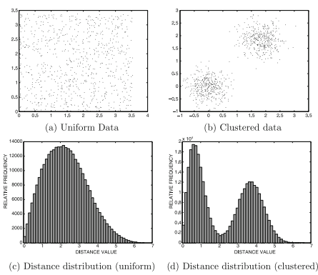

Il calcolo dell’entropia su un subset di feature k-dimensionale, prevede che si effettui una **discretizzazione** sulle k feature al fine di stimare la densità di probabilità in ogni intervallo e calcolare effettivamente l’entropia. Questo approccio presenta dei problemi al crescere della dimensionalità, poichè le regioni della griglia diventano sempre più sparse.

Pertanto, un'alternativa è calcolare le **distanze punto a punto** tra i campioni lungo ogni feature (monodimensionale) e calcolare l'entropia su questa distribuzione di distanza.

Se abbiamo *m* intervalli di discretizzazione dei valori di distanza, avremo che:

$$
E = \sum_{i=1}^{m} \big[p_i \cdot log(p_i) \ + \ (1-p_i) \cdot log(1-p_i) \big]
$$

Partendo dall'insieme completo di feature, verranno scelte quelle con entropia minore, secondo un approccio **greedy**.

#### Statistica di Hopkins

Si consideri un campione *R* costituito da r punti appartenenti ad un data-set *D*, scelti casualmente, ed un campione sintetico *S* costituito da r punti appartenenti allo spazio dei dati.

Siano $\alpha_i$ e $\beta_i$, con $i = 1, ..., r$ rispettivamente le distanze dei punti in *R* e in *S* dal più vicino campione in *D*.

$$
H=\frac {\sum_{i=1}^{r} \beta_i} {\sum_{i=1}^{r} (\alpha_i + \beta_i)} \in (0,1)
$$

In particolare:

* $H = 0.5$ per dati distribuiti uniformemente, dato che $\alpha_i$ e $\beta_i$ hanno un comportamento simile
* $H=1$ per dati clusterizzati, dato che $\alpha_i \ll \beta_i$.

Più H è prossimo a 1, maggiore sarà la tendenza al clustering dei dati. Questo criterio può essere usato insieme ad un approccio greedy per trovare il sottoinsieme rilevanti di feature, come nel caso dell'entropia.

### Modelli wrapper

Consistono nell'applicare una serie di algoritmi di clustering su diversi sottoinsiemi di feature e nel verificare di volta in volta la qualità del clustering ottenuto usando come metrica di valutazione una certa **misura interna di bontà del clustering**.

Questo approccio ha come **principale svantaggio** la sua forte dipendenza dalla **scelta della misura di bontà**, che potrebbe portare ad **errori di valutazione** del clustering. Inoltre, è computazionalmente oneroso, dato che necessita di un approccio greedy per la ricerca dei sottoinsiemi rilevanti nello spazio delle feature.

In alternativa, si segue un approccio più semplice, che prevede di:

1. Utilizzare un **algoritmo di clustering** sul sottoinsieme corrente di feature selezionate *$F$*, al fine di correggere le etichette *$L$* del cluster per i dati.
2. Utilizzare un **criterio supervisionato di classificazione** su tali etichette per valutare la bontà del clustering e selezionare le prime $k$ feature che hanno una migliore accuratezza sulla base di questo criterio.

Per raggiungere una maggiore efficienza, di solito vengono creati dei **modelli ibridi**, frutto della combinazione tra i **modelli wrapper** e i **modelli** **basati su filtro**.

## Clustering basato su prototipi rappresentativi

> **PROTOTIPI**: punti rappresentativi o centroidi utilizzati per definire i cluster. Sono dei punti nel dato spazio che rappresentano in qualche modo il "**centro**" del cluster.

Gli algoritmi basati su prototipi rappresentativi sono i più semplici tra gli algoritmi di clustering, perchè **si basano direttamente su nozioni intuitive di distanza/similarità** dei dati del cluster.

Infatti, i cluster vengono creati in un colpo solo e non esistono relazioni gerarchiche tra di loro. La creazione dei cluster avviene con l'uso di una serie di prototipi rappresentativi (rappresentanti di partizionamento). Questi possono essere a loro volta creati in funzione dei dati nel cluster (tipo la media) oppure possono essere selezionati dai dati esistenti nel cluster.

La caratteristica di questi metodi è che la scoperta di cluster di alta qualità equivale alla scoperta di un insieme di prototipi rappresentativi di alta qualità.

Una volta determinati i prototipi, è possibile usare una funzione di distanza per assegnare i dati ai prototipi vicini.

I $k$ cluster sono generalmente determinati dall'utente.

Assumiamo di avere un dataset $\mathcal D$ contenente *$n$* dati $\bar {X_1}, \bar{X_2}, \dots , \bar {X_n}$. L'obiettivo è quello di determinare *k* prototipi rappresentativi $\bar {Y_1}, \bar{Y_2}, \dots , \bar {Y_k}$ che minimizzino la seguente funzione obiettivo:

$$
O = \sum_{i=1}^{n} \bigg[ min_j \ Dist(\bar{X_i}, \ \bar{Y_j}) \bigg]
$$

> La somma delle distanze dei diversi dati dai loro prototipi rappresentativi più vicini deve essere ridotta al minimo.

La scelta della funzione di distanza $Dist(\cdot, \cdot)$ dà luogo a differenti algoritmi:

* K-means
* Mahalanobis K-means
* Kernel's K-means (**kernel trick**)
* K-medians
* K-medoids

La struttura generica per algoritmi basati su prototipi rappresentativi con una funzione di distanza generica è:

    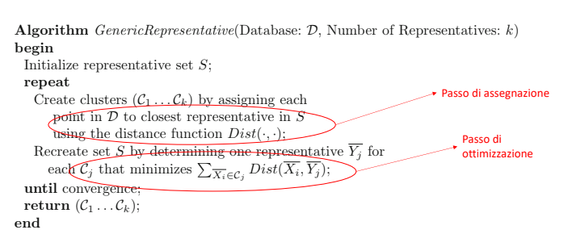

### K-means

> **Centroide**: la media di tutti i punti del cluster.

K-means è un algoritmo di clustering basato su prototipi ampiamente utilizzato per raggruppare un insieme di dati non etichettati in *k* cluster, dove *k* è un numero predefinito specificato dall'utente.

L'algoritmo K-means si basa sulla somma dei quadrati delle distanze euclidee dei dati dai loro prototipi rappresentativi (centroidi, ovvero i punti medi dei dati assegnati a ciascun cluster) più vicini per quantificare la funzione obiettivo del clustering.

$$
Dist(\bar {X_i}, \ \bar {Y_j}) = \| \bar {X_i} - \bar {Y_j} \|_2^2
$$

La funzione obiettivo da minimizzare, in questo caso è la somma dei quadrati delle distanze tra ciascun dato $X_i$ e il centroide $Y_j$ del suo cluster assegnato.

$\rightarrow$ Si può mostrare che i valori ottimi degli $\bar Y_j$ sono i **valori medi** dei punti in ogni singolo cluster $\mathcal C_j$.

L'output dell'algoritmo K-means è un insieme di *k* centroidi che rappresentano i cluster finali. Ogni dato viene assegnato al cluster il cui centroide è più vicino.

### Mahalanobis K-means

La **distanza di Mahalanobis** è una misura che tiene conto della correlazione tra le variabili e delle loro varianze. È definita come la distanza euclidea tra un punto e un centroide, ma normalizzata rispetto alla covarianza del data-set.

A differenza dell'algoritmo K-means tradizionale, che assume che tutte le variabili abbiano una varianza uguale e siano indipendenti, l'algoritmo Mahalanobis K-means tiene conto delle correlazioni e delle strutture di covarianza dei dati,  portando a cluster più accurati in presenza di variabili correlate.

$$
Dist(\bar {X_i}, \ \bar {Y_j}) = (\bar {X_i} - \bar {Y_j}) \cdot \Sigma_j^{-1} \cdot (\bar {X_i} - \bar {Y_j})^T
$$

La covarianza locale $\Sigma_j$, calcolata sui punti del cluster $\mathcal C_j$, fornisce una misura implicita di **densità** del cluster e consente di gestire cluster a densità variabile.

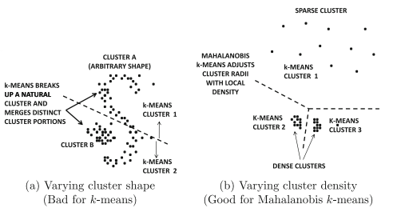

$\rightarrow$ Il **k-means** è adatto per **cluster di forma sferica**.

$\rightarrow$ Il **Mahalanobis k-means** è adatto per **cluster a densità variabile**.

### Kernel's K-means (**kernel trick**)

L'algoritmo k-means non è la scelta migliore quando i cluster sono di **forma arbitraria**.

Per la gestione di cluster di forma qualunque, il k-means ricorre al cosiddetto **kernel-trick**: l'idea di base è trasformare implicitamente i dati in modo che i cluster di forma arbitraria vengano mappati ai cluster euclidei nel nuovo spazio, risolvendo così il problema della non linearità dei dati.

Il kernel-trick sfrutta l'osservazione che la formulazione SVM può essere completamente espressa in termini di prodotti scalari (**similarità**) tra coppie di dati, senza conoscere i valori delle feature.

Si consideri una funzione $\phi(\cdot)$ che mappa un vettore in uno spazio a più alta dimensionalità.

> Si definisce **kernel** una qualunque funzione $K$ che può essere definita come prodotto scalare di due mapping uguali $\phi(\bar X_i)$ e $\phi (\bar Y_j)$ dal loro spazio di partenza $\mathbb{R^d}$ ad uno spazio $\mathbb{R^h}$, con $h >> d$.
>
> $$
> K: \ \ \ \ \ \ \mathbb{R^d} \ \longrightarrow \ \mathbb{R^h} \\ \ \ \ \ \ \ \ \ \ \ \ \ \ \ \ \ \ \ \ \ \ \ \ \ \ \ \ \ \ \ \ \ \ \ \ \ \ \ \ \ \ \ \ \  \ \ \ \ \ \ \ \  (\bar X_i, \bar Y_j) \ \longmapsto \ K(\bar X_i, \bar Y_j) = \phi (\bar X_i) \cdot \phi(\bar Y_j)
> $$

La funzione kernel è un **operatore lineare nello spazio trasformato** $\mathbb{R^h}$ e quindi consente l'uso di algoritmi lineari nello spazio definito da $\phi(\cdot)$.

Il kernel $K(\cdot, \cdot)$ viene definito direttamente in termini dei vettori dello spazio di ingresso $\mathbb R^d$ e non è **MAI** necessario calcolare il mapping $\phi(\cdot)$.

Per selezionare il kernel più adatto ad un determinato compito si ricorre all'uso di **euristiche** e di **algoritmi di ML dedicati**.

### K-medians

Viene usata la **distanza di Manhattan** per la funzione obiettivo. Pertanto:

$$
Dist(\bar X_i, \bar Y_j) = \| \bar {X_i} - \bar {Y_j} \|_1
$$

$\rightarrow$ Si può dimostrare che il prototipo rappresentativo ottimale $\bar Y_j$ è la **mediana dei punti** lungo ciascuna dimensione nel cluster $\mathcal C_j$, dato che il punto che ha la somma minima delle distanze $L_1$ da un insieme di putni distribuiti su una linea è la **mediana** di quell'insieme.

Poichè la mediana viene scelta in maniera indipendente lungo ciascuna dimensione, il prototipo rappresentativo d-dimensionale risultante tipicamente **NON APPARTIENE** al data-set.

L'approccio k-medians seleziona i prototipi rappresentativi dei cluster in modo più robusto agli outlier rispetto all'algoritmo k-means, in quanto la mediana non è dipendente dalla presenza dei valori anomali nel cluster, a differenza della media.

### K-medoids

> **Medoide**: punto più “rappresentativo” del cluster.

Nonostante il K-medoids utilizzi il concetto di prototipi rappresentativi, l'algoritmo è diverso da quello basato su *k* prototipi rappresentativi, anche se la funzione obiettivo è la stessa.

Nel K-medoids **i prototipi rappresentativi sono sempre selezionati dal dataset $\mathcal D$**, ovvero i valori degli $\bar Y_j \in \mathcal D$. Ciò avviene per due motivi:

1. Il prototipo rappresentativo di un cluster k-means potrebbe essere distorto a causa della presenza degli outlier in quel cluster. Ciò potrebbe causare che il prototipo rappresentativo si trovi in una regione vuota che non rappresenti la maggior parte dei putni in quel cluster. Questo problema potrebbe essere risolto parzialmente gestendo attentamente gli outlier e usando delle variazioni del k-means, come il k-medians.
2. A volte è difficile calcolare il prototipo rappresentativo centrale ottimale di un insieme di dati di tipo complesso (serie temporali di durata variabile). In questi casi, selezionare i prototipi rappresentativi dal data-set originale potrebbe essere molto utile.

Una proprietà chiave dell'algoritmo k-medoids è che **può essere utilizzato su qualsiasi tipo di dati, a patto che sia possibile definire una funzione di distanza o di similarità**.

Questo approccio utilizza una strategia generica di hill climbing, secondo cui l'insieme dei prototipi rappresentativi $\mathcal S$ è inizializzato ad un insieme di punti del data-set originale $\mathcal D$ e viene migliorato in maniera iterativa scambiando un singolo punto da $\mathcal S$ con un punto selezionato da $\mathcal D$. Ogni scambio può essere considerato come un passo di hill climbing.

Il passo iterativo termina quando la funzione obiettivo non migliora o se il tasso di miglioramento è inferiore ad una certa soglia.

    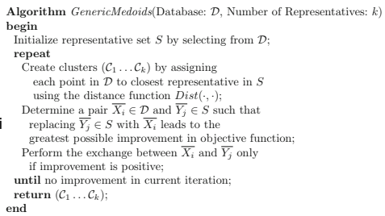

## Clustering gerarchico

Il **clustering gerarchico** crea una tassonomia (classificazione) di cluster che vengono aggregati attraverso il calcolo di distanze tra essi (raggruppano i dati in cluster con le distanze). Il calcolo di tali distanze utilizza in genere altri approcci come quelli basati sul concetto di densità o sull’utilizzo di grafi.

Esistono due tipi di algoritmi gerarchici, sulla base di come viene costruito l'albero gerarchico dei cluster:

* Metodi agglomerativi o bottom-up
* Metodi divisivi o top-down

### Approcci agglomerativi o bottom-up

Si parte da una situazione in cui tutte le *n* unità sono suddivise in *n* gruppi distinti formati da una sola unità per poi essere iterativamente aggregate, bottom-up, in cluster di livello superiore.

Ad ogni iterazione vengono selezionati due cluster ritenuti i **più vicini possibile**.

    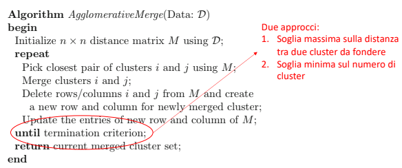

Sia $n$ la cardinalità del data-set d-dimensionale $\mathcal D$ e sia $n_t = n - t$ il numero di cluster dopo $t$ iterazioni. L'algoritmo si compone dei seguenti passi:

1. Viene inizializzata ed inserita in memoria una matrice delle distanze $M$ di dimensione iniziale $n \times n$.
2. Finchè non viene raggiunto il **criterio di terminazione**:
   1. Viene selezionato il primo elemento non diagonale di $M$ che ha il valore minimo, ovvero vengono selezionati due cluster $i$ e $j$ ritenuti i **più vicini possibili**: se i cluster hanno, rispettivamente, dimensione $m_i$ ed $m_j$, verranno calcolate $m_i \times m_j$ distanze.
   2. Questi cluster vengono uniti secondo un **criterio di fusione**.
   3. Vengono eliminate le righe e le colonne corrispondenti ai cluster $i$ e $j$ dalla matrice $M$ e vengono create una nuova riga e una nuova colonna di distanze corrispondenti al cluster appena creato.
   4. Vengono aggiornate le distanze tenendo conto del nuovo cluster.

All'iterazione $t$, la matrice $M$ sarà di dimensione ridotta $n_t \times n_t$.

Per il **criterio di terminazione** dell'algoritmo, si può scegliere tra:

1. Soglia massima sulle **distanze tra due cluster uniti**: viene determinato automaticamente il numero naturale di cluster nei dati, ma richiede la specifica di una soglia di qualità difficile da intuire.
2. Soglia minima sul **numero di cluster**: è interpretabile in modo intuitivo in termini di numero di cluster nei dati.

L'ordine di fusione crea in modo naturale una struttura gerarchica ad albero, detta **dendrogramma**.

    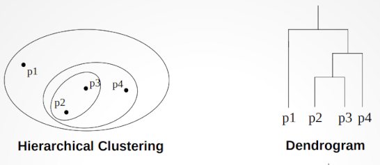

Per il **criterio del calcolo delle distanze**, possiamo scegliere tra:

1. **SINGLE LINKAGE**: Dato l'insieme $m_i \times m_j$ delle distanze tra i cluster $i$ e $j$, viene scelto il **valore minimo** di distanza presente nell'insieme. Particolarmente efficace per scoprire **cluster di forma arbitraria**, ma sensibile a dati rumorosi, in quanto potrebbe fondere in modo inappropriato cluster distinti.

   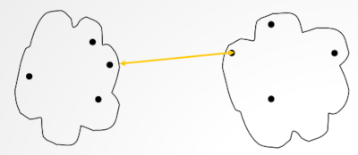

   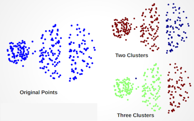
2. **COMPLETE LINKAGE**: Viene scelto il **valore massimo** di distanza presente nell'insieme. Meno suscettibile a rumore e outlier, ma tende a spezzare i cluster più grandi e a preferire cluster di forma sferica.

   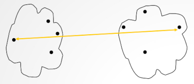

   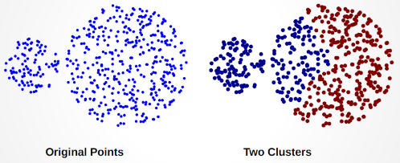
3. **GROUP-AVERAGE LINKAGE**: Viene scelta la **media** delle distanze. È il giusto compromesso tra single linkage e complete linkage, dato che è meno suscettibile a rumori e outlier rispetto a single linkage, ma anch'esso tende a preferire cluster sferici.

   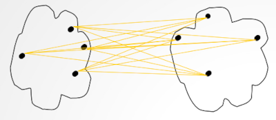
4. **CENTROIDE PIÙ VICINO**: Si fondono i cluster con i centroidi più vicini. Questo approccio non è desiderabile poiché i centroidi perdono informazioni sulle propagazioni relative dei diversi cluster.

   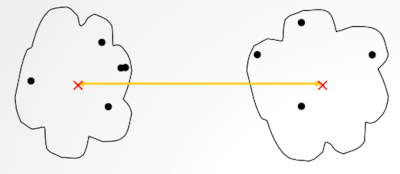
5. **CRITERIO BASATO SULLA VARIANZA DEL CLUSTER**: Si cerca di fondere i cluster quando la variazione della funzione obiettivo (varianza del cluster) è la minima possibile, per preservare le proprietà statistiche del cluster. A tal fine, $\forall \ \mathcal C_i$ vengono mantenute le statistiche dei momenti di ordine 0, 1 e 2.

   1. Sia $m_i$ il momento di ordine 0.
   2. Siano $S_{ir} = \sum_{x \in \mathcal C_i} x_r^2$ e $F_{ir} = \sum_{x \in \mathcal C_i} x_r$ rispettivamente i momenti del $I$ e del $II$ ordine calcolati lungo ogni dimensione *r*.
   3. L'errore quadratico medio dell'i-esimo cluster $\mathcal C_i$ può essere calcolato in funzione di questi tre momenti. In formule:
      1. $SE_i = \sum_{r=1}^d \Big( \frac {S_{ir}} {m_i} - \frac {F_{ir}^2} {m_i^2} \Big)$
   4. Considerato che **le statistiche del momento di una fusione tra due cluster $\mathcal C_i, \ \mathcal C_j$ sono pari alla SOMMA delle statistiche dei singoli momenti**, data la varianza di una **potenziale fusione** tra $\mathcal C_i$ e $\mathcal C_j$, $SE_{i \cup j}$, la variazione della varianza nell'esecuzione di questa potenziale fusione è $0 \le \Delta SE_{i \cup j} = SE_{i \cup j} - SE_i - SE_j$.
   5. Viene selezionata la coppia di cluster con la **MINIMA** $\Delta SE_{i \cup j}$.

I metodi gerarchici bottom-up portano in modo naturale alla costruzione di un albero binario di cluster. È difficile controllare la struttura dell'albero gerarchico con metodi bottom-up, poichè questi sono sensibili ad un piccolo numero di errori commessi durante il processo di fusione: se avviene una fusione errata a causa della presenza di rumore all'interno del dataset, non è possibile annullarla ed avremo una **error propagation nelle fusioni successive**.

Questi metodi vengono infatti spesso combinati con metodi di campionamento e di partizionamento per fornire soluzioni qualitatevoli.

### Approcci divisivi o top-down

Grazie all'approccio top-down si ottiene un maggiore controllo sulla struttura globale dell'albero.

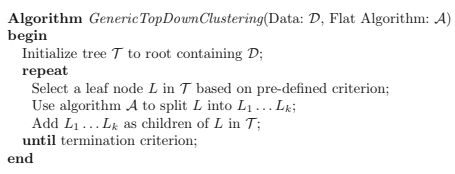

Ricevuti in input un data-set $\mathcal D$ di cardinalità $n$ e un algoritmo di clustering "flat" generico $\mathcal A$, l'algoritmo si compone delle seguenti fasi:

1. Inizializza l'albero $\mathcal T$ nel nodo radice contenente tutti i dati di $\mathcal D$.
2. Finchè non viene raggiunto il **criterio di terminazione**:
   1. Seleziona un nodo foglia $L$ secondo un **criterio predefinito**.
   2. Usa l'algoritmo $\mathcal A$ (che può essere un qualunque algoritmo di clustering) per dividere $L$ in _k_ nodi (cluster) $L_1, L_2, ..., L_k$.
   3. Aggiunge questi nuovi *k* nodi all'albero come figli di $L$.

#### Bisecting k-means

È un algoritmo di clustering gerarchico top-down in cui ogni nodo è suddiviso esattamente in 2 figli ad ogni iterazione con un algoritmo 2-means. Per dividere un nodo vengono usate diverse esecuzioni randomizzate della divisione e viene usata la divisione che ha il miglior impatto sull'obiettivo di clustering generale.

La scelta del nodo $L$ può essere dettata da diversi criteri, ma in genere si predilige **il nodo più vicino alla radice**.

## Clustering probabilistico

> Una **distribuzione di probabilità** è un modello matematico che collega i valori di una variabile alle probabilità che tali valori possano essere osservati.
>
> Le distribuzioni di probabilità vengono utilizzate per modellizzare il comportamento di un fenomeno di interesse in relazione alla popolazione di riferimento, ovvero alla totalità dei casi di cui lo sperimentatore osserva un dato campione.
>
> In questo contesto la variabile di interesse è vista come una **variabile casuale** (o **variabile aleatoria**, v.a.) la cui legge di probabilità esprime il grado di incertezza con cui i suoi valori possono essere osservati.
>
> In base alla scala di misura della variabile di interesse $X$, possiamo distinguere due tipi di distribuzioni di probabilità:
>
> * **distribuzioni continue**: la variabile viene espressa su un scala continua (es: il diametro del pistone)
> * **distribuzioni discrete**: la variabile viene misurata con valori numerici interi (es: numero di elementi non conformi o difettosi in un circuito stampato)
>
> Una **funzione di densità di probabilità** ($pdf$) è una legge matematica $f(x)$ con sui vengono espresse le **distribuzioni di probabilità continue**.
>
> Una **funzione di probabilità** $p(x)$ è, invece, una legge matematica con cui vengono espresse le **distruzioni di probabilità discrete**.
>
> 

Gli algoritmi di clustering basati su modelli probabilistici sono algoritmi flessibili in quanto ogni dato può avere una probabilità di assegnazione diversa da 0 a molti cluster.

Assumiamo che $\mathcal p_{data}$ sia una misura di distribuzioni $\mathcal G_i$, che saranno i nostri cluster, con un insieme di prior $\alpha_i = P(\mathcal G_i)$.

Ogni dato $\bar X_i$, con $i \in {1, 2, \dots, n}$, viene generato dal nostro modello generativo basato su misura $\mathcal M$ come segue:

1. Si seleziona una componente di misura con probabilità a priori (prior) $\alpha_i = P(\mathcal G_i)$, con $i \in {1, 2, \dots, n}$. Supponiamo che venga selezionata la componente r-esima.
2. Si genera un dato $\bar X_r$ da $\mathcal G_r$.

> I prior $\alpha_i$ e i parametri delle distribuzioni $\mathcal G_i$ **non sono noti a priori**.
>
> Ogni distribuzione $\mathcal G_i$ è spesso una gaussiana, anche se può avere una forma arbitraria qualunque. La scelta di $\mathcal G_i$ è importante perchè riflette la comprensione a priori dell'utente sulla distribuzione e la forma dei singoli cluster.

Dopo che abbiamo stimato i parametri delle distribuzioni (se scegliamo la **gaussiana**, la stima della media sarà uguale alla stima della media di ogni centroide dei cluster in un algoritmo basato su $k$ prototipi rappresentativi), è possibile determinare la **probabilità di generazione a posterior** (posterior) dei dati rispetto a ciascuna distribuzione (cluster) $\mathcal G_i$.

Sia $f^i(\cdot)$ la $pdf$ rappresentativa della distribuzione $\mathcal G_i$.

La $pdf$ del punto $\bar X_j$ generato dal nostro modello $\mathcal M$ è descritta da:

$$
f^{point} \big( \bar X_j | \mathcal M \big) = \sum_{i=1}^k \alpha_i \cdot f^i \big( \bar X_j \big) = pdf(\bar X_j|\mathcal M)
$$

ovvero dalla **somma pesata** con peso $\alpha_i$ delle $pdf$ sulle diverse distribuzioni, dove $\alpha_i = P(\mathcal G_i)$ è il prior delle distribuzioni $\mathcal G_i$.

Per l'intero data-set $\mathcal D$ contenente $n$ dati $\bar X_1, \bar X_2, \dots, \bar X_n$ si ha:

$$
f^{data} \big( \mathcal D | \mathcal M \big) = \prod_{j=1}^n f^{point} \big( \bar X_j | \mathcal M \big) = pdf(\mathcal D|\mathcal M)
$$

ovvero la $pdf$ dell'intero data-set $\mathcal D$ generata dal nostro modello $\mathcal M$ è pari al prodotto delle $pdf$ specifiche di ogni dato $X_j$.

La log-likelihood $\mathcal L (\mathcal D|\mathcal M)$ del data-set $\mathcal D$ rispetto al modello $\mathcal M$ è il logaritmo di $f^{data} \big( \mathcal D | \mathcal M \big)$ e, per la proprietà del prodotto tra logaritmi:

$\log(a \cdot b) = \log(a) + \log(b)$ avremo che:

$$
\mathcal L \big ( \mathcal D | \mathcal M\big) = \log(f^{data} \big( \mathcal D | \mathcal M \big)) = \log \Bigg( \prod_{j=1}^{n} f^{point} \big( \bar X_j | \mathcal M \big) \Bigg) = \sum_{j=1}^n \log \Big( f^{point} (\bar X_j | \mathcal M) \Big) = \sum_{j=1}^n \log \Bigg( \sum_{i=1}^k \alpha_i \cdot f^i \big(\bar X_j \big) \Bigg)
$$

> Il clustering si ottiene massimizzando la log-likelihood $\mathcal L(\mathcal D|\mathcal M)$. Va osservato che:
>
> Se sono note le probabilità dei dati generati dai diversi cluster $\Rightarrow$ è semplice determinare i parametri ottimali di $\mathcal M$ per ciascuna distribuzione $\mathcal G_i$ e viceversa.
>
> Questa dipendenza circolare ricorda quanto visto nell'**ottimizzazione della funzione obiettivo degli algoritmi basati sui prototipi operativi**.

Sia $\Theta$ l'insieme di tutti i parametri della mistura di distribuzioni, inclusi i prior.

> Nel caso della distribuzione gaussiana, $\Theta$ conterrà tutte le medie della mistura, le varianze, le covarianze e i prior $\alpha_1, \alpha_2, \dots, \alpha_k$.

I parametri di ogni distribuzione, come media e varianza devono essere **stimati** dai dati, in modo che i dati complessivi abbiano la **massima probabilità di essere generati dal modello $\mathcal M$**.

Questa massimizzazione si ottiene con un approccio iterativo a due passi, detto algoritmo di Massimizzazione delle Aspettative, o **Expectation Maximization $\big ( EM \big)$**:

Dato in input un insieme iniziale di valori di $\Theta$, l'algoritmo procede attraverso due passi:

1. **Passo di Expectation**: Dato il valore corrente dei parametri in $\Theta$, si stima col **Teorema di Bayes** la posterior che un certo punto sia stato generato da una componente $\mathcal G_i$ della mistura:

$$
P(\mathcal G_i | \bar X_j, \Theta) = \cfrac {P( \mathcal G_i) \cdot P(\bar X_j|\mathcal G_i, \Theta)} {\sum_{r=1}^k P(\mathcal G_r) \cdot P(\bar X_j|\mathcal G_r, \Theta)} = \cfrac {\alpha_i \cdot f^{i, \Theta} (\bar X_j)} {\sum_{r=1}^{k} \alpha_r \cdot f^{r, \Theta}(\bar X_j)}
$$

2. **Passo di Maximization**: Note le probabilità **stimate** di assegnazione di ciascun punto ad ogni cluster, si massimizza la log-likelihood, aggiornando $\Theta$, dove i nuovi prior $\alpha_i$ sono dati da:

$$
\alpha_i = P(\mathcal G_i) = \cfrac {\sum_{j=1}^{n} P(\mathcal G_i|\bar X_j, \Theta)} {n}
$$

> I due step vengono ripetuti iterativamente al fine di migliorare il **criterio di massima verosimiglianza**. L'algoritmo converge quando la funzione obiettivo non migliora in modo significativo in un certo numero di iterazioni.

Nella pratica, la regola generale è quella di adattare la complessità del modello alla dimensione dei dati disponibili: data-set più grandi consentono modelli più complessi, mentre con data-set piccoli dobbiamo usare dei modelli che abbiano un numero ridotto di parametri, per ovitare l'**overfitting**, ovvero la situazione in cui i parametri appresi su un piccolo campione non riflettono il modello, a causa delle forti variazioni all'interno dei dati.

In questi scenari, una **buona conoscenza del dominio** sulla distribuzione dei dati nel cluster permette all'analista di selezionare le distribuzioni sulla base di tale conoscenza.

## Clustering per densità

> Uno dei problemi principali con gli algoritmi probabilistici e con quelli basati sulla distanza è che la forma del cluster è già definita implicitamente dalla distribuzione di probabilità dei dati o dalla funzione di distanza. Ad esempio k-means assume una forma sferica per i cluster e, allo stesso modo, un algoritmo $EM$ con la gaussiana generalizzata assume cluster ellittici.

Nella pratica i cluster possono essere difficili da modellare con una forma impostata implicitamente e, pertanto, si ricorre ad algoritmi **density-based**, che sono molto utili in questi scenari.

> L'idea di base è che un cluster è una regione densa di punti, separata dagli altri cluster da regioni a bassa densità. Questo tipo di clustering viene usato quando i cluster hanno forma irregolare o intrecciata e inoltre sono presenti rumore e outlier.
>
> 

In questi approcci si cerca di creare i cluster come componenti connesse di un grafo costituito da elementi strutturali che sono caratterizzati dal possedere un parametro di densità sopra una certa soglia. In particolare distinguiamo:

1. Approcci **density based**: gli elementi strutturali sono **punti il cui intorno contiene un numero (una densità) di punti maggiore di una certa soglia**.
2. Approcci **grid-based**: gli elementi strutturali sono **ipercubi di una griglia che suddivide lo spazio**. Gli ipercubi sono **densi** se contengono un numero di punti maggiore di una certa soglia: se vi sono $p$ intervalli lungo ognuna delle $d$ dimensioni, allora vi saranno $p^d$ celle della griglia.

### Algoritmi grid-based

> Gli algoritmi grid-based anziché ragionare sui dati, **ragionano sullo spazio**. Lo spazio viene quantizzato in un numero finito di celle sulle quali sono effettuate le operazioni di clustering.

Negli algoritmi grid-based i dati vengono discretizzati in $p$ intervalli (tipicamente) ad ampiezza costante. Per un dataset $d$-dimensionale, ciò porta ad un totale di $p^d$ ipercubi nei dati.

Per determinare il sottoinsieme degli ipercubi **densi** viene utilizzata una **soglia di densità** $\tau$.

Il cluster risultante sarà dato da diversi ipercubi densi adiacenti, ovvero aventi tra di loro un lato (o un angolo) comune.

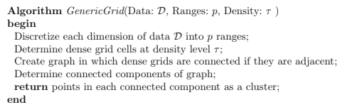

Ricevuti in **input**: un data-set $\mathcal D$, il numero $p$ degli intervalli e una soglia di densità $\tau$, l'algoritmo si compone dei seguenti passi:

1. Viene discretizzata ogni dimensione del data-set $\mathcal D$ in $p$ intervalli (tipicamente) ad ampiezza costante. Per un dataset $d$-dimensionale, ciò porta ad un totale di $p^d$ ipercubi nei dati.
2. Di questi $p^d$ ipercubi vengono selezionati solo quelli **densi** usando la **soglia di densità** $\tau$.
3. Viene creato un **grafo** in cui gli ipercubi (griglie) densi (**nodi**) vengono connessi da archi se sono **adiacenti**. Nel nostro caso, due ipercubi connessi della griglia $d$-dimensionale si dicono adiacenti se hanno un lato comune.
4. Vengono determinate le componenti connesse del grafo, ovvero vengono generati i **cluster**. Nell'esempio sottostante vi sono 2 componenti connesse.
5. Vengono restituiti in **output** i punti di ogni componente connessa come **cluster**.

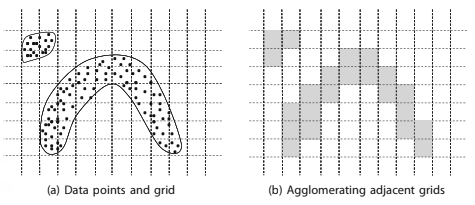

> Risulta evidente, quindi, come la scelta della dimensione $p$ degli intervalli e della soglia di densità $\tau$ sia di fondamentale importanza, dato che:
>
> 1. Celle troppo grandi possono contenere punti di diversi cluster, mentre celle troppo piccole possono generare un numero molto elevato di celle vuote.
> 2. Una soglia troppo bassa fa collassare più celle in un cluster, mentre una soglia troppo alta tende a spezzare i cluster.
>
> L'altro problema di fondo è l'**elevata dimensionalità dei dati**, dato che il numero di celle (ipercubi) della griglia cresce esponenzialmente al variare di $d$.

### Algoritmi density based - DBSCAN

> Gli algoritmi density-based identificano i cluster come regioni dello spazio dense, separate da zone a piu scarsa densità, che rappresentano quindi il rumore.
>
> Questi algoritmi possiedono quindi l'intrinseca capacita di rilevare cluster di forma arbitraria e di filtrare il rumore identificando gli outlier.

Il principale algoritmo basato sulla densità è il DBSCAN (*Density-Based Spatial Clustering of Applications with Noise*).

L'approccio consiste nel classificare i singoli punti in base alla loro **densità** e nell'utilizzarli come **building blocks**.

La densità di un punto nel data-set è definita dal numero di punti che si trovano lungo un raggio $Eps$ di quel punto (incluso il punto stesso).

In base alla loro densità, l'algoritmo DBSCAN prevede di classificare ciascun punto del data-set $\mathcal D$ in una di 3 categorie:

* **Core point (punto centrale)**: punti che nel loro intorno di dato raggio $Eps$ contengono almeno $\tau$ punti.
* **Border point (punto di confine)**: punti che nel loro intorno contengono meno di $\tau$ punti, ma che contengono almeno un core point.
* **Noise point (punto di rumore)**: punti che nel loro intorno contengono meno di $\tau$ punti e non contengono core point.

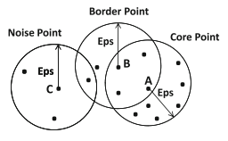

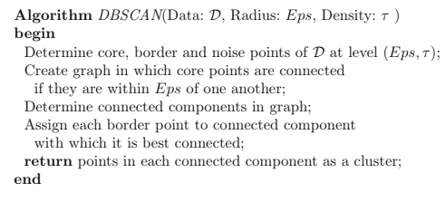

Ricevuti in **input**: un data-set $\mathcal D$, il valore $Eps$ del raggio e una soglia di densità $\tau$, l'algoritmo si compone dei seguenti passi:

1. Viene classificato ciascun punto del data-set $\mathcal D$ tenendo conto dei parametri $Eps$ e $\tau$. Avremo quindi 3 sottoinsiemi di $\mathcal D$:
   1. Insieme dei core points.
   2. Insieme dei border points.
   3. Insieme dei noise points.
2. A partire dall'insieme dei core points, viene creato un grafo (costruito su punti, a differenza di grid-based) in cui ogni nodo corrisponde ad un core point e connette due nodi $n_i$ ed $n_j$ (crea l'arco $\{ n_i, n_j \}$) se e solo se $Dist(n_i, n_j) \leq Eps$.
3. Vengono determinate le componenti connesse del grafo, ovvero vengono generati i **cluster**.
4. Vengono assegnati i border points al cluster (componenti connesse) con cui hanno un livello di connettività più elevato.
5. Vengono restituiti in **output** i gruppi risultanti (punti di ogni componente connessa) come **cluster** e i noise points vengono riportati come **outlier**.

> Il passo di determinazione del grafo dei core points è un approccio single linkage con distanza $Eps$.
>
> L'approccio di DBSCAN presenta come problemi:
>
> 1. Un costo computazionale di ricerca dei core points potenzialmente elevato di $O(n^2)$, che può essere ridotto a $O \Big( n\cdot \log(n) \Big)$ con apposite strutture di indicizzazione (anche se ciò è valido solo per basse dimensionalità).
> 2. La scelta di un parametro $\tau$ fissato comporta problemi nella gestione di cluster a densità variabile. In particolare, dopo aver scelto $\tau$, si può utilizzare $Eps$ come valore di cut-off della distanza di ogni punto dai suoi $\tau$ vicini più vicini.

In caso di utilizzo di un approccio grid-based, è possibile legare la dimensione della cella a al valore di $Eps$, a parità di scelta di $MinPts = \tau$, per ottenere forme dei cluster simili a quelle di DBSCAN

Se assumiamo che i dati si trovino all'intero di un ipercubo unitario, si può affermare, per ottenere una adiacenza tra celle dense che raggruppi i punti in modo molto simile agli intorni dei core point, che:

$$
\cfrac 1 p \propto \cfrac {Eps} {\sqrt{2}}
$$

## Misure di bontà del clustering

> Il clustering è una procedura **non supervisionata** e quindi non ci
> fornisce, in principio, informazioni utili alla validazione della bontà del task effettuato.

Si determinano due tipologie di criteri per fare **cluster validation**:

1. **Criteri di validazione interni**: sono criteri **basati sui dati** da analizzare e, dunque, indipendenti dall'algoritmo utilizzato
2. **Criteri di validazione esterni**: sono criteri indipendenti dai dati e vengono applicati principalmente quando il dataset è generato in modo sintetico (cluster noti a priori).

### Criteri di validazione interni

> Si tratta di criteri che sono formulati prendendo in prestito alcuni aspetti della funzione obiettivo da ottimizzare.
>
> Di conseguenza, tendono a favorire algoritmi che usano lo stesso tipo di funzione obiettivo.
>
> La loro utilità risiede soprattutto quando è impossibile usare un criterio esterno.

#### Within Cluster Sum of Squares (WCSS)

$$
WCSS = \sum_{j=1}^{K} \sum_{\bar X_i \in \mathcal C_j} \big( \bar X_i - \bar Y_j \big)^2
$$

È un criterio che si sposa perfettamente con gli algoritmi che generano **cluster sferici**. Da notare che, all'aumentare del numero $K$ di cluster, $WCSS$ diminuisce a prescindere, dato che i cluster saranno generalmente più piccoli.

#### Rapporto delle distanze Intra-cluster/Inter-cluster

$$
Intra = \sum_{\big ( \bar X_i, \bar X_j \big) \in P}  \cfrac {dist \big( \bar X_i, \bar X_j \big) } {|P|} = \cfrac {1} {|P|} \cdot \sum_{\big ( \bar X_i, \bar X_j \big) \in P} {dist \big( \bar X_i, \bar X_j \big) }
$$

$$
Inter = \sum_{\big ( \bar X_i, \bar X_j \big) \in Q}  \cfrac {dist \big( \bar X_i, \bar X_j \big) } {|Q|} = \cfrac {1} {|Q|} \cdot \sum_{\big ( \bar X_i, \bar X_j \big) \in Q} {dist \big( \bar X_i, \bar X_j \big) }
$$

L'algoritmo segue i seguenti passi:

1. Sceglie un certo cluster e seleziona le $P$ coppie che appartengono ad esso.
2. Seleziona le rimanenti $Q$ coppie che non appartengono al cluster scelto.
3. Calcola il rapporto $\cfrac {Intra} {Inter}$.

Più questo rapporto è piccolo, migliore sarà il clustering.

#### Silhouette Coefficient

Siano:

* $D_{avg_i^{in}}$ la distanza media di un punto $\bar X_i$ rispetto agli altri punti all'interno dello stesso cluster.
* $D_{min_i^{out}}$ la minima distanza media di un punto $\bar X_i$ dagli altri cluster diversi dal suo.

Il **Silhouette Coefficient** $S_i$ relativo al dato $\bar X_i$ è definito come:

$$
S_i = \cfrac {D_{min_i^{out}} - D_{avg_i^{in}}} {max \Bigl\{ D_{min_i^{out}}, D_{avg_i^{in}} \Bigr\} } \in \big[ -1, 1 \big]
$$

Valori di $S_i$ prossimi ad $1$ indicano una buona separazione tra i cluster, ovvero che è stato effettuato un buon clustering.

> $D_{min_i^{out}} < D_{avg_i^{in}} \Longleftrightarrow$ il punto $\bar X_i$ è più vicino ad almeno un altro cluster diverso dal proprio.

Il **Silhouette Coefficient Complessivo** $S$ è pari alla **media** dei **Silhouette Coefficients Specifici** dei punti.

$$
S = \cfrac {1} {n} \cdot \sum_i S_i
$$

#### Misure Probabilistiche

Si usa un metodo simile al passo di massimizzazione dell'approccio EM calcolando la log-likelihood di una mistura di distribuzioni che sottenda ipoteticamente i dati.

Questa misura è utile quando è nota la forma che i cluster dovrebbero avere.

#### Considerazioni Finali

Come detto in precedenza, queste misure **dipendono fortemente dall'algoritmo di clustering**, che tende a favorire specifiche forme di clustering, che potrebbero non essere quelle reali.

Questa criticità rende difficile valutare un confronto tra i diversi criteri per testare la bontà di un algoritmo.

Tutti gli algoritmi di clustering utilizzano una serie di parametri come input, come il numero di cluster o la densità.

Nonostante i criteri di valutazione interni abbiano criticità intrinseche, possono essere utilizzati come strumento per il **tuning** (regolazione) **dei parametri dell'algoritmo di clustering**.

> L'idea alla base di questa teoria risiede nel fatto che la variazione delle misure di validazione al crescere dei parametri tende a mostrare un punto di flesso (**elbow**) alla scelta corretta del parametro.

La forma del punto di flesso può variare in base alla natura del parametro da regolare e alla misura di validazione utilizzata. Ad esempio, nel caso del clustering k-means, in cui il parametro da regolare è il numero dei cluster $k$, sia utilizzando come criterio $WCSS$ che il rapporto $\cfrac {Intra}{Inter}$, la misura andrà a decrescere fino al punto di flesso e poi potrebbe decrescere leggermente, andando a creare un **plateau**.

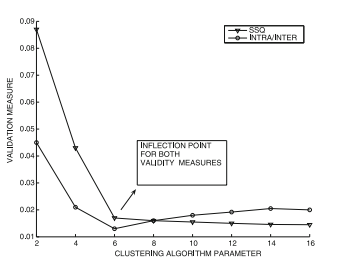

> Tali tecniche di tuning dei parametri con misure di validazione interne dovrebbero essere utilizzate come una **regola pratica informale**, piuttosto che come un criterio rigoroso.

### Criteri di valutazione esterni

> Si tratta di criteri utilizzati quando sono disponibili le **etichette di classe**:
>
> * **Benchmark data-set**: quando vengono generati data-set sintetici da benchmark noti, è possibile associare etichette di cluster ai record generati.
> * **Data-set Reali**: quando abbiamo a che fare con data-set con etichette di classe che dipendono dall’applicazione di classificazione e potrebbero non riflettere le caratteristiche dei cluster naturali dei dati.
>
> Il rischio maggiore con le etichette di classe è che queste si basano su proprietà specifiche dell'applicazione di quel data-set e potrebbero non riflettere i cluster naturali dei dati.
>
> Tuttavia, i criteri di valutazione esterni sono preferibili ai criteri interni perché possono evitare errori nelle valutazioni, se usati su più data-set.

Uno dei problemi è che **il numero di cluster naturali dei dati potrebbe non riflettere il numero di etichette di classe** (o identificatori di cluster).

Siano $k_t$ il numero di etichette di classe (il numero reale dei cluster) e $k_d$ il numero di cluster determinati dall'algoritmo.

Se $k_t = k_d$, si può utilizzare una **matrice di confusione** (che metta in relazione il mapping tra cluster reali e cluster predetti dall'algoritmo) che fornisce un metodo intuitivo per valutare **visivamente** la bontà del clustering.

Ogni riga $i$ di questa matrice corrisponde all'etichetta di classe (valori reali), mentre ogni colonna $j$ corrisponde ai valori predetti dall'algoritmo.

L'elemento $(i,j$) è uguale al numero di punti nel cluster reale $i$ mappati nel cluster predetto $j$.

Se il clustering è di **alta qualità** è possibile permutare gli elementi della matrice di confusione in modo che solo gli elementi diagonali siano grandi (matrice 1).

Se il clustering è di **bassa qualità** gli elementi nella matrice saranno distribuiti in modo più **uniforme** (matrice 2).

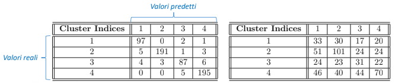

La costruzione di una matrice di confusione all'aumentare del numero dei cluster (o quando $k_t \neq k_d$) potrebbe non essere una soluzione pratica.

Ha più senso progettare misure rigorose per valutare la **qualità complessiva** della matrice di confusione.

Sia $m_{ij}$ il numero di punti della classe (reale) $i\in [1, k_t]$ mappati nel cluster (predetto) $j\in [1, k_d]$, ovvero l'elemento $(i,j)$ della matrice di confusione.

Il numero di punti in diversi cluster può essere ottenuto come segue:

$$
\begin{cases} 
	N_i = \sum_{j=1}^{k_d} m_{ij} & \forall i = 1, 2, \dots, k_t \\
	M_j = \sum_{i=1}^{k_t} m_{ij} & \forall j = 1, 2, \dots, k_d
\end{cases}
$$

Due misure di bontà comunemente usate sono la **cluster purity** e il **Gini Index Class-Based**.

#### Purity

> Si assume che un **un cluster $j$ di alta qualità dovrebbe contenere quanti più punti possibili tutti appartenenti alla stessa classe**.

Dato $P_j = \underset i {max} \ \{m_{ij} \}$, ovvero il numero di punti nella classe dominante, possiamo calcolare la **Purity** come segue:

$$
Purity = \cfrac {\sum_{j=1}^{k_d} P_j} {\sum_{j=1}^{k_d} M_j}
$$

La **Purity** tende a $1$ per un buon clustering.

> Tale misura ha un solo problema: considera come indice di purezza solo le classi dominanti, **ignorando la distribuzione su tutte le altre classi**.

#### Gini Index

> Considera il contributo anche delle altre classi presenti nel cluster.
>
> È un buon cluster quello in cui i punti sono concentrati in poche classi.

$$
G_j = 1- \sum_{i=1}^{k_t} \bigg( \cfrac {m_{ij}} {M_j} \bigg)
$$

Se il clustering è buono, ovvero quando gli elementi in una colonna della matrice di confusione sono molto variabili, il valore di $G_j$ tende a $0$.

Se il clustering non è buono, cioè quando gli elementi della matrice di confusione sono distribuiti uniformemente, $G_j$ tende a $1-\cfrac {1}{k_t}$, che coincide con il limite superiore.

$$
G_{average} = \cfrac {\sum_{j=1}^{k_d} G_j \cdot M_j} {\sum_{j=1}^{k_d} M_j}
$$

#### Entropia

> L'indice di Gini è strettamente correlato al concetto di **entropia** $E_j$ del cluster $j$, in quanto il rapporto $\cfrac {m_{ij}} {M_j} $ è la probabilità che un punto appartenda al cluster $j$.

L'entropia $E_j$ misura le stesse caratteristiche intuitive dei dati:

$$
E_j = - \sum_{i=1}^{k_t} \bigg( \cfrac {m_{ij}} {M_j} \bigg) \cdot log \bigg( \cfrac {m_{ij}} {M_j} \bigg)
$$

Se $E_j$ è **piccolo**, allora il **clustering** è **buono**.

$$
E_{average} = \cfrac {\sum_{j=1}^{k_d} E_j \cdot M_j} {\sum_{j=1}^{k_d} M_j}
$$

È possibile infine stabilire una misura di bontà del clustering analizzando la matrice di confusione con le misure tipiche della classificazione: Precision, Recall e F1-score (che vedremo più avanti).

## Domande frequenti

1. Clustering basato su densità (approcci grid-based, density-based). Cosa esprime il parametro di densità?
2. Elbow method (come stabilire il numero di cluster ideale), selezione delle feature rilevanti per la clusterizzazione.
3. Clustering per densità, perchè è meglio il grid-base rispetto a quello dei punti (costo computazionale, uno fa la distanza euclidea, l'altro confronti degli intervalli)
4. Tipologie di clustering. K-Means

# 16 - Classificatori

## Generalità

> Il problema della **classificazione** è strettamente correlato al problema del **clustering**.
>
> Mentre lo scopo del clustering è quello di determinare gruppi simili di dati, lo scopo della classificazione è quello di saper predire il valore dell'etichetta per dati di **test** mai visti dall'algoritmo.

La **classificazione** è uno dei tipici problemi del Machine Learning, come detto in precedenza, e consiste, dato un dataset in input, in cui ogni occorrenza è etichettata come appartenente a una classe, nel **saper predire un'etichetta di classe ad ogni occorrenza dei dati di test**, mai visti dall'algoritmo di apprendimento.

Gli algoritmi di classificazione rientrano tra quelli di **apprendimento supervisionato**, in quanto l'apprendimento della struttura dei gruppi avviene per esempi (e non attraverso la loro tendenza al clustering).

Si tratta, forse, della tipologia di algoritmo di machine learning più comune, e si compone tipicamente di due fasi:

* **Fase di addestramento**, in cui viene costruito un modello addestrato a partire da esempi di addestramento.
* **Fase di test**, in cui il modello addestrato viene utilizzato per predire l'etichetta di classe di dati mai visti prima.

Grazie all'eterogeneità di fonti di dati che possono fungere da insieme di addestramento, gli algoritmi di classificazione sono **molto versatili** in termini di contesto applicativo.
In generale, dati $n$ punti nello spazio $\mathbb{R}^d$ appartenenti al dataset $\mathcal{D}$, questi vengono associati ad un insieme di etichette $\{1,\dots, k\}$ (da notare che, per $k = 2$, si parla di classificazione binaria e le etichette vengono indicate con $\{−1,1\}$ o $\{0,1\}$) tramite un algoritmo di classificazione.

L'**output** di un algoritmo di classificazione può essere di due tipi:

1. **Predizione esplicita dell'etichetta**: viene predetta un'etichetta per ogni esempio di test.
2. **Score numerico**: il modello assegna un punteggio a ciascuna combinazione esempio-etichetta che misura la probabilità di appartenenza del punto ad una particolare classe. Può essere riportato alla prima tipologia usando come etichetta esplicita quella la cui probabilità è massima.

Per un compito di classificazione, esistono diversi modelli (alberi di decisione, Support Vector Machines, ecc.), ognuno con le proprie caratteristiche, ma un problema più importante della scelta del modello avviene a monte, e riguarda la scelta delle caratteristiche (feature) più informative per la classificazione.

## Selezione delle feature

> È la prima fase del processo di classificazione e consiste nella scelta delle **feature rilevanti** per la previsione delle etichette di classe all'interno del data-set $\mathcal D$.

È la **prima fase** del processo di classificazione e consiste nella **scelta delle features** nel dataset **con un certo contenuto informativo**, dato che quelle che danno poca informazione ai fini della classificazione rischiano di essere fuorvianti per il modello e rappresentano un peso inutile in termini di computazioni.

Per la selezione delle feature esistono tre principali metodologie:

* **Modelli basati su filtro**: sfruttano un **criterio matematico** per valutare la qualità di una feature o di un sottoinsieme di esse. Tale criterio viene utilizzato con indicatori numerici della rilevanza delle feature per filtrare (eliminare) le feature irrilevanti.
* **Modelli wrapped**: sfruttano un **algoritmo di classificazione** per valutare le performance del vero e proprio algoritmo di classificazione per uno specifico insieme di features, **per poi stabilire quale sia il sottoinsieme di features più utile** ai fini della vera e propria classificazione.
* **Modelli embedded**: utilizzano la **soluzione di un algoritmo di classificazione** per ricavare suggerimenti utili sulle features più rilevanti, che, una volta isolate, possono essere utilizzate per **riaddestrare il modello solo su di esse**.

### Modelli Basati su Filtro

> Come detto, questo tipo di modelli valuta le feature in base a un criterio matematico e ha il vantaggio di **tener conto delle ridondanze tra di esse**.

L'uso di tali metodi ha, però, un problema riguardo ai costi computazionali, dato che, per un problema $d$-dimensionale, esistono $2^d$ possibili sottoinsiemi di feature di cui valutare la bontà.
Nella pratica, pertanto, **si tende ad analizzare le features in modo indipendente**, per poi selezionare quelle più discriminanti.

#### Gini Index

> Viene usato per **attributi categorici**, ma può essere generalizzato ad **attributi numerici discreti**, mediante il processo di **discretizzazione**.

Siano $v_1, v_2, \dots, v_r$ gli $r$ possibili valori di un attributo categorico.

Sia $p_j$ l'insieme dei dati contenenti il valore $v_i$ dell'attributo nella classe $j \in \{ 1, 2, \dots, k \}$.

L'indice di Gini per il valore $v_i$ di un attributo categorico è definito come:

$$
G(v_i) = 1 - \sum_{j=1}^k p_j^2
$$

> Come visto con il clustering, **valori piccoli** dell'indice di Gini indicano una **maggiore capacità discriminatoria** dell'attributo, dato che punti appartenenti alla stessa classe per lo stesso valore $v_i$ dell'attributo restituiscono $G (v_i) = 0$.
>
> $$
> G(v_i) = \begin{cases} 0 & se \ tutti \ i \ punti \ appartengono \ alla \ stessa \ classe \\ 1 - \cfrac {1} {k} & se \ le \ classi \ sono \ distribuite \ uniformemente \end{cases}
> $$

Il Gini Index complessivo per tutti gli $r$ valori dell'attributo $v_i$ è definito come la **media pesata** sui diversi valori dell'attributo:

$$
G = \sum_{i=1}^r n_i \cdot \frac {G(v_i)} {n}
$$

dove $n_i$ indica il numero di punti che assumono il valore $v_i$ dell'attributo, da cui l'insieme dei punti $n = \sum _{i=1}^r n_i$.

#### Entropia

> La misura dell'**entropia class-based** sfrutta la **correlazione tra variazioni di entropia e contenuto informativo** tipici della teoria dell'informazione.

Sia $p_j$ la frazione di punti contenente il valore $v_i$ dell'attributo e che appartengono alla classe $j \in \{ 1, 2, \dots, k \}$.

L'entropia class-based $E(v_i)$ relativa al valore $v_i$ è definita come:

$$
E(v_i) = - \sum_{j=1}^k p_j \cdot \log_2(p_j)
$$

$$
E(v_i) \in \bigg[0, \log_2(k) \bigg]
$$

> **Valori elevati** dell'entropia implicano **alta mescolanza tra classi diverse**, mentre **un'entropia a 0 indica la perfetta separazione tra classi**, dunque un alto potere discriminatorio della feature.

Analogamente a quanto visto con il **Gini Index**, è possibile definire un'entropia class-based complessiva per tutti gli $r$ valori dell'attributo $v_i$:

$$
E = \sum_{i=1}^r n_i \cdot \frac {E(v_i)} {n}
$$

dove $n_i$ è la frequenza del valore $v_i$ dell'attributo.

#### Fisher score

> È progettato per misurare il **rapporto tra separazione media inter-classe e intra-classe di attributi numerici**.
>
> **Più è alto** il Fisher Score, **più è alto il potere discriminatorio dell'attributo**.

Siano $\mu_j$ e $\sigma_j$ rispettivamente la **media** e la **deviazione standard** dei punti appartenenti alla classe $j$ per una particolare feature.

Il Fisher Score viene definito come:

$$
F = \cfrac{\sum_{j=1}^k p_j \left( \mu_j-\mu \right)^2 }{\sum_{j=1}^k p_j \sigma_j^2 }
$$

Dove, **per ogni feature**:

* $p_j$ è la **frazione** di dati appartenente alla classe $j$
* $\mu_j$ è la **media** dei dati appartenenti alla classe $j$
* $\sigma_j$ è la **deviazione standard** dei dati appartenenti alla classe $j$

Il **numeratore** della formula rappresenta la separazione **inter-classe** media, mentre il **denominatore** la separazione **intra-classe** media.

#### **Fisher Linear Discriminant**

> Può essere pensato come una **generalizzazione del Fisher Score per combinazioni lineari di feature**.

Lavorando in forma supervisionata, è un metodo che tende a trovare la direzione massima di variazione delle features e, per contro, l'iperpiano perpendicolare che separa meglio le classi rispetto alle features stesse, in modo da massimizzare il già citato rapporto **Inter-class/Intra-class**.

### Modelli Wrapped

> Sono modelli caratterizzati da una **strategia generale**, che consiste nel **perfezionare iterativamente un insieme di feature** $F$ aggiungendo una feature per volta.

Ricevuto in **input** uno specifico algoritmo di classificazione $\mathcal A$, si procede come segue:

1. Si inizializza l'insieme delle feature $F = \emptyset$.
2. Si aggiungono una o più feature ad $F$.
3. Si utilizza l'algoritmo di classificazione $\mathcal A$ per valutare l'accuratezza dell'insieme $F$.
   1. Se l'accuratezza diminuisce rispetto all'iterazione precedente, vengono rimosse da $F$ le feature aggiunte al passo 2.

Bisogna quindi definire le **possibili strategie** per aggiungere feature ad $F$:

* Una strategia **greedy** può incrementare l'insieme $F$ ad ogni passo aggiungendo sempre la feature più discriminatoria rispetto ad un certo criterio.
* Usare **campionamento casuale** per aggiungere una feature ad $F$.

> Il processo iterativo dell'incremento dell'insieme delle feature rilevanti $F$ continua finché non vi saranno più miglioramenti dopo un certo numero di iterazioni.
>
> L'insieme finale $F$ **dipende dalla scelta dell'algoritmo di classificazione $\mathcal A$**.

## Decision Tree

> Si tratta di un metodo di classificazione basato su **decisioni gerarchiche sulle feature**, disposte in una struttura ad albero.
>
> Il data-set $\mathcal D$ viene suddiviso ricorsivamente in parti più piccole sulla base di una **discriminazione sui valori** degli attributi.

È un **algoritmo supervisionato**, in quanto necessita che i dati abbiano affibbiate delle etichette, e fa in modo da suddividere gerarchicamente il data-set $\mathcal D$ in modo che il livello di mescolamento delle features di classe in ogni ramo sia il minore possibile.

La suddivisione operata dagli alberi di decisione **ricorda il funzionamento dell'algoritmo di clustering top-down**.

Gli alberi di decisione possono effettuare delle discriminazioni sia su singole features, per cui si parla di **split univariato del nodo**, o su un insieme di attributi, nel qual caso si parla di **split multivariato del nodo**.
L'uso di **split multivariati** è più potente e porta ad alberi meno profondi.

Un algoritmo di induzione ha due tipi di nodo, i **nodi interni** e i **nodi foglia**. **Ogni nodo foglia è etichettato con la classe predominante nel nodo**, mentre un nodo interno speciale e la radice,
che corrisponde all'intero spazio delle features.
Durante la creazione dell'albero, **è possibile separare solo quei nodi che sono combinazione di due o più classi**, mentre essa giunge alla fine nel momento in cui l'algoritmo incontra un criterio di arresto (il più semplice è quello in cui tutti gli esempi in una foglia appartengono alla
stessa classe).

La costruzione dell'albero, se troppo dettagliata, può portare ad una situazione di **overfitting**, in cui il modello aderisce esattamente agli esempi di addestramento ed è incapace di generalizzare.
Per non incorrere in overfitting, **si può effettuare una potatura dei nodi che sono andati in overfitting** secondo un qualche criterio (es. si valida l'incremento di precisione su un insieme di validazione estratto dal training set).

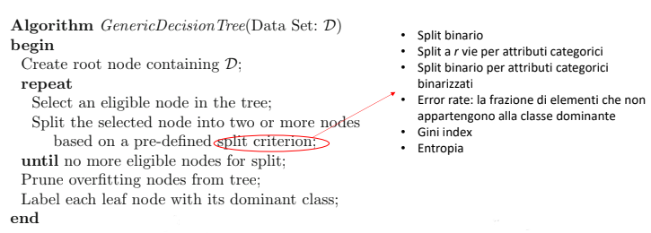

Ricevuto in **input** un data-set $\mathcal D$, l'algoritmo si compone delle seguenti fasi:

1. Viene creato il nodo radice contenente $\mathcal D$.
2. Finché non ci sono più nodi ammissibili per la divisione:
   1. Seleziona un nodo ammissibile nell'albero.
   2. Divide il nodo selezionato in due o più nodi basandosi su un **criterio di split** predefinito.
3. Effettua il pruning dei nodi foglia che vanno in **overfitting**.
4. Etichetta ogni nodo foglia con la sua classe dominante.

## Random Forests

Sono una **generalizzazione degli alberi di decisione** e si tratta di classificatori di tipo ensemble, ossia è composto da più classificatori addestrati sullo stesso dataset che e ettuano ognuno la propria predizione e **il cui risultato è una combinazione** di queste, atta a generare una predizione globale più robusta. Fanno uso della tecnica del **bagging**, ossia:

1. **Si crea un ensemble di $k$ classificatori indipendenti** e distribuiti identicamente, in modo da ridurre la varianza delle stime all'aumentare del numero di stime e ettuate.
2. **Si generano $k$ dataset con campionamento con rimpiazzo**, così da poter generare dataset quanto più simili possibili.
3. **Si addestrano i classificatori** e la predizione della foresta è quella che ha ottenuto la maggioranza dei voti o la media delle predizioni espresse da ciascun classificatore su ogni campione.

Data questa cooperazione, la random forest è molto più potente di un singolo albero di decisione.
Un'altra caratteristica interessante è che **i nodi più elevati della gerarchia sono**, di base, **invarianti**, in quanto la particolarizzazione degli alberi avviene nei nodi più interni, in modo da non ottenere solo copie dello stesso albero. Per ottenere questa diversi cazione, le random forests fanno uso di **specifici algoritmi per lo split casuale** nei diversi alberi dell'ensemble. Tra i criteri di split abbiamo:

* **Forest-RI (Forest - Random Input)**, in cui viene estratto un sottoinsieme casuale di features $q < d$, con $q$ che viene usato come regolatore della casualità introdotta nel criterio di split.
  Lo split in ogni nodo è preceduto dalla selezione casuale di un sottoinsieme di attributi $S$ di dimensione $q$, per cui gli split tengono in considerazione solo $S$. Più è piccolo il valore di $q$, minore sarà la correlazione tra gli alberi, ma minore sarà la precisione dell'albero.
  È stato dimostrato che, per $d$ dimensioni, il miglior compromesso è selezionare $q = \log _2 (d ) + 1$ features.
* **Forest-RC (Forest - Random Combination)**, in cui viene estratto un sottoinsieme $L$ di features e si creano $q$ combinazioni lineari da usare come features multivariate per lo split.
  Per ogni nodo le $L$ features vengono selezionate casualmente e combinate linearmente con coefficienti generati uniformemente nell'intervallo $[−1,1]$.

Usando algoritmi di random forest, non si fa uso di una strategia di potatura esplicita, per cui ogni albero cresce cercando di addestrarlo con dati di addestramento atti a massimizzare la riduzione di varianza. Tuttavia, a causa dei criteri limitati di random split degli alberi, i singoli costituenti potrebbero mostrare un bias maggiore, molto marcato nel momento in cui la frazione di features significative è molto piccola.

## Classificatori probabilistici

Si tratta di un modello che quanti ca la relazione tra le features e la classe obiettivo in termini di probabilità. I due modelli più diffusi sono:

* **Classificatori di Bayes**, in cui si usa la regola di Bayes per modellare la probabilità di ciascun valore della variabile target per features date. In genere, si assume che i punti all'interno di una classe siano generati secondo una specifica distribuzione di probabilità, come Bernoulli o quella multinomiale.
  Tra questi classificatori, i **Bayes naive** assumono features condizionate dalla classe statisticamente indipendenti, in modo da semplificare la modellazione (anche se ciò non semprecorrisponde alla realtà).
* **Regressori logistici**, che assumono la variabile target come tratta da una distribuzione di Bernoulli la cui media è de nita da una funzione logit parametrizzata sulle features.
  Pertanto, la distribuzione di probabilità della variabile target è una funzione parametrizzata delle features.

Il primo tipo di classificatore prende il nome di **classificatore generativo**, mentre il secondo viene definito **classificatore discriminativo**.

### Regressione logistica

Nella forma più semplice, si assume che la variabile target sia binaria con valori $\{−1,1\}$.
Sia $\bar{\Theta} = \left( θ_0, ⋯, θ_d\right)$ un vettore di parametri $d + 1$-dimensionale, in cui $θ_0$ è un **parametro di offset** e $θ_i$ il **coefficiente relativo alla i-esima dimensione** nei dati. Per un record $\bar{X} = \left( x_0, ⋯, x_d\right)$ la probabilità che la variabile $C$,rappresentante la classe, abbia valore -1 o 1 è
modellata dalla funzione logistica

$ P (C = 1 | X̄ ) = \frac{1}{1+e^{-(θ_0 + \sum_{i=1}^d θ_i x_i)}}$ e $ P (C = -1 | X̄ ) = \frac{1}{1+e^{(θ_0 + \sum_{i=1}^d θ_i x_i)}}$

Un regressore logistico **può essere visto come un classificatore lineare** in cui $\bar{\Theta}$ rappresenta il vettore dei coefficienti dell'iperpiano di separazione tra le due classi, laddove i punti $X̄$ che fanno assumere valori positivi all'equazione dell'iperpiano saranno assegnati alla classe positiva, e viceversa.

Per stimare i parametri più adatti del modello di regressione logistica viene utilizzato l'approccio a massima verosimiglianza.
Siano $\mathcal{D}_+$ e $\mathcal{D}_-$ i segmenti di dati appartenenti alle classi positiva e negativa. Se indichiamo con $X̄_k = (x_k^1, ⋯, x_k^d)$ il k-esimo punto, la funzione di verosimiglianza $\mathcal{L}(\bar{\Theta})$ per il dataset viene definita come

$\mathcal{L}(\bar{\Theta}) = \prod _{X̄_k \in \mathcal{D}_+} \frac{1}{1+e^{-(θ_0 + \sum_{i=1}^d θ_i x_i)}} \cdot \prod _{X̄_k \in \mathcal{D}_-} \frac{1}{1+e^{(θ_0 + \sum_{i=1}^d θ_i x_i)}}$

Poiché l'obiettivo è **massimizzare la funzione di verosimiglianza**, dobbiamo lavorare con le derivate parziali della funzione, che altro non sono che i parametri $\theta _i \in \bar{\Theta}$ ed eseguire un algoritmo di ascesa del gradiente. Per semplificare i costi computazionali, conviene sempre **lavorare con la log-likelihood associata**, per cui abbiamo che, la derivata parziale di $\mathcal{L}$ rispetto al parametro $\theta _i \in \bar{\Theta}$ è data da

$ \frac{\delta \mathcal{L}}{\delta \theta_i} = \sum _{X̄_k \in \mathcal{D}_+} \mathrm{Pr}\left( \bar{X}_k \in \mathcal{D}_- \right) x_k^i - \sum _{X̄_k \in \mathcal{D}_-} \mathrm{Pr}\left( \bar{X}_k \in \mathcal{D}_+ \right) x_k^i$

che altro non sono che le **somme degli errori di classificazione** commessi per le due classi.

La **condizione di aggiornamento** per il parametro $θ_i$ è

$θ_i ← θ_i + α\cdot \left( \sum _{X̄_k \in \mathcal{D}_+} \mathrm{Pr}\left( \bar{X}_k \in \mathcal{D}_- \right) x_k^i - \sum _{X̄_k \in \mathcal{D}_-} \mathrm{Pr}\left( \bar{X}_k \in \mathcal{D}_+ \right) x_k^i \right)$

dove α è il passo di aggiornamento, determinabile usando una ricerca binaria per massimizzare il miglioramento della funzione obiettivo.

### Naive Bayes

Sia $C$ la variabile aleatoria target che rappresenta la classe di un esempio di test, la cui feature $X̄$ d-dimensionale ha valori $X̄ = \left( a_1, ⋯, a_d\right)$, potendo scrivere i valori sulla singola feature come $X̄ = \left( x_1, ⋯, x_d\right)$; la probabilità condizionata di appartenenza a una classe ($C = c$) dato $X̄$ a valori fissati è, secondo il teorema di Bayes

$\mathrm{Pr} (C = c | x_1 = a_1, ⋯, x_d = a_d) = \frac{\mathrm{Pr} (x_1 = a_1, ⋯, x_d = a_d | C = c) ⋅ \mathrm{Pr} (C = c)}{\mathrm{Pr} (x_1 = a_1, ⋯, x_d = a_d)}$

Per l'assunzione naive di questo classificatore, le componenti della feature sono statisticamente indipendenti, per cui vale

$\mathrm{Pr} (x1 = a1, ⋯, xd = ad | C = c) = \prod _j \mathrm{Pr} \left( x_j = a_j | C = c\right)$

Da cui deriviamo che

$\mathrm{Pr} (C = c | x_1 = a_1, ⋯, x_d = a_d) ∝ \mathrm{Pr} (C = c)⋅\prod_j \mathrm{Pr} (x_j = a_j | C = c)$

In questo modo, si è semplificato il calcolo di una probabilità condizionata e congiunta al calcolo di più probabilità condizionate, che possono essere espresse in termine frequentista come

$\mathrm{Pr} (x_j = a_j | C = c) = \frac{q (a_j, c)}{r(c)}$

Il problema di quest'ultima relazione risiede nel fatto che, per piccole dimensioni del dataset, fa tendere l'intera probabilità del classi catore a 0, dunque bisogna introdurre un fattore di smoothing laplaciano, per cui la relazione diventa

$\mathrm{Pr} (x_j = a_j | C = c) = \frac{q(a_j, c) + α}{ r (c) + α ⋅ m_j} $

$\alpha$ è il parametro di smoothing, mentre $m_j$ è il numero di valori distinti della feature j-esima.
Questa aggiunta fa in modo che, per valori nulli, il rapporto sia uguale a $\frac{1}{m_j}$, una stima ragionevole in assenza di dati di addestramento sulla classe $c$.

## Support Vector Machine

Si tratta di classificatori che permettono di **determinare l'iperpiano di separazione ottimale** tra due classi, ossia quello che massimizza il margine tra i due iperpiani paralleli che delimitano le classi, i cosiddetti **support vectors**.
Nel caso di classi linearmente separabili, è possibile determinare un iperpiano lineare che separi nettamente i dati delle due classi.

### SVM per Dati Linearmente Separabili (Hard SVM)

Di base, per dati linearmente separabili, è possibile individuare in niti iperpiani separatori lineari.
Lo scopo di una SVM è quello di determinare l'iperpiano **la cui distanza minima da entrambe le classi sia la massima possibile**, in quanto ciò genera un classi catore molto robusto. La distanza minima cui si fa riferimento è modellabile grazie al concetto di **margine** dell'iperpiano.

Consideriamo un iperpiano separatore tra due classi, il margine è definito come la **somma delle sue distanze dai punti più vicini** di ciascuna classe. Supponiamo, allora, di costruire due iperpiani paralleli che passano per i punti di addestramento di entrambe le classi (che, in questo senso, prendono il nome di vettori di supporto) e di definire la distanza tra di loro come margine: di fatto, **l'iperpiano ottimale si troverà esattamente al centro** tra i due iperpiani.

Per determinare l'iperpiano di margine massimo, possiamo massimizzare il margine espresso in termini di coefficienti dell'iperpiano di separazione. Se indichiamo gli $n$ punti del training set $\mathcal{D}$ con $(X̄_1, y_1), ⋯, (X̄_n, y_n)$, dove $X̄_i$ **è un vettore d-dimensionale corrispondente all'i-esimo punto** e $y_i ∈ \{−1,1\}$ **è la classe binaria associata all'i-esimo punto**, possiamo definire l'iperpiano di separazione con la forma $W̄ ⋅ X̄_i + b = 0$, dove $W̄$ è un vettore d-dimensionale rappresentante la **direzione normale** al piano e $b$ uno scalare detto **bias**, con il primo che indica l'orientamento dell'iperpiano e il secondo che indica la sua distanza dall'origine.

I $d + 1$ coefficienti individuati nell'equazione dell'iperpiano devono essere **appresi per addestramento** in modo da **massimizzare il margine**. Se le classi sono linearmente separabili, l'iperpiano di separazione esiste certamente.
Tutti gli $X̄_i$ associati a $y_i = 1$ soddisferanno l'equazione

$W̄ ⋅ X̄_i + b ≥ 0$

mentre quelli per cui $y_i = − 1$ soddisferanno l'equazione

$W̄ ⋅ X̄_i + b < 0$

Avendo detto che, se esiste, l'iperpiano si trova al centro tra i due vettori di supporto e ha equazione $W̄ ⋅ X̄_i + b = 0$, possiamo esprimere i vettori di supporto in termine di un parametro $c$ che regola la distanza tra di essi, secondo le equazioni

$W̄ ⋅ X̄_i + b = c$  e   $W̄ ⋅ X̄_i + b = − c$

che, con variabili opportunamente scalate, possono essere riscritte come

$W̄ ⋅ X̄_i + b = 1$  e   $W̄ ⋅ X̄_i + b = − 1$

Quelle appena scritte sono le **equazioni dei vincoli di margine** e, avendo detto che le classi sono linearmente separabili, nello spazio tra di esse non vi sono dati con classificazione indecisa. Ciò permette di esprimere le condizioni di appartenenza a una o all'altra classe come

$$
\begin{cases}
W̄ ⋅ X̄_i + b ≥ 1 & ∀i | y_i = 1 \\
W̄ ⋅ X̄_i + b ≤ − 1 & ∀i | y_i = − 1
\end{cases}
$$

Queste condizioni possono essere scritte in **forma compatta** come $y_i (W̄ ⋅ X̄_i + b) ≥ 1$.
Avendo ricavato i vettori di supporto, grazie all'algebra lineare, possiamo affermare che **la distanza tra di essi è** $∥W̄∥_2$ da cui, poiché la differenza tra i termini costanti delle due equazioni è 2, il margine è pari a $\frac{2}{∥W̄∥}$, che altro non è che la funzione da massimizzare.

In realtà, massimizzare la forma $\frac{2}{∥W̄∥}$ equivale a minimizzare la funzione $O = \frac{∥W̄∥^2}2$, una forma quadratica che può essere risolta con **rilassamento lagrangiano**, la cui risoluzione viene omessa, che portano a una definizione dei parametri direttori del piano $W̄ = \sum_{i=1}^n \lambda_i y_i \bar{X}_i $ e a una derivazione di $b$ da cui si ricava che **solo i vettori di supporto sono utilizzati per trovare la soluzione**.
Il duale lagrangiano può essere ottimizzato attraverso la tecnica di ascesa lungo il gradiente in termini del parametro vettoriale n-dimensionale $\bar{λ}$

$$
\frac{\delta L_D}{\delta \lambda_i} = 1-y_i\sum_{j=1}^n y_j\lambda_j \bar{X}_i \cdot \bar{X}_j
$$

In modo analogo alla regressione logistica, l'**equazione di aggiornamento** basata sul gradiente è la seguente

$$
(λ_1, ⋯, λ_n) ← (λ_1, ⋯, λ_n) + α (\frac{δL_D}{δ \lambda_1}, ⋯, \frac{δL_D}{δ \lambda_n} )
$$

dove $α$ è il **tasso di apprendimento**. Come soluzione iniziale si può considerare il vettore nullo,
che rientra nello spazio delle soluzioni.

### SVM per Dati non Linearmente Separabili (Soft SVM)

Nella maggior parte dei casi reali, i dataset contengono dati non linearmente separabili, ma ciò non vieta di poter classificare usando una SVM: è possibile, infatti, costruire un iperpiano di separazione che classifica ottimamente la stragrande maggioranza dei dati, a meno di poche eccezioni.

La costruzione di un iperpiano con SVM per classi non linearmente separabili fa uso di un **sistema di penalità** che compensano la violazione dei vincoli di margine. Solitamente, il livello di violazione di ciascun vincolo da parte del punto $X̄_i$ è dato da una **variabile di rilassamento** $ξ_i ≥ 0$, per cui possiamo definire il nuovo **insieme di soft margin sui vettori di supporto** come

$$
\begin{cases}
W̄ ⋅ X̄_i + b ≥ 1 − ξ_i & ∀i | y_i = 1 \\
W̄ ⋅ X̄_i + b ≤ − 1 + ξ_i & ∀i | y_i = − 1
\end{cases}
$$

Indicati con $C$ e $r$ due parametri di rilassamento del modello, possiamo affermare che i punti che violano i vincoli **penalizzano il modello** con un fattore $C ⋅ ξ_i^r$. Tipicamente si pone $r = 1$, per cui possiamo riformulare la funzione obiettivo **hinge loss** come

$$
O =\frac{∥W̄∥^2}2+C\sum_{i=1}^n ξ_i
$$

che è, ancora una volta, un problema risolvibile con rilassamento lagrangiano.
Si dimostra che **le soluzioni al problema** per $W̄$ e $b$ **non risentono dei fattori di penalizzazione** e sono, pertanto, identici al risultato con hard margin, così come il duale lagrangiano, in quanto **i termini lineari che coinvolgono** $ξ_i$ **sono nulli**.

## Valutazione della bontà della classificazione

Per la classificazione il concetto di precisione si può applicare a diversi indicatori, per cui dobbiamo dare due definizioni preliminari:

* Si definiscono **problemi metodologici** quelli **legati alla divisione dei dati** etichettati in segmenti di dati di addestramento e dati di test, e quindi legati alla metodologia usata per tale divisione, che impatta la valutazione.
* Si definiscono **problemi di quantificazione** quelli legati alla **scelta di una misura numerica** per valutare la bontà del metodo.

La misura più semplice è la **accuracy**, ossia una misura che esprime **quanto le classi predette sono uguali alle classi corrette** del dataset. Posta $C(x)$ la classe predetta del dato $x$ e detto $C_k$ lo spazio delle classi, la accuracy si esprime come

$$
\mathrm{ACC} = \frac{1}N \sum_{k=1}^C \sum_{x \in C_k} I\left( C(x)=C_k \right)
$$

dove

$$
I=\begin{cases}
0 & \text{se } C(x)\neq C_k\\
1 & \text{altrimenti}
\end{cases}
$$

Per evitare che le classi risultino sbilanciate nella valutazione della accuracy, si può utilizzare la **versione bilanciata** della stessa, che viene espressa come

$$
\mathrm{bACC} = \frac{1}C \sum_{k=1}^C \frac{1}{|C_k|} \sum_{x \in C_k} I\left( C(x)=C_k \right)
$$

La bontà della predizione può essere valutata anche attraverso una **matrice di confusione**, che nel caso binario si configura come una matrice 2 × 2, così fatta

<table>
   <thead>
      <tr>
         <th />
         <th colspan=2>Classe Prevista</th>
      </tr>
   </thead>
   <tbody>
      <tr>
         <th>Classe Reale</th>
         <th>Ci</th>
         <th>Altre classi</th>
      </tr>
      <tr>
         <th>Ci</th>
         <th>TPi</th>
         <th>FNi</th>
      </tr>
      <tr>
         <th>Altre Classi</th>
         <th>FPi</th>
         <th>TNi</th>
      </tr>
   </tbody>
</table>

in cui le righe rappresentano la classe reale e le colonne fanno riferimento alla classe predetta.
L'ideale sarebbe avere i valori fuori dalla diagonale uguali a $0$, perché sarebbe sintomo di classificazione perfetta, posto che i positivi $P_i = TP_i + FN_i$ e che i negativi $N_i = FP_i + TN_i$. Tra le misure che possiamo utilizzare abbiamo:

* **Precision** - $\mathrm{Precision}_i=\frac{TP_i}{TP_i + FP_i}$
  Misura **quanto l'algoritmo riesce ad individuare una certa classe**.
* **Recall** - $\mathrm{Recall}_i=\frac{TP_i}{TP_i + FN_i}$
  Misura **quanto l'algoritmo riesce a separare una classe dalle altre** (valori alti indicano l'incapacità dell'algoritmo di classi care altre classi in presenza di una certa classe).
* **F1-Score** - $\mathrm{F1}_i =2\cdot \frac{\mathrm{Precision}_i \cdot \mathrm{Recall}_i}{\mathrm{Precision}_i + \mathrm{Recall}_i}$

Un'altra misura è l'area sotto la **curva AUC**, ovvero l'**area sottesa dalla curva ROC**, che illustra la **capacità diagnostica di un sistema di classificazione binario al variare della sua soglia di discriminazione**.

**La ROC mette a confronto i tassi di falsi positivi e positivi reali**, laddove il tasso dei falsi positivi è pari alla differenza tra 1 e precision, mentre il tasso dei positivi reali è la quantità di veri positivi rispetto al totale, e coincide con il recall.

## Domande frequenti

1. Algoritmo Random Forest. Come viene usato l'indice di Gini per stabilire se abbiamo una bontà di classificazione.
2. Capacità di un modello, overfit, underfit, Bayes error.
3. Teoria dell'apprendimento.
4. Support Vector Machine. Il margine com'è definito? Come funziona l'algoritmo?
   Cosa sono le slack variables? Cos'è il kernel trick?
5. Forme funzionali Sigmoide Softmax

# 17 - Introduzione al Deep Learning

## Generalità

Il Deep Learning nasce perchè in alcuni ambiti dell'IA, come la **visione artificiale** o la **speech recognition**, gli algoritmi tradizionali di ML (le reti neurali poco profonde SHALLOW) non hanno buona capacità di generalizzazione.

In particolar modo presentano:

1. Incapacità di rappresentare funzioni ad elevata complessità e non linearità.
2. Course of dimensionality, ovvero perdita di generalizzazione al crescere delle dimensioni.

Gli algoritmi di ML classici dipendono dai **prior**, ovvero dalle **assunzioni a priori** che si fanno sulla forma del funzionale $f$ per **aumentare la capacità del modello**.

A tal fine, entrano in gioco:

* Termini di regolarizzazione espressi come condizioni di **smoothing** all'interno delle funzioni di loss. Questi agiscono sulle loss per cercare di localizzarle verso il **minimo globale**.
* Utilizzo di un **prior probabilistico**.

I prior tendono a preferire l'apprendimento si una $f$ che rimane pressoché invariata in un piccolo intorno del punto $\bold x$, ovvero:

$$
f(\bold x) \approx f(\bold x + \epsilon)
$$

Questo comportamento è limitante nella capacità di generalizzazione, dato che **servirebbero molti campioni ben distribuiti nelle zone ad elavata variazione di $f$**.

All'aumentare delle dimensioni, anche i prior probabilistici non garantiscono **smoothness** lungo le dimensioni delle loss e si verifica **curse of dimensionality**.

> Servono algoritmi che apprendano **funzioni più complesse da pochi dati**: a tal scopo nasce il Deep Learning.

Il DL gestisce la complessità facendo assunzioni sullo spazio delle ipotesi **più ampie** rispetto alle ipotesi del Machine Learning:

1. Si assume che i dati siano generati dalla composizione di molte feature semplici, che vengono via via aggregate in feature più complesse secondo livelli gerarchici.
   * **ES**: Percezione di un volto:
     * Percezione di una forma ovoidale.
     * Percezione di feature quali la presenza di occhi, naso, bocca.
     * $\dots$
2. Non tutte le configurazioni dei dati in ingresso (spazio delle configurazioni) sono **rilevanti** per il problema: **si tende a prendere un sottospazio di dimensione ridotta**.
3. $f$ assume valori rilevanti su un **manifold** di dimensione $k$ di $\mathbb R^d$, con $d$ pari alla dimensione dei dati in input: una rete neurale profonda cerca di apprendere sottospazi $(d-k)$-dimensionali.

> **Manifold**: spazio topologico che **localmente** assomiglia ad uno spazio euclideo. È un sottospazio di $\mathbb R^d$ di dimensione $k$ con una propria topologia $(d-k)$-dimensionale.

## Multi-Layer Perceptron

> È il principio fondamentale su cui si basano le DNN (Deep Neural Networks).

Un MLP è una rete neurale costituita da:

1. Uno strato di **neuroni** **di input**.
2. Uno strato di **neuroni nascosti**.
3. Uno strato di **output**.

> **Neurone**: Unità computazionale che raccoglie gli input (una combinazione lineare di essi + un bias costante) e calcola l'uscita del vettore degli ingressi secondo una propria funzione, detta **funzione di attivazione**.

Le DNN sono delle MLP che hanno più strati nascosti. Inolstre sono **dense** (**fully connected**), ovvero ogni neurone di uno strato $n$ riceve gli input da **tutti** i neuroni dello strato $n-1$.

L'uscita di ogni neurone si propaga negli strati successivi.

I **pesi** della rete sono le **combinazioni lineari dell'output** dello strato $n-1$ che vanno in input ad ogni neurone dello strato $n$.

Un MLP apprende una classificazione sui dati di ingresso:

$$
y = f^*(\bold x)
$$

L'architettura della rete è data da una serie di $n$ strati (la rete avrà **profondità** $n$) in cui si trovano numeri diversi di neuroni (la **larghezza** della rete).

Gli strati interni sono detti **strati nascosti** (hidden) le cui attivazioni (funzioni di attivazione) sono indicate con $\bold h$.

Nel complesso la rete approssima $f^*$ come $f(\bold x, \theta)$ e viene addestrata a trovaer i paramerti $\theta$ ottimi per la migliore approssimazione di $f^*$.

$f(\bold x, \theta)$ viene calcolata concatenando gli effetti delle funzioni di attivazione di ognuno degli $n$ strati:

$$
f(\bold x) = f^{(n)} \Big( \dots f^{(3)} \Big( f^{(2)} \Big( f^{(1)}(\bold x) \Big) \Big) \Big)
$$

$\longrightarrow$ **MLP**: $y = f(\bold x, \theta)$

$\longrightarrow$ **DNN**: $y = f(\bold x,  \bold\theta, \bold \omega) = \phi (\bold x, \bold \theta)^T \bold \omega$

La forma funzionale di $f$ si definisce come un operatore lineare applicato ad un mapping non lineare $\phi(\bold x)$ degli ingressi. La rete apprende anche la rappresentazione per $\phi$.

## Aspetti architetturali

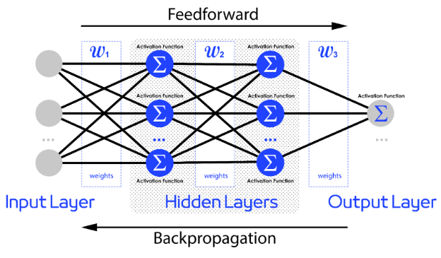

L’architettura di una DNN è molto complessa ed è isomorfa ad un grafo, detto **grafo di computazione**, che viene generato:

* Per il calcolo delle attivazioni **"in avanti"**.
* Per il calcolo di gradienti ed errori **"all'indietro"** nell'addestramento con **backpropagation**.

I framework di DL si appoggiano esplicitamente a un componente di **graph compiling** per mappare le operazioni su hardware.

### Funzioni di costo e unità di uscita

Nella **scelta della funzione di costo** abbiamo le stesse opzioni degli altri modelli di ML.

> La cross-entropia fornisce la stima **MLE** di una distribuzione di probabilità condizionale $p(\bold y | \bold x)$:
>
> $$
> J(\bold \theta) = - \mathbb E_{\bold x, \bold y \sim \hat p_{data} } \cdot \log \big( p_{model} (\bold y | \bold x) \big)
> $$
>
> $$
> p_{model} (\bold y | \bold x) = \mathcal N \big( \bold y, f(\bold x, \bold \theta), \bold I \big)
> $$
>
> dove $f(\bold x, \bold \theta)$ è lo **stimatore della media della Gaussiana**.
>
> $$
> J(\bold \theta) = \cfrac 1 2 \cdot \mathbb E_{\bold x, \bold y \sim \hat p_{data} } \| \bold y - f(\bold x, \bold \theta) \|^2 + const \ \ \longrightarrow MSE
> $$
>
> Come si può notare, se assumiamo che il modello abbia una distribuzione di probabilità gaussiana, lo stimatore $J(\bold \theta)$ corrisponde alla stima di cross-entropia.
>
> Possiamo essere interessati a stimare semplicemente **una statistica** $f^*(\bold x, \bold \theta)$ su $\bold y$, piuttosto che stimare una probabilità $f(\bold x, \bold \theta)$.
>
> Il problema di apprendimento diventa quello di stimare la funzione ottima $f^*$ ed il $MSE$ è la **stima della media** di $\bold y$:
>
> $$
> f^* = \underset f { arg \ min} \ \mathbb E_{\bold x, \bold y \sim p_{data}} \| \bold y - f(\bold x) \|^2
> $$
>
> $$
> f^*(\bold x) = \mathbb E_{\bold y \sim p_{data} (\bold y | \bold x)} \ \big[\bold y \big]
> $$
>
> In questo caso il $MSE$ può essere una ottima **funzione di loss**.
>
> In alternativa possiamo utilizzare il $MAE$, che è la **stima della mediana** di $\bold y$:
>
> $$
>
>
> $$

La **scelta delle funzioni di attivazione** delle unità di uscita e di quelle nascoste dipende da alcuni fattori:

* Consentire la stima di funzioni non lineari complesse.
* Soddisfare le forma funzionale di uno stimatore **MLE** o **MAP** riguardo alla distribuzione di probabilità dei valori delle uscite.
* Avere un gradiente ampio e ben stimabile per supportare gli algoritmi di apprendimento che si basano sulla discesa lungo il gradiente per minimizzare l’errore commesso sulle uscite (loss).

#### Attivazione delle unità di uscita

#### Attivazione delle unità nascoste

### Unità nascoste (?)

## Addestramento

### Stochastic Gradient Descent

### Backpropagation

## Regolarizzazione e Ottimizzazione

## Reti Convoluzionali

## Autoencoder

## Generative Adversarial Networks

## Reti Ricorrenti

## Transformers

## Domande frequenti

1. Depth Wise Separable Convolution: che operatore è nelle reti convoluzionali profonde? Che cos'è una rete convoluzionale?
2. Deeplearning.
3. Reti neurali convoluzionali: come funzionano, a cosa serve la ReLU.
4. Back propagation nelle reti neurali, come funziona e come viene affrontato a livello computazionale.
5. Auto-encoder ed auto-encoder variazionali. Definizione e differenze.
6. Architettura di un transformer.
7. Architettura delle reti ricorrenti. Architettura delle LSTM.
