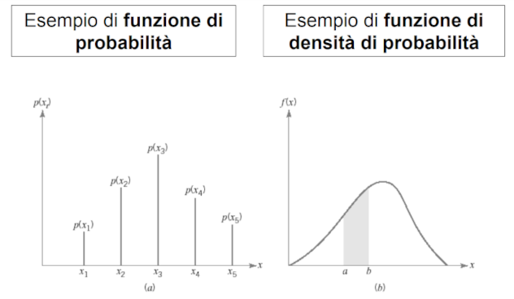

<link rel="stylesheet" type="text/css" href="stili.css">

# 4 - Distanze e Similarità

## Distanza e similarità

Servono per valutare (QUANTIFICARE) la somiglianza tra oggetti o istanzeall’interno di un dataset. Questo è un compito cruciale in molteapplicazioni di data mining, come il CLUSTERING, la CLASSIFICAZIONE ela RICERCA DI PATTERN.

* **SIMILARITÀ**: dati due oggetti $O_i$ e $O_j$ la similarità $Sim(O_i, \ O_j)$ è una funzione che ritorna unvalore tanto più GRANDE quanto $O_i$ e $O_j$ sono simili.
* **DISTANZA**: dati due oggetti $O_i$ e $O_j$ la distanza $Dist(O_i, \ O_j)$ è una funzione che ritorna un valore tanto più PICCOLO quanto  e  sono simili.

Siparla di distanza o di similarità a seconda del dominio in analisi, ma va ricordato che I PRINCIPI DI PROGETTAZIONE SONO IDENTICI, A PRESCINDERE DAL DOMINIO.

Tali funzioni sono, in genere, espresse:

1. in FORMA CHIUSA: la funzione viene espressa secondo una FORMULA MATEMATICA (ad esempio la distanza euclidea)
2. in FORMULAZIONE ALGORITMICA: la funzione viene espressa mediante un ALGORITMO.

In base al tipo di dato, abbiamo distanze e/o similarità differenti.

## Misure di similarità per dati quantitativi

La funzione di distanza più comune è la **norma $L_p$**:

$$
Dist(\bar X,\ \bar Y) = \big( \ \sum_{i=1}^d |x_i - y_i|^p \ \big)^{\frac{1}{p}}
$$

dove $\bar X = x_1, x_2, ..., x_d$ e $\bar Y = y_1, y_2, ..., y_d$ sono dati multidimensionali (ovvero **vettori**).

In particolare:

* $p=1 \Rightarrow DISTANZA \ DI \ MANHATTAN$, ovvero la somma delle differenze (in valore assoluto) tra le corrispondenti coordinate di $\bar X$ e $\bar Y$. È quindi la distanza percorsa tra due punti, se si dovesse camminare
  su una griglia ortogonale seguendo solo percorsi orizzontali e verticali.
* $p=2 \Rightarrow DISTANZA \ EUCLIDEA$, ovvero la distanza lineare (in linea retta) tra due vettori (dati
  multidimensionali). Essa è **invariante alla rotazione dello spazio dei dati**, dato che la distanza lineare tra due punti (dati) non cambia con l’orientamento del sistema di assi. Allora trasformazioni come  **PCA** ,**SVD** o **DWT** per serie temporali, possono essere usate sui dati senza incidere sulla distanza, dato che le distanze vengono modificate dopo che le dimensioni vengono eliminate.
* $p=\infty \Rightarrow NORMA \ DEL \ MASSIMO \ O \ NORMA \ DI \ CHEBYSHEV$, ovvero la misura di distanza tra due vettori (dati multidimensionali) definita come la **MASSIMA DIFFERENZA** tra le corrispondenti componenti dei due vettori.

Considerato che la **norma $L_p$** prende in considerazione tutti gli attributi in **MANIERA UNIFORME**, essa potrebbe non operare molto bene in alcuni casi, risentendo dell'influenza di diversi fattori:

* Importanza delle feature (specifica del dominio)
* Alta dimensionalità
* Feature localmente irrilevanti

### Impatto dell'importanza delle feature

Un analista può sapere quali feature sono più significative di altre per una data applicazione e può, di conseguenza, scegliere di **pesare** tali feature in modo diverso.

In tal caso viene usata la **distanza $L_p$ generalizzata**, nota anche come **distanza di Minkowski**:

$$
Dist(\bar X, \ \bar Y) = \big( \sum_{i=1}^d a_i \cdot |x_i - y_i|^p \big)^{\frac 1 p}
$$

dove $a_i$ è il peso della feature i-esima.

### Impatto dell'alta dimensionalità

Molte applicazioni di data mining basate sulla distanza, al crescere della dimensionalità dei dati, sono soggette ad un fenomeno noto come **curse of dimensionality**: le norme, al crescere della dimensionalità dei dati, perdono di capacità discriminativa.

Per meglio comprendere il fenomeno, si consideri un ipercubo unitario d-dimensionale, interamente situato nel quadrante non negativo dello spazio e con uno spigolo coincidente col vettore di origine $\bar O$.

Se volessimo calcolare la distanza di Manhattan tra $ \bar O$ e un punto (vettore) n-dimensionale $ \bar {X} = \big( Y_1, Y_2, ..., Y_n \big)$ appartenente all'ipercubo, otterremmo:

$$
Dist(\bar X, \ \bar O) = \sum_{i=1}^{d} \big( Y_i - 0 \big) = \sum_{i=1}^d Y_i
$$

Il risultato è una variabile aleatoria con media $\mu = \frac d 2$ e deviazione standard $ \sigma = \sqrt{\frac d {12}}$.

Si dimostra che, per la legge dei grandi numeri, al crescere della dimensionalità *d* dei dati, la distanza tra due punti qualunque dell'ipercubo cadrà nell'intervallo $\big[ D_{min}, \ D_{max} \big] = \big [ \mu - 3\sigma, \ \mu + 3\sigma \big]$ e ciascun punto disterà dall'origine $\bar O$ esattamente $D_{max} - D_{min} = 6\sigma = \sqrt{3d}$.

Il **contrasto** della distanza di Manhattan, ovvero il rapporto tra la differenza tra il valor massimo di distanza e il minimo rispetto al valor medio $\mu$ delle grandezze in gioco è dunque:

$$
Contrast(d)=\frac{D_{max} - D_{min}}{\mu} = \frac {\sqrt{3d}} {\frac d 2} = \sqrt{\frac {12} d}
$$

All’aumentare di **p**, il contrasto decresce ancora più velocemente con **d**.

È qui che si verifica il fenomeno della **curse of dimensionality**: all’aumentare della dimensionalità, un uso diretto della norma $L_p$ potrebbe non essere efficace.

È quindi utile esaminare l'impatto delle **feature rilevanti** sui dati considerato che, al crescere delle dimensioni, oltre all'aumento del rumore dei dati si verifica l'aumento del numero di **feature irrilevanti**.

Questi due fattori, combinati con l'uso di norme basate su somme di quadrati (come norme $L_1$ ed $L_2$) causano degli errori nel calcolo delle distanze. È quindi importante, al fine di non avere distanze falsate e di evitare la **course of dimensionality**:

1. eliminare le feature irrilevanti (**Proximity Thresholding**)
2. ridurre il rumore sui dati

### Eliminazione delle feature irrilevanti

Dato che, come abbiamo visto, è desiderabile **selezionare feature rilevanti** a livello locale per il calcolo della distanza, come facciamo a mettere in pratica questo approccio per le applicazioni di data mining?

Un approccio generale, che sembra funzionare bene con dati ad alta dimensionalità è il  **PROXIMITY THRESHOLDING** . Esso si basa sul fatto che l’impatto della variazione dei dati dovuta al rumore lungo i singoli attributi deve essere de-enfatizzato mentre la corrispondenza cumulativa su molte dimensioni deve essere conteggiata.

Viene usata una **PROXIMITY THRESHOLD** (soglia di prossimità) che dipende dalla dimensionalità. Prima di applicare questa sogliatura, è necessario preparare opportunamente (discretizzare) i dati:

Si suddividono le dimensioni dei dati in $k_d$ intervalli equiprofondi, in modo da rendere costante la probabilità che due dati condividano lo stesso intervallo in una data dimensione.

Siano $ \bar X = (x_1, x_2, ..., x_d)$ e $\bar Y = (y_1, y_2, ..., y_d)$ due record d-dimensionali.

Se $x_i, y_i \in k_i \ \ \Rightarrow \ \ Dist(x_i, y_i) < PROXIMITY \ \ THRESHOLD \ \ \Rightarrow \ \ \bar X, \bar Y$ **sono in prossimità della dimensione *i-esima***.

Pertanto, dato l'**insieme delle prossimità** $S \big( \bar X, \bar Y, k_d \big)$, ovvero il sottoinsieme delle dimensioni in cui $\bar X$ e $\bar Y$ sono in prossimità, la dimensione $i \in S \big( \bar X, \bar Y, k_d \big)$.

Ciascun intervallo $k_i$, come tale, è caratterizzato dalla presenza di:

* un estremo superiore $sup(k_i) = m_i$
* un estremo inferiore $inf(k_i) = n_i$

Si parla quindi di **similarità PSelect** tra i record $ \bar X$ e $\bar Y$:

$$
PSelect(\bar X, \bar Y, k_d) = \Bigg[ \sum_{i \ \in \ S(\bar X, \ \bar Y, \ k_d)} {\bigg ( 1 - \frac {|x_i - y_i|} {m_i - n_i} \bigg)^p} \Bigg] ^ {\frac 1 p}
$$

Poiché ogni singola espressione della sommatoria è compresa tra 0 e 1, il valore della PSelect sarà a sua volta compreso nell'intervallo $\Bigg[ 0, \Big| S \big ( \bar X, \bar Y, k_d \big) \Big| \Bigg]$: più questo valore è grande, più $ \bar X$ e $\bar Y$ sono simili.

La scelta di $k_d$ anzichè $d$ fa sì che questo approccio si adatti in maniera automatica al crescere della dimensionalità:

* Per **valori piccoli** di $d$ si avrà un comportamento simile alla norma $L_p$
* Per **valori grandi** di *d* si avrà un comportamento simile alle funzioni di similarità dei **domini testuali**, dove si usa la similarità sulla corrispondenza degli attributi.

### Impatto della distribuzione dei dati

La norma $L_p$ dipende solo dai due dati $\bar X$ e $\bar Y$ ed è invariante alle statistiche globali dei dati rimanenti. Le distanze, dovrebbero anche dipendere **dalla distribuzione dei dati rimanenti** nel dataset.

A tal fine, entra in gioco la **distanza di Mahalanobis**, che tiene esplicitamente conto della covarianza tra i dati che possono avere una particolare distribuzione nello spazio.

$$
Maha \big(\bar X, \bar Y \big) = \sqrt{\big(\bar X - \bar Y \big) \cdot \Sigma^{-1} \cdot \big(\bar X - \bar Y \big)^T}
$$

dove $\Sigma$ è la matrice di covarianza $d \times d$ del dataset ed è una matrice **simmetrica** che **rappresenta la variazione di ogni variabile rispetto alle altre (inclusa sè stessa)**. Ogni elemento è definito come

$$
\sigma_{ij}^2 = \frac 1 n \sum_{h=1}^d(x_{hi} - \mu_i) \cdot (x_{hj}-\mu_j)
$$

$\rightarrow$ La distanza di Mahalanobis è una distanza euclidea che normalizza i dati sulla base delle correlazioni tra attributi.

$\rightarrow$ Diviene banalmente la **distanza euclidea** dopo aver ruotato i dati lungo le loro componenti principali (Σ diviene diagonale).

## Misure di similarità per dati binari, categorici e testuali

### Dati categorici

Le funzioni di distanza nei dati numerici, che sono ordinati, sono calcolate come differenze di valori lungo le dimensioni. Nei dati categorici, invece, non esiste alcun ordinamento tra i valori discreti: come si fa a calcolare le distanze?

Si convertono i dati categorici in numerici attraverso il processo di **BINARIZZAZIONE**.

In questo modo, si otterrebbe un vettore binario sparso che è poco adatto all’uso di distanze. Pertanto, anziché parlare di funzioni di distanza, **nei dati categorici si parla di funzioni di similarità** in quanto, per valori discreti, ha più senso trovare una corrispondenza (una similarità) tra i singoli attributi, ognuno dei quali varia all’interno di una proprio insieme di valori discreti.

Dati due record $\bar X = \big( x_1, x_2, ..., x_d \big)$ e $\bar Y = \big( y_1, y_2, ..., y_d \big)$, la **similarità complessiva** tra $\bar X$ e $\bar Y$ è indicata come:

$$
Sim(\bar X, \ \bar Y) = \sum_{i=i}^d S(x_i, \ y_i)
$$

La scelta di $S(x_i, y_i)$ determina i vari tipi di similarità.

#### Inverse occurrence frequency

Secondo questa misura, **due attributi** corrispondenti di due record **sono simili** sulla base di una funzione inversa della frequenza del valore corrispondente.

$$
S(x_i, y_i) =
\begin{cases}
\frac{1}{p_k(x_i)^2}& \text{$x_i=y_i$}\\
0& \text{altrimenti}.
\end{cases}
$$

dove $p_k(x)$ è la frazione di record per cui il k-esimo attributo vale *x*: va vista come una **frequenza di occorrenze**, ovvero un conteggio del numero delle volte che il k-esimo attributo vale *x* nel dataset.

#### Goodall similarity

$$
S(x_i, y_i) =
\begin{cases}
1 - {p_k(x_i)^2}& \text{$x_i=y_i$}\\
0& \text{altrimenti}.
\end{cases}
$$

### Dati testuali

Come abbiamo visto, un dato testuale può essere considerato un dato quantitativo multidimensionale quando viene trattato come bag-of-words:

* la **frequenza di parole** può essere trattata come un attributo quantitativo
* il **lessico** di base (insieme delle parole) può essere trattato come l’insieme degli attributi

Così facendo, si otterrebbe una matrice sparsa e, come abbiamo visto precedentemente, misure come le norme $L_p$ non gestirebbero bene documenti di lunghezza differente appartenenti ad un corpus documentale e avrebbero la tendenza a riportare valori sempre più alti. Ad esempio, la norma $L_2$ tra due documenti lunghi sarà sempre maggiore rispetto a quella tra due documenti brevi, anche se i primi avrebbero molte parole in comune e i secondi sarebbero completamente disgiunti.

Il problema è quindi relativo alla **lunghezza**: basterebbe trovare qualcosa che sia invariante rispetto ad essa per risolvere questa irregolarità.

Un modo per farlo è usare la **distanza coseno**, dato che il coseno dell’angolo tra due vettori è invariante rispetto alla loro lunghezza:

$$
\cos(\bar X, \bar Y) = \frac {\sum_{i=1}^d x_i \cdot y_i} {\sqrt{\sum_{i=1}^d x_i^2} \cdot \sqrt{\sum_{i=1}^d y_i^2}}
$$

La distanza coseno calcola quindi l'**angolo tra due documenti** $\bar X = (x_1, x_2, ..., x_d)$ e $\bar Y = (y_1, y_2, ..., y_d)$ **su un lessico di dimensione *d***.

### Dati binari

## Similarità per serie temporali e sequenze discrete

## Similarità tra grafi

## Domande Frequenti

# 5 - Stimatori, Stima e Campionamento

## Definizione di stimatore

## Stimatori polarizzati e non polarizzati

## Campionamento e stimatori

## Stima MLE e MAP

## Domande Frequenti

# 6 - Mining di Pattern Frequenti

## Generalità e definizioni

## Proprietà di Itemset e Regole

## Algoritmo Apriori e sue varianti

## Mining di pattern interessant

## Gestione di grandi database

## Domande Frequenti

# 7 - Data Warehousing e Data Lake

## Introduzione

### Basi di dati integrate, sì, ma ...

### OLTP e OLAP

## Data warehouse e data warehousing

## Dati multidimensionali

## Data Lake

## Domande Frequenti

# 8 - Introduzione a HDFS

HDFS (Hadoop Distributed File System) è un **sistema di file distribuito**, parte integrante di Apache Hadoop, progettato per archiviare e gestire grandi quantità di dati in modo efficiente e affidabile su cluster di computer commodity (computer economici e di basso costo).

## Caratteristiche di HDFS

HDFS è **progettato per gestire file di grandi dimensioni**, tipicamente di dimensioni comprese tra i gigabyte e i petabyte, suddividendoli in **blocchi di dimensioni fisse**, tipicamente di 128 MB o 256 MB. I blocchi vengono **distribuiti su diversi nodi** del cluster e **replicati** per garantire l'affidabilità dei dati e la tolleranza ai guasti. HDFS è in grado di gestire la replicazione dei blocchi, la gestione del failover, l'accesso parallelo ai dati e la scalabilità orizzontale del cluster.

## Architettura

Le componenti principali di HDFS sono:
* **NameNode**: il NameNode è il componente centrale di HDFS e gestisce il namespace del file system, ovvero i nomi dei file e delle directory, nonché le informazioni di posizione e di replicazione dei blocchi di dati. Il NameNode funziona come un singolo punto di fallimento, quindi è importante avere un meccanismo di backup o di ripristino in caso di problemi.
Il NameNode è caratterizzato da metadati scritti in due file, uno statico e uno dinamico, aventi la stessa struttura: il primo è FsImage, che contiene la lista dei nomi del file system, il secondo è EditLogs, che registra tutte le operazioni fatte nello spazio dei nomi.
* **DataNode**: il DataNode è il componente di storage di HDFS e gestisce i blocchi di dati, ovvero il contenuto dei file. Il DataNode si occupa dell'accesso ai dati, della lettura e scrittura dei blocchi e della replicazione dei blocchi su altri nodi del cluster. I datanode sono fisicamente organizzati in rack, ossia vengono considerati come facenti parte di un unico insieme.
* **Secondary NameNode**: il Secondary NameNode è un nodo di supporto che aiuta il NameNode a gestire le informazioni sul file system. Il Secondary NameNode crea regolarmente snapshot del namespace del file system e delle informazioni di posizione dei blocchi di dati, che vengono utilizzati in caso di ripristino del sistema.

Vi sono anche altri nodi che permettono di mantenere la sincronizzazione dell'architettura, come il **CheckpointNode** e il **BackupNode**, le cui funzionalità sono intuitive.

Una proprietà importante per HDFS è la **rack awareness**, per cui si progetta un algoritmo che permetta al NameNode di **scegliere il DataNode ad esso più vicino**, in modo da limitare l'uso di banda di rete e ridurre i costi delle operazioni read/write.

Un'altra caratteristica saliente di HDFS è la cosiddetta **high availability**, ossia quella caratteristica per cui, quando un client richiede una risorsa e non ottiene una risposta per il percorso associato alla risorsa, **il NameNode riesce a restituire la nuova locazione** per leggere dei blocchi dagli altri DataNode e ottenere l'informazione richiesta.

## Operazioni di read/write

(*Le immagini nelle slide sono esplicative*)

## Caratteristiche avanzate

* **High availability del NameNode** - Uso di almeno due NameNode ridondanti sempre in
funzione, uno **attivo** e uno **passivo**. Il NameNode passivo entra in gioco nel momento in cui quello attivo va in fault, venendo messo prima in stand-by e poi divenendo il nuovo nodo passivo.
Per implementare tale strategia, viene fatto uso del **QuorumJournalNode**, ossia un **pool di nodi** di journaling, in cui ogni nodo **genera e condivide i propri EditLog**, che poi il nodo candidato a diventare attivo deve leggere e garantire di aver aggiornato il proprio namespace in modo corretto. Si dimostra che, per $N$ nodi di journaling, sono gestibili $\frac{N-1}2$ fallimenti.
* **Federazione di HDFS** - Per come è pensata, HDFS è letteralmente il collo di bottiglia delle
applicazioni distribuite, pertanto soffre di problemi come:
   * **forte accoppiamento tra storage dei blocchi e spazio dei nomi;**
   * **poca scalabilità dello spazio dei nomi;**
   * **performance limitate dal throughput del NameNode;**
   * **assenza di isolamento tra le applicazioni e tra chi gestisce il cluster e la gestione dello spazio dei nomi**.

   Pertanto, si può pensare di **federare più HDFS**, facendo in modo che ogni NameNode abbia un pool di blocchi, che vi sia gestione separata dei DataNode, che vi sia isolamento tra le applicazioni, scalabilità dello spazio dei nomi e, in generale, un aumento delle performance.
* **Disk Balancing** - Ossia il **bilanciamento del carico** a livello dei singoli DataNode. Quando uno dei DataNode risulta in sovraccarico, **HDFS sposta internamente dei blocchi** per cercare di mantenere omogenea l'occupazione di spazio su tutti i dischi del DataNode.
* **Erasure Coding** - Ossia un metodo di **protezione dei dati** per cui questi ultimi vengono suddivisi in frammenti, espansi e codificati con parti di dati ridondanti, per poi venire archiviati in posizioni diverse. In questo modo, se un'unità è guasta o i dati vengono danneggiati, essi possono essere ricostruiti a partire da tali frammenti, superando, di fatto, alcune limitazioni legate alla struttura a tre repliche di un blocco. 

## Domande Frequenti

* HDFS

# 9 - Database NoSQL

## RDBMS per la gestione di grandi moli di dati

### Legge di Amdhal

### Protocollo 2PC

## CAP Theorem

## Proprietà BASE

## Caratteristiche NoSQL

## Tipologie principali dei database NoSQL

## Vantaggi e svantaggi dei database NoSQL

# 10 - MongoDB

## Modello dei dati

## Interazione base con MongoDB

## Caratteristiche generali

### Indicizzazione

### Aggregazione e Map-Reduce

## Caratteristiche architetturali

### Gestione della replicazione e sharding

### GridFS

## Modellazione del database

## Domande Frequenti

# 11 - Cassandra

## Caratteristiche Principali

## Cassandra vs MongoDB

## Architettura

## Modello dei dati

## Domande Frequenti

# 12 - Hadoop

## Caratteristiche generali

Hadoop è un framework open source per il processing distribuito di grandi volumi di dati su cluster di computer.
Il suo obiettivo principale è quello di fornire un modo efficiente per elaborare, archiviare e analizzare grandi quantità di dati, suddividendoli in blocchi e distribuendoli su un cluster di macchine.
Il cuore di Hadoop è composto dalle seguenti componenti:
* il file system distribuito HDFS (Hadoop Distributed File System)
* il framework per il calcolo parallelo MapReduce
* il framework di gestione delle risorse YARN (Yet Another Resource Negotiator)
* un framework di elaborazione dati distribuito come Spark

Hadoop è stato progettato per funzionare su cluster di computer commodity, cioè su hardware standard e a basso costo. Grazie a questo approccio, è possibile costruire cluster di elaborazione ad alte prestazioni senza dover investire in costose macchine proprietarie.

## Architettura generale

### HDFS

(*Vedi cap. 8*)

### YARN

Il funzionamento di YARN si basa su un'architettura client-server composta da tre componenti principali:
* **ResourceManager**
* **NodeManager**
* **ApplicationMaster**

Il **ResourceManager** è il componente centrale di YARN. Esso **è responsabile dell'allocazione delle risorse** del cluster alle applicazioni in esecuzione. Il ResourceManager tiene traccia delle risorse disponibili nel cluster e le assegna alle applicazioni in base alle loro richieste. Il ResourceManager è in grado di gestire più code di lavoro e di impostare limiti di utilizzo delle risorse per ciascuna di esse.

Il **NodeManager** è il componente che viene eseguito su ciascun nodo del cluster. Esso è responsabile della **gestione delle risorse locali del nodo**, tra cui la CPU, la memoria e lo spazio su disco. Il NodeManager comunica con il ResourceManager per informarlo sulle risorse disponibili nel nodo e per ottenere l'autorizzazione per l'esecuzione delle applicazioni.

L'**ApplicationMaster** è un **componente specifico dell'applicazione** che viene eseguito su un nodo del cluster. Esso è responsabile della **gestione delle risorse richieste dall'applicazione** e della **coordinazione** con il ResourceManager per ottenere le risorse necessarie.
L'ApplicationMaster comunica con il NodeManager per monitorare l'utilizzo delle risorse del nodo e per assicurarsi che l'applicazione abbia abbastanza risorse a disposizione.

Il processo di esecuzione di un'applicazione su YARN prevede i seguenti passi:
1. L'utente sottomette la richiesta di esecuzione dell'applicazione al ResourceManager.
2. Il ResourceManager cerca i nodi del cluster con risorse sufficienti per soddisfare la richiesta dell'applicazione.
3. Il ResourceManager assegna al NodeManager di ciascun nodo del cluster le risorse richieste dall'applicazione.
4. L'ApplicationMaster viene eseguito su un nodo del cluster e richiede le risorse necessarie all'esecuzione dell'applicazione al ResourceManager.
5. L'ApplicationMaster comunica con il NodeManager per monitorare l'utilizzo delle risorse del nodo e per assicurarsi che l'applicazione abbia abbastanza risorse a disposizione.
6. L'applicazione viene eseguita sui nodi del cluster assegnati dal ResourceManager e gestiti dai NodeManager.

Un altro componente fondamentale di YARN è il **JobSubmitter**, che consente agli utenti di far eseguire jobs al sistema YARN. Esso viene **eseguito sul client**, ovvero sulla macchina dell'utente che vuole eseguire un lavoro sul cluster Hadoop.

Il JobSubmitter di YARN fornisce un'interfaccia per la sottomissione dei lavori al sistema, che può essere effettuata tramite la **riga di comando** o tramite un'**API**. Quando un lavoro viene sottomesso, il JobSubmitter si occupa di **incapsularlo in un container**, che rappresenta l'unità di esecuzione di un lavoro su YARN. Il container viene quindi **assegnato a un NodeManager sul cluster**, che si occuperà dell'esecuzione del lavoro.

Il JobSubmitter di YARN **gestisce** anche **la fase di configurazione del lavoro**, ovvero la definizione delle risorse richieste dal lavoro, dei parametri di configurazione e delle dipendenze.

Inoltre, esso **fornisce meccanismi per il monitoraggio e il controllo dell'esecuzione dei lavori sottomessi**, ad esempio per l'invio di comandi di stop o di segnalazioni di stato.

### MapReduce

Consente di elaborare grandi quantità di dati in parallelo su un cluster di computer, suddividendo il lavoro in **due fasi**: la fase di **map** e la fase di **reduce**.

Nella fase di **map**, i dati vengono elaborati in **modo parallelo** da un insieme di **mapper**. Ogni mapper legge un blocco di dati di input e **applica una funzione di mapping** ad ogni elemento del blocco. La funzione di mapping prende in input un elemento e **produce un insieme di coppie chiave-valore** (key-value pair), dove la chiave rappresenta una categoria di raggruppamento e il valore rappresenta l'informazione associata a quella categoria.

Successivamente alla fase di mapping, in cui viene generate una lista di coppie chiave-valore, abbiamo un'operazione detta di shuffle e sort, con cui i dati vengono mescolati e riordinati da due componenti dell'architettura MapReduce: **Combiner** (responsabile dello shuffle) e **Partitioner** (responsabile del partizionamento della lista). L'uso di questo meccanismo permette di alleggerire il traffico di rete (viaggiano dati meno pesanti) e di migliorare il throughput.

Per quanto riguarda l'operazione di sorting, esso avviene per chiave e, comunque, prima di finire al reducer (che quindi non deve fare queste operazioni).

Nella fase di **reduce**, i dati vengono elaborati in **modo parallelo** da un insieme di **reducer**. Ogni reducer riceve tutte le coppie chiave-valore prodotte dai mapper che hanno la stessa chiave, e **applica una funzione di riduzione** a ciascun gruppo di coppie. La funzione di riduzione prende in input la chiave e un insieme di valori associati alla chiave, e **produce un insieme di coppie chiave-valore** di output.

Il framework MapReduce di Hadoop gestisce la distribuzione dei dati tra i mapper e i reducer, la gestione degli errori, la tolleranza ai guasti e la sincronizzazione dell'esecuzione delle fasi di map e reduce.

MapReduce è molto potente perché consente di elaborare grandi quantità di dati in modo scalabile, utilizzando un approccio dichiarativo che separa la logica dell'elaborazione dei dati dall'implementazione specifica del codice. Inoltre, MapReduce può essere utilizzato in combinazione con altri framework di Hadoop, come HDFS per la gestione del file system distribuito e YARN per la gestione delle risorse, per costruire soluzioni di elaborazione di dati distribuite e scalabili.

## Ecosistema Hadoop

### Hive

Hive è un framework di elaborazione di dati distribuito in Hadoop che permette di interrogare i dati memorizzati in Hadoop utilizzando una **sintassi simile al linguaggio SQL**. Hive **converte le query SQL in una serie di attività di MapReduce** che vengono eseguite sul cluster Hadoop. In
questo modo, gli utenti possono interrogare i dati in modo semplice e naturale, come se stessero lavorando con un database relazionale tradizionale, senza dover scrivere codice MapReduce.

L'accesso a Hive è consentito a client eterogenei, grazie a connettori specifici per la connessione.
Ogni drive di Hive non si appoggia direttamente su MapReduce, ma usa uno **store di metadati** per schemi e tabelle.

Hive utilizza una serie di componenti per l'elaborazione dei dati, tra cui:
1. **HiveQL**: HiveQL è un dialetto SQL-like che permette di scrivere query per l'elaborazione dei dati. HiveQL supporta una vasta gamma di funzioni SQL standard, come SELECT, WHERE, GROUP BY, JOIN e altre. Hive converte automaticamente le query HiveQL in attività MapReduce da eseguire sul cluster.
2. **Hive Metastore**: Hive Metastore è un database che memorizza i metadati dei dati archiviati in Hadoop, come lo schema dei dati e le informazioni sulle partizioni. Hive utilizza i metadati del metastore per generare le attività MapReduce necessarie per eseguire le query.
3. **Driver Hive**: Il Driver Hive è il componente principale del framework Hive. Esso riceve le query dall'utente e le traduce in attività MapReduce che possono essere eseguite sui nodi del cluster Hadoop.
4. **Hive Server**: Il server Hive fornisce un'interfaccia per l'accesso ai dati Hive tramite protocollo JDBC/ODBC. Questo consente alle applicazioni di accedere ai dati Hive in modo simile a come accedono a un database relazionale tradizionale.
5. **Hadoop Distributed File System (HDFS)**: HDFS è un sistema di file distribuito che viene utilizzato da Hive per memorizzare i dati elaborati.

Ma come avviene il processo di esecuzione in Hive?

Inizialmente **viene invocato il driver**, che legge le istruzione SQL e avvia una fase di **compilazione** il cui risultato è un DAG detto **piano**. A partire dal piano, **il driver cerca** nel Metastore **le informazioni sugli schemi logici** nel sistema **ed innesca l'esecuzione** vera e propria.

Una caratteristica importante di Hive è il **sistema di cache**, grazie al quale vengono evitate interazioni continue con HDFS.

Per quanto concerne i tipi di dato, abbiamo i **tipi semplici** (tipici di SQL) e i **tipi complessi**, come **Array**, **Map**, **Struct** e **UnionType**.

Le operazioni sulle tabelle sono le stesse di SQL, mentre un discorso a parte va effettuato per i dati creati in una tabella. I dati possono essere divisi in partizioni, suddivise a loro volta in **bucket**, ossia gruppi di righe raggruppati per chiave e utilizzati per rendere l'indicizzazione più efficiente.

Un'altra caratteristica interessante di Hive è che permette di **caricare i dati sia dal file system locale**, attraverso la parola chiave LOCAL, **oppure da HDFS**, attraverso la parola INPATH seguita da un percorso specifico. La parola chiave PARTITION, invece, consente di specificare la struttura di partizioni della tabella (se ammesse).

### Pig

È uno strumento che fa uso di **programmazione procedurale** attraverso degli **script** (detti *pig latin*) ma, a parte questa differenza, opera esattamente come Hive, dato che l'esecuzione di uno script genera un piano per l'execution engine, il quale genera i processi MapReduce.

Pig, inoltre, permette una maggiore versatilità di linguaggio, consentendo le **funzioni definite dall'utente**.

**I tipi di dato sono sia semplici**, come int, long, float, double e chararray, **che complessi**, come **tupla** (ossia la riga di un database), **mappa** (coppie chiave-valore), **bag** (insieme non ordinato di tuple).

Abbiamo, infine, **operatori di base**, come quelli aritmetici, booleani e di casting, **funzioni di load/store**, per il caricamento e la scrittura di dati in un file system locale/su HDFS, **funzioni di descrizione dei dati**, come **dump** (per descrivere il contenuto di un alias), **explain** (per mostrare la struttura del piano e la sua decomposizione in azioni semplici), **describe** (per mostrare lo schema dell'aggregato) e **illustrate** (che funziona come describe, ma inserisce esplicitamente alcuni campioni per la visualizzazione), e **operatori relazionali**, come order by, rank, ecc.

## Domande Frequenti

1. Architettura a cluster Hadoop (in generale). Input e output degli step map e reduce.
2. È possibile eseguire su Hadoop processi non map/reduce?

# 13 - Spark

## Ecosistema Spark

## Architettura di Spark

## Introduzione a PySpark

È un'interfaccia Python per Spark, disponibile tramite **pacchetto** in ambiente Python. **Fornisce l'accesso ad una SparkSession**.

È possibile utilizzarlo sia tramite CLI che tramite IDE, anche se in questo caso bisogna impostare una variabile d'ambiente e bisogna aver preinstallato Hadoop.

Dopo aver eseguito l'accesso alla SparkSession, è possibile accedere alle varie proprietà di una sessione, come il contesto, e alle varie API che abbiamo trattato.

## Domande Frequenti

# 14 - Introduzione al Machine Learning

## Generalità

Il **machine learning** si riferisce allo sviluppo di programmi per computer capaci di **apprendere dai dati**.

Più in generale, una macchina avrà a disposizione un'esperienza E rispetto a una classe di task T da svolgere e dovrà misurare unacerta performance P, secondo la logica che P deve migliorare sui compiti T usando l'esperienza E.

Volendo fornire una rappresentazione più matematica del significato di machine learning, definiamo:

* $x$ un insieme di campioni a disposizione del calcolatore
* $f$ un modello di apprendimento, ossia una caratterizzazione della famiglia di forme funzionali usate o dell'algoritmo usato
* $w$ i parametri del modello, ovvero delle quantità direttamente coinvolte nella forma funzionale di $f$ che devono essere apprese
* $\theta$ gli iperparametri del modello, cioè quantità che influenzano l'evoluzione dell'algoritmo, ma che devono essere fissate in fase di	apprendimento (dovendo essere, il più delle volte, stimati)

L'apprendimento viene misurato dalla relazione $y=f(x, w, \theta)$.

## Tipologie dei compiti di apprendimento

In base al tipo di apprendimento, gli algoritmi di machine learning devono impiegare $f$ distinte, specifiche per il compito in questione.

## Utilizzo dei dati

## Capacità e generalizzazione

## Tecniche di addestramento

# 15 - Clustering

## Generalità

Il **clustering** rappresenta una classe di algoritmi di **apprendimento non supervisionato** e consiste in un processo di **partizionamento** di un data-set in modo che ogni partizione (o cluster) contenga dati omogenei tra di loro rispetto ai dati appartenenti ad altre partizioni.

Un **cluster** è un insieme di oggetti che presentano tra loro delle similarità, ma che, per contro, presentano dissimilarità con oggetti in altri cluster.

* **INPUT**: campione di elementi
* **OUTPUT**: un certo numero di cluster in cui gli elementi del campione sono suddivisi in base ad una misura di similarità.

## Feature selection

Molte feature possono essere affette da **rumore** o essere **poco rilevanti** per la cluster analysis e, pertanto, devono essere rimosse nelle prime fasi del processo di clustering.

L'obiettivo della **feature selection** è quello di rimuovere gli attributi rumorosi che non si clusterizzano (raggruppano) bene. Avendo a che fare con metodi non supervisionati, questo procedimento è più difficile, in quanto i criteri di validazioni esterni (labels) non sono disponibili per la selezione delle feature.

È necessario impiegare dei modelli di feature selection che cercano di individuare la **tendenza al clustering** di certi sottoinsiemi di feature e di **massimizzarla** per i sottoinsiemi di feature estratti.

* **Modelli basati su filtro**: viene valutata la tendenza di una feature o di un gruppo di feature a contribuire al clustering utilizzando uno score numerico.
* **Modelli «wrapper»**: approcci iterativi di clustering per tentativi su sottoinsiemi di feature. Sono computazionalmente onerosi, ma possono fornire una base per la scelta del miglior algoritmo di clustering per il problema sotto esame.

### Modelli basati su filtro

Deve essere usato un criterio specifico per valutare la tendenza al clustering.

#### Term Strength

Particolarmente adatta per analisi di **domini sparsi** (dati testuali), la **term strength** viene calcolata come la frazione delle coppie di documenti simili in cui occorre un certo termine *t*, posto che *t* occorra nel primo dei due.

Determina **termini rilevanti** rispetto al data-set.

$$
Term \ Strength = P(t \in \bar Y| t \in \bar X)
$$

È una similarità che può essere estesa a **dati multidimensionali** rappresentati come vettori binari di attributi presenti/assenti.

Analogamente si possono usare misure di rilevanza rispetto a **dati quantitativi** confrontando la distanza tra singoli attributi di due campioni rispetto alla distanza complessiva dei due campioni.

#### Dipendenza predittiva da attributi

Parte dalla considerazione che gli attributi rilevanti per il clustering sono correlati.

Sfrutta algoritmi di regressione (attributi numerici) o classificazione (attributi non numerici) per classificare il data-set e quantificare la rilevanza di un attributo i:

1. Si usa un algoritmo di **classificazione** su tutte le feature tranne la i-esima, per prevedere il valore dell'attributo i, trattandolo come una variabile di classe artificiale.
2. La misura di accuratezza della classificazione rispetto all’attributo i sarà la misura di rilevanza utilizzata per la feature selection.

Spesso ricorre all'uso di un **classificatore nearest neighbor**.

#### Entropia

Parte dalla considerazione che i dati raggruppati in un cluster:

* hanno entropia più bassa rispetto a quelli distribuiti uniformemente nello spazio di variazione.
* riflettono alcune delle loro caratteristiche di clustering sulle **distribuzioni di distanza**.

L'obiettivo delle misure basate su entropia è quantificare la **forma** di questa distribuzione di distanza e scegliere il sottoinsieme di feature in cui la distribuzione mostra un comportamento simile alla figura **b**:

    

Il calcolo dell’entropia su un subset di feature k-dimensionale, prevede che si effettui una **discretizzazione** sulle k feature al fine di stimare la densità di probabilità in ogni intervallo e calcolare effettivamente l’entropia. Questo approccio presenta dei problemi al crescere della dimensionalità, poichè le regioni della griglia diventano sempre più sparse.

Pertanto, un'alternativa è calcolare le **distanze punto a punto** tra i campioni lungo ogni feature (monodimensionale) e calcolare l'entropia su questa distribuzione di distanza.

Se abbiamo *m* intervalli di discretizzazione dei valori di distanza, avremo che:

$$
E = \sum_{i=1}^{m} \big[p_i \cdot log(p_i) \ + \ (1-p_i) \cdot log(1-p_i) \big]
$$

Partendo dall'insieme completo di feature, verranno scelte quelle con entropia minore, secondo un approccio **greedy**.

#### Statistica di Hopkins

Si consideri un campione *R* costituito da r punti appartenenti ad un data-set *D*, scelti casualmente, ed un campione sintetico *S* costituito da r punti appartenenti allo spazio dei dati.

Siano $\alpha_i$ e $\beta_i$, con $i = 1, ..., r$ rispettivamente le distanze dei punti in *R* e in *S* dal più vicino campione in *D*.

$$
H=\frac {\sum_{i=1}^{r} \beta_i} {\sum_{i=1}^{r} (\alpha_i + \beta_i)} \in (0,1)
$$

In particolare:

* $H = 0.5$ per dati distribuiti uniformemente, dato che $\alpha_i$ e $\beta_i$ hanno un comportamento simile
* $H=1$ per dati clusterizzati, dato che $\alpha_i << \beta_i$.

Più H è prossimo a 1, maggiore sarà la tendenza al clustering dei dati. Questo criterio può essere usato insieme ad un approccio greedy per trovare il sottoinsieme rilevanti di feature, come nel caso dell'entropia.

### Modelli wrapper

Consistono nell'applicare una serie di algoritmi di clustering su diversi sottoinsiemi di feature e nel verificare di volta in volta la qualità del clustering ottenuto usando come metrica di valutazione una certa **misura interna di bontà del clustering**.

Questo approccio ha come **principale svantaggio** la sua forte dipendenza dalla **scelta della misura di bontà**, che potrebbe portare ad **errori di valutazione** del clustering. Inoltre, è computazionalmente oneroso, dato che necessita di un approccio greedy per la ricerca dei sottoinsiemi rilevanti nello spazio delle feature.

In alternativa, si segue un approccio più semplice, che prevede di:

1. Utilizzare un **algoritmo di clustering** sul sottoinsieme corrente di feature selezionate *F*, al fine di correggere le etichette *L* del cluster per i dati.
2. Utilizzare un **criterio supervisionato di classificazione** su tali etichette per valutare la bontà del clustering e selezionare le prime *k* feature che hanno una migliore accuratezza sulla base di questo criterio.

Per raggiungere una maggiore efficienza, di solito vengono creati dei **modelli ibridi**, frutto della combinazione tra i **modelli wrapper** e i **modelli** **basati su filtro**.

## Clustering basato su prototipi rappresentativi

**PROTOTIPI** = punti rappresentativi o centroidi utilizzati per definire i cluster. Sono dei punti nel dato spazio che rappresentano in qualche modo il "**centro**" del cluster.

Gli algoritmi basati su prototipi rappresentativi sono i più semplici tra gli algoritmi di clustering, perchè **si basano direttamente su nozioni intuitive di distanza/similarità** dei dati del cluster.

Infatti, i cluster vengono creati in un colpo solo e non esistono relazioni gerarchiche tra di loro. La creazione dei cluster avviene con l'uso di una serie di prototipi rappresentativi (rappresentanti di partizionamento). Questi possono essere a loro volta creati in funzione dei dati nel cluster (tipo la media) oppure possono essere selezionati dai dati esistenti nel cluster.

La caratteristica di questi metodi è che la scoperta di cluster di alta qualità equivale alla scoperta di un insieme di prototipi rappresentativi di alta qualità.

Una volta determinati i prototipi, è possibile usare una funzione di distanza per assegnare i dati ai prototipi vicini.

I *k* cluster sono generalmente determinati dall'utente.

Assumiamo di avere un dataset $\mathcal D$ contenente *n* dati $\bar {X_1}, \bar{X_2}, \dots , \bar {X_n}$. L'obiettivo è quello di determinare *k* prototipi rappresentativi $\bar {Y_1}, \bar{Y_2}, \dots , \bar {Y_k}$ che minimizzino la seguente funzione obiettivo:

$$
O = \sum_{i=1}^{n} \bigg[ min_j \ Dist(\bar{X_i}, \ \bar{Y_j}) \bigg]
$$

> La somma delle distanze dei diversi dati dai loro prototipi rappresentativi più vicini deve essere ridotta al minimo.

La scelta della funzione di distanza $Dist(\cdot, \cdot)$ dà luogo a differenti algoritmi:

* K-means
* Mahalanobis K-means
* Kernel's K-means (**kernel trick**)
* K-medians
* K-medoids

La struttura generica per algoritmi basati su prototipi rappresentativi con una funzione di distanza generica è:

    

### K-means

> **Centroide**: la media di tutti i punti del cluster.

K-means è un algoritmo di clustering basato su prototipi ampiamente utilizzato per raggruppare un insieme di dati non etichettati in *k* cluster, dove *k* è un numero predefinito specificato dall'utente.

L'algoritmo K-means si basa sulla somma dei quadrati delle distanze euclidee dei dati dai loro prototipi rappresentativi (centroidi, ovvero i punti medi dei dati assegnati a ciascun cluster) più vicini per quantificare la funzione obiettivo del clustering.

$$
Dist(\bar {X_i}, \ \bar {Y_j}) = \| \bar {X_i} - \bar {Y_j} \|_2^2
$$

La funzione obiettivo da minimizzare, in questo caso è la somma dei quadrati delle distanze tra ciascun dato $X_i$ e il centroide $Y_j$ del suo cluster assegnato.

$\rightarrow$ Si può mostrare che i valori ottimi degli $\bar Y_j$ sono i **valori medi** dei punti in ogni singolo cluster $\mathcal C_j$.

L'output dell'algoritmo K-means è un insieme di *k* centroidi che rappresentano i cluster finali. Ogni dato viene assegnato al cluster il cui centroide è più vicino.

### Mahalanobis K-means

La **distanza di Mahalanobis** è una misura che tiene conto della correlazione tra le variabili e delle loro varianze. È definita come la distanza euclidea tra un punto e un centroide, ma normalizzata rispetto alla covarianza del data-set.

A differenza dell'algoritmo K-means tradizionale, che assume che tutte le variabili abbiano una varianza uguale e siano indipendenti, l'algoritmo Mahalanobis K-means tiene conto delle correlazioni e delle strutture di covarianza dei dati,  portando a cluster più accurati in presenza di variabili correlate.

$$
Dist(\bar {X_i}, \ \bar {Y_j}) = (\bar {X_i} - \bar {Y_j}) \cdot \Sigma_j^{-1} \cdot (\bar {X_i} - \bar {Y_j})^T
$$

La covarianza locale $\Sigma_j$, calcolata sui punti del cluster $\mathcal C_j$, fornisce una misura implicita di **densità** del cluster e consente di gestire cluster a densità variabile.

$\rightarrow$ Il **k-means** è adatto per **cluster di forma sferica**.

$\rightarrow$ Il **Mahalanobis k-means** è adatto per **cluster a densità variabile**.

### Kernel's K-means (**kernel trick**)

L'algoritmo k-means non è la scelta migliore quando i cluster sono di **forma arbitraria**.

Per la gestione di cluster di forma qualunque, il k-means ricorre al cosiddetto **kernel-trick**: l'idea di base è trasformare implicitamente i dati in modo che i cluster di forma arbitraria vengano mappati ai cluster euclidei nel nuovo spazio, risolvendo così il problema della non linearità dei dati.

Il kernel-trick sfrutta l'osservazione che la formulazione SVM può essere completamente espressa in termini di prodotti scalari (**similarità**) tra coppie di dati, senza conoscere i valori delle feature.

Si consideri una funzione $\phi(\cdot)$ che mappa un vettore in uno spazio a più alta dimensionalità.

> Si definisce **kernel** una qualunque funzione $K$ che può essere definita come prodotto scalare di due mapping uguali $\phi(\bar X_i)$ e $\phi (\bar Y_j)$ dal loro spazio di partenza $\mathbb{R^d}$ ad uno spazio $\mathbb{R^h}$, con $h >> d$.
>
> $$
> K: \ \ \ \ \ \ \mathbb{R^d} \ \longrightarrow \ \mathbb{R^h} \\ \ \ \ \ \ \ \ \ \ \ \ \ \ \ \ \ \ \ \ \ \ \ \ \ \ \ \ \ \ \ \ \ \ \ \ \ \ \ \ \ \ \ \ \  \ \ \ \ \ \ \ \  (\bar X_i, \bar Y_j) \ \longmapsto \ K(\bar X_i, \bar Y_j) = \phi (\bar X_i) \cdot \phi(\bar Y_j)
> $$

La funzione kernel è un **operatore lineare nello spazio trasformato** $\mathbb{R^h}$ e quindi consente l'uso di algoritmi lineari nello spazio definito da $\phi(\cdot)$.

Il kernel $K(\cdot, \cdot)$ viene definito direttamente in termini dei vettori dello spazio di ingresso $\mathbb R^d$ e non è **MAI** necessario calcolare il mapping $\phi(\cdot)$.

Per selezionare il kernel più adatto ad un determinato compito si ricorre all'uso di **euristiche** e di **algoritmi di ML dedicati**.

### K-medians

Viene usata la **distanza di Manhattan** per la funzione obiettivo. Pertanto:

$$
Dist(\bar X_i, \bar Y_j) = \| \bar {X_i} - \bar {Y_j} \|_1
$$

$\rightarrow$ Si può dimostrare che il prototipo rappresentativo ottimale $\bar Y_j$ è la **mediana dei punti** lungo ciascuna dimensione nel cluster $\mathcal C_j$, dato che il punto che ha la somma minima delle distanze $L_1$ da un insieme di putni distribuiti su una linea è la **mediana** di quell'insieme.

Poichè la mediana viene scelta in maniera indipendente lungo ciascuna dimensione, il prototipo rappresentativo d-dimensionale risultante tipicamente **NON APPARTIENE** al data-set.

L'approccio k-medians seleziona i prototipi rappresentativi dei cluster in modo più robusto agli outlier rispetto all'algoritmo k-means, in quanto la mediana non è dipendente dalla presenza dei valori anomali nel cluster, a differenza della media.

### K-medoids

> **Medoide**: punto più “rappresentativo” del cluster.

Nonostante il K-medoids utilizzi il concetto di prototipi rappresentativi, l'algoritmo è diverso da quello basato su *k* prototipi rappresentativi, anche se la funzione obiettivo è la stessa.

Nel K-medoids **i prototipi rappresentativi sono sempre selezionati dal dataset $\mathcal D$**, ovvero i valori degli $\bar Y_j \in \mathcal D$. Ciò avviene per due motivi:

1. Il prototipo rappresentativo di un cluster k-means potrebbe essere distorto a causa della presenza degli outlier in quel cluster. Ciò potrebbe causare che il prototipo rappresentativo si trovi in una regione vuota che non rappresenti la maggior parte dei putni in quel cluster. Questo problema potrebbe essere risolto parzialmente gestendo attentamente gli outlier e usando delle variazioni del k-means, come il k-medians.
2. A volte è difficile calcolare il prototipo rappresentativo centrale ottimale di un insieme di dati di tipo complesso (serie temporali di durata variabile). In questi casi, selezionare i prototipi rappresentativi dal data-set originale potrebbe essere molto utile.

Una proprietà chiave dell'algoritmo k-medoids è che **può essere utilizzato su qualsiasi tipo di dati, a patto che sia possibile definire una funzione di distanza o di similarità**.

Questo approccio utilizza una strategia generica di hill climbing, secondo cui l'insieme dei prototipi rappresentativi $\mathcal S$ è inizializzato ad un insieme di punti del data-set originale $\mathcal D$ e viene migliorato in maniera iterativa scambiando un singolo punto da $\mathcal S$ con un punto selezionato da $\mathcal D$. Ogni scambio può essere considerato come un passo di hill climbing.

Il passo iterativo termina quando la funzione obiettivo non migliora o se il tasso di miglioramento è inferiore ad una certa soglia.

    

## Clustering gerarchico

Il **clustering gerarchico** crea una tassonomia (classificazione) di cluster che vengono aggregati attraverso il calcolo di distanze tra essi (raggruppano i dati in cluster con le distanze). Il calcolo di tali distanze utilizza in genere altri approcci come quelli basati sul concetto di densità o sull’utilizzo di grafi.

Esistono due tipi di algoritmi gerarchici, sulla base di come viene costruito l'albero gerarchico dei cluster:

* Metodi agglomerativi o bottom-up
* Metodi divisivi o top-down

### Approcci agglomerativi o bottom-up

Si parte da una situazione in cui tutte le *n* unità sono suddivise in *n* gruppi distinti formati da una sola unità per poi essere iterativamente aggregate, bottom-up, in cluster di livello superiore.

Ad ogni iterazione vengono selezionati due cluster ritenuti i **più vicini possibile**.

    

Sia $n$ la cardinalità del data-set d-dimensionale $\mathcal D$ e sia $n_t = n - t$ il numero di cluster dopo $t$ iterazioni. L'algoritmo si compone dei seguenti passi:

1. Viene inizializzata ed inserita in memoria una matrice delle distanze $M$ di dimensione iniziale $n \times n$.
2. Finchè non viene raggiunto il **criterio di terminazione**:
   1. Viene selezionato il primo elemento non diagonale di $M$ che ha il valore minimo, ovvero vengono selezionati due cluster $i$ e $j$ ritenuti i **più vicini possibili**: se i cluster hanno, rispettivamente, dimensione $m_i$ ed $m_j$, verranno calcolate $m_i \times m_j$ distanze.
   2. Questi cluster vengono uniti secondo un **criterio di fusione**.
   3. Vengono eliminate le righe e le colonne corrispondenti ai cluster $i$ e $j$ dalla matrice $M$ e vengono create una nuova riga e una nuova colonna di distanze corrispondenti al cluster appena creato.
   4. Vengono aggiornate le distanze tenendo conto del nuovo cluster.

All'iterazione $t$, la matrice $M$ sarà di dimensione ridotta $n_t \times n_t$.

Per il **criterio di terminazione** dell'algoritmo, si può scegliere tra:

1. Soglia massima sulle **distanze tra due cluster uniti**: viene determinato automaticamente il numero naturale di cluster nei dati, ma richiede la specifica di una soglia di qualità difficile da intuire.
2. Soglia minima sul **numero di cluster**: è interpretabile in modo intuitivo in termini di numero di cluster nei dati.

L'ordine di fusione crea in modo naturale una struttura gerarchica ad albero, detta **dendrogramma**.

    

Per il **criterio del calcolo delle distanze**, possiamo scegliere tra:

1. **SINGLE LINKAGE**: Dato l'insieme $m_i \times m_j$ delle distanze tra i cluster $i$ e $j$, viene scelto il **valore minimo** di distanza presente nell'insieme. Particolarmente efficace per scoprire **cluster di forma arbitraria**, ma sensibile a dati rumorosi, in quanto potrebbe fondere in modo inappropriato cluster distinti.

                 				      	
2. **COMPLETE LINKAGE**: Viene scelto il **valore massimo** di distanza presente nell'insieme. Meno suscettibile a rumore e outlier, ma tende a spezzare i cluster più grandi e a preferire cluster di forma sferica.

   								
3. **GROUP-AVERAGE LINKAGE**: Viene scelta la **media** delle distanze. È il giusto compromesso tra single linkage e complete linkage, dato che è meno suscettibile a rumori e outlier rispetto a single linkage, ma anch'esso tende a preferire cluster sferici.

   
4. **CENTROIDE PIÙ VICINO**: Si fondono i cluster con i centroidi più vicini. Questo approccio non è desiderabile poiché i centroidi perdono informazioni sulle propagazioni relative dei diversi cluster.

   
5. **CRITERIO BASATO SULLA VARIANZA DEL CLUSTER**: Si cerca di fondere i cluster quando la variazione della funzione obiettivo (varianza del cluster) è la minima possibile, per preservare le proprietà statistiche del cluster. A tal fine, $\forall \ \mathcal C_i$ vengono mantenute le statistiche dei momenti di ordine 0, 1 e 2.

   1. Sia $m_i$ il momento di ordine 0.
   2. Siano $S_{ir} = \sum_{x \in \mathcal C_i} x_r^2$ e $F_{ir} = \sum_{x \in \mathcal C_i} x_r$ rispettivamente i momenti del $I$ e del $II$ ordine calcolati lungo ogni dimensione *r*.
   3. L'errore quadratico medio dell'i-esimo cluster $\mathcal C_i$ può essere calcolato in funzione di questi tre momenti. In formule:
      1. $SE_i = \sum_{r=1}^d \Big( \frac {S_{ir}} {m_i} - \frac {F_{ir}^2} {m_i^2} \Big)$
   4. Considerato che **le statistiche del momento di una fusione tra due cluster $\mathcal C_i, \ \mathcal C_j$ sono pari alla SOMMA delle statistiche dei singoli momenti**, data la varianza di una **potenziale fusione** tra $\mathcal C_i$ e $\mathcal C_j$, $SE_{i \cup j}$, la variazione della varianza nell'esecuzione di questa potenziale fusione è $0 \le \Delta SE_{i \cup j} = SE_{i \cup j} - SE_i - SE_j$.
   5. Viene selezionata la coppia di cluster con la **MINIMA** $\Delta SE_{i \cup j}$.

I metodi gerarchici bottom-up portano in modo naturale alla costruzione di un albero binario di cluster. È difficile controllare la struttura dell'albero gerarchico con metodi bottom-up, poichè questi sono sensibili ad un piccolo numero di errori commessi durante il processo di fusione: se avviene una fusione errata a causa della presenza di rumore all'interno del dataset, non è possibile annullarla ed avremo una **error propagation nelle fusioni successive**.

Questi metodi vengono infatti spesso combinati con metodi di campionamento e di partizionamento per fornire soluzioni qualitatevoli.

### Approcci divisivi o top-down

Grazie all'approccio top-down si ottiene un maggiore controllo sulla struttura globale dell'albero.

Ricevuti in input un data-set $\mathcal D$ di cardinalità $n$ e un algoritmo di clustering "flat" generico $\mathcal A$, l'algoritmo si compone delle seguenti fasi:

1. Inizializza l'albero $\mathcal T$ nel nodo radice contenente tutti i dati di $\mathcal D$.
2. Finchè non viene raggiunto il **criterio di terminazione**:
   1. Seleziona un nodo foglia $L$ secondo un **criterio predefinito**.
   2. Usa l'algoritmo $\mathcal A$ (che può essere un qualunque algoritmo di clustering) per dividere $L$ in _k_ nodi (cluster) $L_1, L_2, ..., L_k$.
   3. Aggiunge questi nuovi *k* nodi all'albero come figli di $L$.

#### Bisecting k-means

È un algoritmo di clustering gerarchico top-down in cui ogni nodo è suddiviso esattamente in 2 figli ad ogni iterazione con un algoritmo 2-means. Per dividere un nodo vengono usate diverse esecuzioni randomizzate della divisione e viene usata la divisione che ha il miglior impatto sull'obiettivo di clustering generale.

La scelta del nodo $L$ può essere dettata da diversi criteri, ma in genere si predilige **il nodo più vicino alla radice**.

## Clustering probabilistico

> Una **distribuzione di probabilità** è un modello matematico che collega i valori di una variabile alle probabilità che tali valori possano essere osservati.
>
> Le distribuzioni di probabilità vengono utilizzate per modellizzare il comportamento di un fenomeno di interesse in relazione alla popolazione di riferimento, ovvero alla totalità dei casi di cui lo sperimentatore osserva un dato campione.
>
> In questo contesto la variabile di interesse è vista come una **variabile casuale** (o **variabile aleatoria**, v.a.) la cui legge di probabilità esprime il grado di incertezza con cui i suoi valori possono essere osservati.
>
> In base alla scala di misura della variabile di interesse $X$, possiamo distinguere due tipi di distribuzioni di probabilità:
>
> * **distribuzioni continue**: la variabile viene espressa su un scala continua (es: il diametro del pistone)
> * **distribuzioni discrete**: la variabile viene misurata con valori numerici interi (es: numero di elementi non conformi o difettosi in un circuito stampato)
>
> Una **funzione di densità di probabilità** ($pdf$) è una legge matematica $f(x)$ con sui vengono espresse le **distribuzioni di probabilità continue**.
>
> Una **funzione di probabilità** $p(x)$ è, invece, una legge matematica con cui vengono espresse le **distruzioni di probabilità discrete**.
>
> 

Gli algoritmi di clustering basati su modelli probabilistici sono algoritmi flessibili in quanto ogni dato può avere una probabilità di assegnazione diversa da 0 a molti cluster.

Assumiamo che $\mathcal p_{data}$ sia una misura di distribuzioni $\mathcal G_i$, che saranno i nostri cluster, con un insieme di prior $\alpha_i = P(\mathcal G_i)$.

Ogni dato $\bar X_i$, con $i \in {1, 2, \dots, n}$, viene generato dal nostro modello generativo basato su misura $\mathcal M$ come segue:

1. Si seleziona una componente di misura con probabilità a priori (prior) $\alpha_i = P(\mathcal G_i)$, con $i \in {1, 2, \dots, n}$. Supponiamo che venga selezionata la componente r-esima.
2. Si genera un dato $\bar X_r$ da $\mathcal G_r$.

> I prior $\alpha_i$ e i parametri delle distribuzioni $\mathcal G_i$ **non sono noti a priori**.
>
> Ogni distribuzione $\mathcal G_i$ è spesso una gaussiana, anche se può avere una forma arbitraria qualunque. La scelta di $\mathcal G_i$ è importante perchè riflette la comprensione a priori dell'utente sulla distribuzione e la forma dei singoli cluster.

Dopo che abbiamo stimato i parametri delle distribuzioni (se scegliamo la **gaussiana**, la stima della media sarà uguale alla stima della media di ogni centroide dei cluster in un algoritmo basato su $k$ prototipi rappresentativi), è possibile determinare la **probabilità di generazione a posterior** (posterior) dei dati rispetto a ciascuna distribuzione (cluster) $\mathcal G_i$.

Sia $f^i(\cdot)$ la $pdf$ rappresentativa della distribuzione $\mathcal G_i$.

La $pdf$ del punto $\bar X_j$ generato dal nostro modello $\mathcal M$ è descritta da:

$$
f^{point} \big( \bar X_j | \mathcal M \big) = \sum_{i=1}^k \alpha_i \cdot f^i \big( \bar X_j \big) = pdf(\bar X_j|\mathcal M)
$$

ovvero dalla **somma pesata** con peso $\alpha_i$ delle $pdf$ sulle diverse distribuzioni, dove $\alpha_i = P(\mathcal G_i)$ è il prior delle distribuzioni $\mathcal G_i$.

Per l'intero data-set $\mathcal D$ contenente $n$ dati $\bar X_1, \bar X_2, \dots, \bar X_n$ si ha:

$$
f^{data} \big( \mathcal D | \mathcal M \big) = \prod_{j=1}^n f^{point} \big( \bar X_j | \mathcal M \big) = pdf(\mathcal D|\mathcal M)
$$

ovvero la $pdf$ dell'intero data-set $\mathcal D$ generata dal nostro modello $\mathcal M$ è pari al prodotto delle $pdf$ specifiche di ogni dato $X_j$.

La log-likelihood $\mathcal L (\mathcal D|\mathcal M)$ del data-set $\mathcal D$ rispetto al modello $\mathcal M$ è il logaritmo di $f^{data} \big( \mathcal D | \mathcal M \big)$ e, per la proprietà del prodotto tra logaritmi:

$\log(a \cdot b) = \log(a) + \log(b)$ avremo che:

$$
\mathcal L \big ( \mathcal D | \mathcal M\big) = \log(f^{data} \big( \mathcal D | \mathcal M \big)) = \log \Bigg( \prod_{j=1}^{n} f^{point} \big( \bar X_j | \mathcal M \big) \Bigg) = \sum_{j=1}^n \log \Big( f^{point} (\bar X_j | \mathcal M) \Big) = \sum_{j=1}^n \log \Bigg( \sum_{i=1}^k \alpha_i \cdot f^i \big(\bar X_j \big) \Bigg)
$$

> Il clustering si ottiene massimizzando la log-likelihood $\mathcal L(\mathcal D|\mathcal M)$. Va osservato che:
>
> Se sono note le probabilità dei dati generati dai diversi cluster $\Rightarrow$ è semplice determinare i parametri ottimali di $\mathcal M$ per ciascuna distribuzione $\mathcal G_i$ e viceversa.
>
> Questa dipendenza circolare ricorda quanto visto nell'**ottimizzazione della funzione obiettivo degli algoritmi basati sui prototipi operativi**.

Sia $\Theta$ l'insieme di tutti i parametri della mistura di distribuzioni, inclusi i prior.

> Nel caso della distribuzione gaussiana, $\Theta$ conterrà tutte le medie della mistura, le varianze, le covarianze e i prior $\alpha_1, \alpha_2, \dots, \alpha_k$.

I parametri di ogni distribuzione, come media e varianza devono essere **stimati** dai dati, in modo che i dati complessivi abbiano la **massima probabilità di essere generati dal modello $\mathcal M$**.

Questa massimizzazione si ottiene con un approccio iterativo a due passi, detto algoritmo di Massimizzazione delle Aspettative, o **Expectation Maximization $\big ( EM \big)$**:

Dato in input un insieme iniziale di valori di $\Theta$, l'algoritmo procede attraverso due passi:

1. **Passo di Expectation**: Dato il valore corrente dei parametri in $\Theta$, si stima col **Teorema di Bayes** la posterior che un certo punto sia stato generato da una componente $\mathcal G_i$ della mistura:

$$
P(\mathcal G_i | \bar X_j, \Theta) = \cfrac {P( \mathcal G_i) \cdot P(\bar X_j|\mathcal G_i, \Theta)} {\sum_{r=1}^k P(\mathcal G_r) \cdot P(\bar X_j|\mathcal G_r, \Theta)} = \cfrac {\alpha_i \cdot f^{i, \Theta} (\bar X_j)} {\sum_{r=1}^{k} \alpha_r \cdot f^{r, \Theta}(\bar X_j)}
$$

2. **Passo di Maximization**: Note le probabilità **stimate** di assegnazione di ciascun punto ad ogni cluster, si massimizza la log-likelihood, aggiornando $\Theta$, dove i nuovi prior $\alpha_i$ sono dati da:

$$
\alpha_i = P(\mathcal G_i) = \cfrac {\sum_{j=1}^{n} P(\mathcal G_i|\bar X_j, \Theta)} {n}
$$

> I due step vengono ripetuti iterativamente al fine di migliorare il **criterio di massima verosimiglianza**. L'algoritmo converge quando la funzione obiettivo non migliora in modo significativo in un certo numero di iterazioni.

Nella pratica, la regola generale è quella di adattare la complessità del modello alla dimensione dei dati disponibili: data-set più grandi consentono modelli più complessi, mentre con data-set piccoli dobbiamo usare dei modelli che abbiano un numero ridotto di parametri, per ovitare l'**overfitting**, ovvero la situazione in cui i parametri appresi su un piccolo campione non riflettono il modello, a causa delle forti variazioni all'interno dei dati.

In questi scenari, una **buona conoscenza del dominio** sulla distribuzione dei dati nel cluster permette all'analista di selezionare le distribuzioni sulla base di tale conoscenza.

## Clustering per densità

> Uno dei problemi principali con gli algoritmi probabilistici e con quelli basati sulla distanza è che la forma del cluster è già definita implicitamente dalla distribuzione di probabilità dei dati o dalla funzione di distanza. Ad esempio k-means assume una forma sferica per i cluster e, allo stesso modo, un algoritmo $EM$ con la gaussiana generalizzata assume cluster ellittici.

Nella pratica i cluster possono essere difficili da modellare con una forma impostata implicitamente e, pertanto, si ricorre ad algoritmi **density-based**, che sono molto utili in questi scenari.

> L'idea di base è che un cluster è una regione densa di punti, separata dagli altri cluster da regioni a bassa densità. Questo tipo di clustering viene usato quando i cluster hanno forma irregolare o intrecciata e inoltre sono presenti rumore e outlier.
>
> 

In questi approcci si cerca di creare i cluster come componenti connesse di un grafo costituito da elementi strutturali che sono caratterizzati dal possedere un parametro di densità sopra una certa soglia. In particolare distinguiamo:

1. Approcci **density based**: gli elementi strutturali sono **punti il cui intorno contiene un numero (una densità) di punti maggiore di una certa soglia**.
2. Approcci **grid-based**: gli elementi strutturali sono **ipercubi di una griglia che suddivide lo spazio**. Gli ipercubi sono **densi** se contengono un numero di punti maggiore di una certa soglia: se vi sono $p$ intervalli lungo ognuna delle $d$ dimensioni, allora vi saranno $p^d$ celle della griglia.

### Algoritmi grid-based

> Gli algoritmi grid-based anziché ragionare sui dati, **ragionano sullo spazio**. Lo spazio viene quantizzato in un numero finito di celle sulle quali sono effettuate le operazioni di clustering.

Negli algoritmi grid-based i dati vengono discretizzati in $p$ intervalli (tipicamente) ad ampiezza costante. Per un dataset $d$-dimensionale, ciò porta ad un totale di $p^d$ ipercubi nei dati.

Per determinare il sottoinsieme degli ipercubi **densi** viene utilizzata una **soglia di densità** $\tau$. 

Il cluster risultante sarà dato da diversi ipercubi densi adiacenti, ovvero aventi tra di loro un lato (o un angolo) comune.

Ricevuti in **input**: un data-set $\mathcal D$, il numero $p$ degli intervalli e una soglia di densità $\tau$, l'algoritmo si compone dei seguenti passi:

1. Viene discretizzata ogni dimensione del data-set $\mathcal D$ in $p$ intervalli (tipicamente) ad ampiezza costante. Per un dataset $d$-dimensionale, ciò porta ad un totale di $p^d$ ipercubi nei dati.
2. Di questi $p^d$ ipercubi vengono selezionati solo quelli **densi** usando la **soglia di densità** $\tau$.
3. Viene creato un **grafo** in cui gli ipercubi (griglie) densi (**nodi**) vengono connessi da archi se sono **adiacenti**. Nel nostro caso, due ipercubi connessi della griglia $d$-dimensionale si dicono adiacenti se hanno un lato comune.
4. Vengono determinate le componenti connesse del grafo, ovvero vengono generati i **cluster**. Nell'esempio sottostante vi sono 2 componenti connesse.
5. Vengono restituiti in **output** i punti di ogni componente connessa come **cluster**.

> Risulta evidente, quindi, come la scelta della dimensione $p$ degli intervalli e della soglia di densità $\tau$ sia di fondamentale importanza, dato che:
>
> 1. Celle troppo grandi possono contenere punti di diversi cluster, mentre celle troppo piccole possono generare un numero molto elevato di celle vuote.
> 2. Una soglia troppo bassa fa collassare più celle in un cluster, mentre una soglia troppo alta tende a spezzare i cluster.
>
> L'altro problema di fondo è l'**elevata dimensionalità dei dati**, dato che il numero di celle (ipercubi) della griglia cresce esponenzialmente al variare di $d$.

### Algoritmi density based - DBSCAN

> Gli algoritmi density-based identificano i cluster come regioni dello spazio dense, separate da zone a piu scarsa densità, che rappresentano quindi il rumore. 
>
> Questi algoritmi possiedono quindi l'intrinseca capacita di rilevare cluster di forma arbitraria e di filtrare il rumore identificando gli outlier.

Il principale algoritmo basato sulla densità è il DBSCAN (*Density-Based Spatial Clustering of Applications with Noise*).

L'approccio consiste nel classificare i singoli punti in base alla loro **densità** e nell'utilizzarli come **building blocks**.

La densità di un punto nel data-set è definita dal numero di punti che si trovano lungo un raggio $Eps$ di quel punto (incluso il punto stesso). 

In base alla loro densità, l'algoritmo DBSCAN prevede di classificare ciascun punto del data-set $\mathcal D$ in una di 3 categorie:

* **Core point (punto centrale)**: punti che nel loro intorno di dato raggio $Eps$ contengono almeno $\tau$ punti.
* **Border point (punto di confine)**: punti che nel loro intorno contengono meno di $\tau$ punti, ma che contengono almeno un core point.
* **Noise point (punto di rumore)**: punti che nel loro intorno contengono meno di $\tau$ punti e non contengono core point.

Ricevuti in **input**: un data-set $\mathcal D$, il valore $Eps$ del raggio e una soglia di densità $\tau$, l'algoritmo si compone dei seguenti passi:

1. Viene classificato ciascun punto del data-set $\mathcal D$ tenendo conto dei parametri $Eps$ e $\tau$. Avremo quindi 3 sottoinsiemi di $\mathcal D$:
   1. Insieme dei core points.
   2. Insieme dei border points.
   3. Insieme dei noise points.
2. A partire dall'insieme dei core points, viene creato un grafo (costruito su punti, a differenza di grid-based) in cui ogni nodo corrisponde ad un core point e connette due nodi $n_i$ ed $n_j$ (crea l'arco $\{ n_i, n_j \}$) se e solo se $Dist(n_i, n_j) \leq Eps$.
3. Vengono determinate le componenti connesse del grafo, ovvero vengono generati i **cluster**.
4. Vengono assegnati i border points al cluster (componenti connesse) con cui hanno un livello di connettività più elevato.
5. Vengono restituiti in **output** i gruppi risultanti (punti di ogni componente connessa) come **cluster** e i noise points vengono riportati come **outlier**.

> Il passo di determinazione del grafo dei core points è un approccio single linkage con distanza $Eps$.
>
> L'approccio di DBSCAN presenta come problemi:
>
> 1. Un costo computazionale di ricerca dei core points potenzialmente elevato di $O(n^2)$, che può essere ridotto a $O \Big( n\cdot \log(n) \Big)$ con apposite strutture di indicizzazione (anche se ciò è valido solo per basse dimensionalità).
> 2. La scelta di un parametro $\tau$ fissato comporta problemi nella gestione di cluster a densità variabile. In particolare, dopo aver scelto $\tau$, si può utilizzare $Eps$ come valore di cut-off della distanza di ogni punto dai suoi $\tau$ vicini più vicini.

In caso di utilizzo di un approccio grid-based, è possibile legare la dimensione della cella a al valore di $Eps$, a parità di scelta di $MinPts = \tau$, per ottenere forme dei cluster simili a quelle di DBSCAN

Se assumiamo che i dati si trovino all'intero di un ipercubo unitario, si può affermare, per ottenere una adiacenza tra celle dense che raggruppi i punti in modo molto simile agli intorni dei core point, che:

$$
\cfrac 1 p \propto \cfrac {Eps} {\sqrt{2}}
$$

## Misure di bontà del clustering

> Il clustering è una procedura **non supervisionata** e quindi non ci
> fornisce, in principio, informazioni utili alla validazione della bontà del task effettuato.

Si determinano due tipologie di criteri per fare **cluster validation**:

1. **Criteri di validazione interni**: sono criteri **basati sui dati** da analizzare e, dunque, indipendenti dall'algoritmo utilizzato
2. **Criteri di validazione esterni**: sono criteri indipendenti dai dati e vengono applicati principalmente quando il dataset è generato in modo sintetico (cluster noti a priori).

### Criteri di validazione interni

> Si tratta di criteri che sono formulati prendendo in prestito alcuni aspetti della funzione obiettivo da ottimizzare. 
>
> Di conseguenza, tendono a favorire algoritmi che usano lo stesso tipo di funzione obiettivo. 
>
> La loro utilità risiede soprattutto quando è impossibile usare un criterio esterno.

#### Within Cluster Sum of Squares (WCSS)

$$
WCSS = \sum_{j=1}^{K} \sum_{\bar X_i \in \mathcal C_j} \big( \bar X_i - \bar Y_j \big)^2
$$

È un criterio che si sposa perfettamente con gli algoritmi che generano **cluster sferici**. Da notare che, all'aumentare del numero $K$ di cluster, $WCSS$ diminuisce a prescindere, dato che i cluster saranno generalmente più piccoli.

#### Rapporto delle distanze Intra-cluster/Inter-cluster

$$
Intra = \sum_{\big ( \bar X_i, \bar X_j \big) \in P}  \cfrac {dist \big( \bar X_i, \bar X_j \big) } {|P|} = \cfrac {1} {|P|} \cdot \sum_{\big ( \bar X_i, \bar X_j \big) \in P} {dist \big( \bar X_i, \bar X_j \big) }
$$

$$
Inter = \sum_{\big ( \bar X_i, \bar X_j \big) \in Q}  \cfrac {dist \big( \bar X_i, \bar X_j \big) } {|Q|} = \cfrac {1} {|Q|} \cdot \sum_{\big ( \bar X_i, \bar X_j \big) \in Q} {dist \big( \bar X_i, \bar X_j \big) }
$$

L'algoritmo segue i seguenti passi:

1. Sceglie un certo cluster e seleziona le $P$ coppie che appartengono ad esso.
2. Seleziona le rimanenti $Q$ coppie che non appartengono al cluster scelto.
3. Calcola il rapporto $\cfrac {Intra} {Inter}$.

Più questo rapporto è piccolo, migliore sarà il clustering.

#### Silhouette Coefficient

Siano:

* $D_{avg_i^{in}}$ la distanza media di un punto $\bar X_i$ rispetto agli altri punti all'interno dello stesso cluster.
* $D_{min_i^{out}}$ la minima distanza media di un punto $\bar X_i$ dagli altri cluster diversi dal suo.

Il **Silhouette Coefficient** $S_i$ relativo al dato $\bar X_i$ è definito come:

$$
S_i = \cfrac {D_{min_i^{out}} - D_{avg_i^{in}}} {max \Bigl\{ D_{min_i^{out}}, D_{avg_i^{in}} \Bigr\} } \in \big[ -1, 1 \big]
$$

Valori di $S_i$ prossimi ad $1$ indicano una buona separazione tra i cluster, ovvero che è stato effettuato un buon clustering.

> $D_{min_i^{out}} < D_{avg_i^{in}} \Longleftrightarrow$ il punto $\bar X_i$ è più vicino ad almeno un altro cluster diverso dal proprio.

Il **Silhouette Coefficient Complessivo** $S$ è pari alla **media** dei **Silhouette Coefficients Specifici** dei punti.

$$
S = \cfrac {1} {n} \cdot \sum_i S_i
$$

#### Misure Probabilistiche

Si usa un metodo simile al passo di massimizzazione dell'approccio EM calcolando la log-likelihood di una mistura di distribuzioni che sottenda ipoteticamente i dati. 

Questa misura è utile quando è nota la forma che i cluster dovrebbero avere.

#### Considerazioni Finali

Come detto in precedenza, queste misure **dipendono fortemente dall'algoritmo di clustering**, che tende a favorire specifiche forme di clustering, che potrebbero non essere quelle reali. 

Questa criticità rende difficile valutare un confronto tra i diversi criteri per testare la bontà di un algoritmo.

È comunque utile notare come, nonostante le criticità intrinseche di questi criteri, essi siano utilizzabili come strumento per il **tuning dei parametri dell'algoritmo di clustering**. 

L'idea alla base di questa teoria risiede nel fatto che la variazione delle misure di validazione al crescere dei parametri tende a mostrare un punto di flesso per un dato numero di cluster, oltre il quale si evidenzia un plateau (questo comportamento è particolarmente evidente in $WCSS$ e nel rapporto intra-cluster/inter-cluster).

### Criteri di valutazione esterni

$$
\begin{cases} 
	N_i = \sum_{j=1}^{k_d} m_{ij} & \forall i = 1, 2, \dots, k_t \\
	M_j = \sum_{i=1}^{k_t} m_{ij} & \forall j = 1, 2, \dots, k_d
\end{cases}
$$

Dato $P_j = \underset i {max} \ \{m_{ij} \}$

$$
Purity = \cfrac {\sum_{j=1}^{k_d} P_j} {\sum_{j=1}^{k_d} M_j}
$$

$$
G_j = 1- \sum_{i=1}^{k_t} \bigg( \cfrac {m_{ij}} {M_j} \bigg)
$$

$$
G_{average} = \cfrac {\sum_{j=1}^{k_d} G_j \cdot M_j} {\sum_{j=1}^{k_d} M_j}
$$

$$
E_j = - \sum_{i=1}^{k_t} \bigg( \cfrac {m_{ij}} {M_j} \bigg) \cdot log \bigg( \cfrac {m_{ij}} {M_j} \bigg)
$$

$$
E_{average} = \cfrac {\sum_{j=1}^{k_d} E_j \cdot M_j} {\sum_{j=1}^{k_d} M_j}
$$

## Domande frequenti

# 16 - Classificatori

## Generalità

## Selezione delle feature

## Decision Tree

## Random Forests

## Classificatori probabilistici

### Regressione logistica

### Naive Bayes

## Support Vector Machine

## Valutazione della bontà della classificazione

## Domande frequenti

# 17 - Introduzione al Deep Learning

## Generalità

## Multi-Layer Perceptron

## Aspetti architetturali

### Funzioni di costo e unità di uscita

### Unità nascoste

## Addestramento:

### Stochastic Gradient Descent

### Backpropagation

## Regolarizzazione e Ottimizzazione

## Reti Convoluzionali

## Autoencoder

## Generative Adversarial Networks

## Reti Ricorrenti

## Transformers

## Domande frequenti
